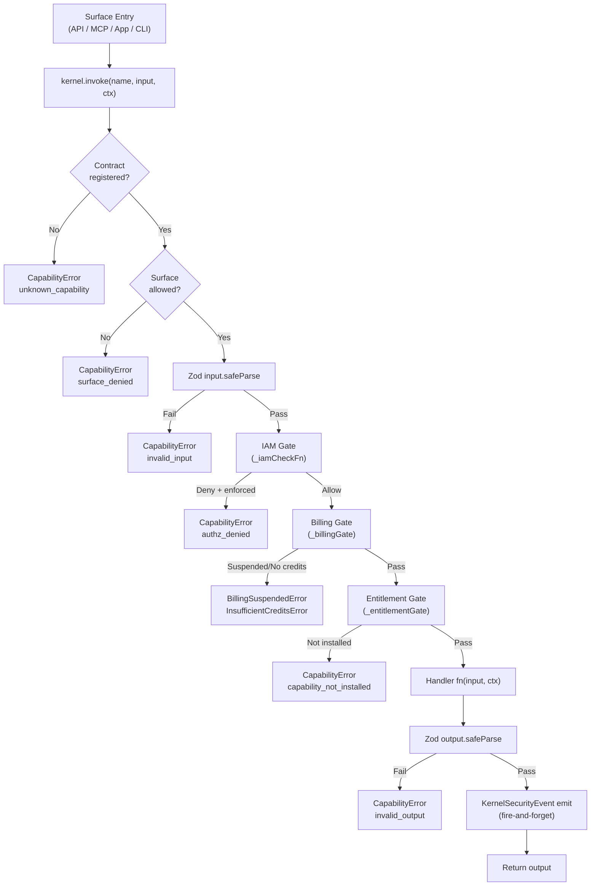
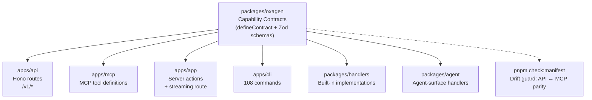
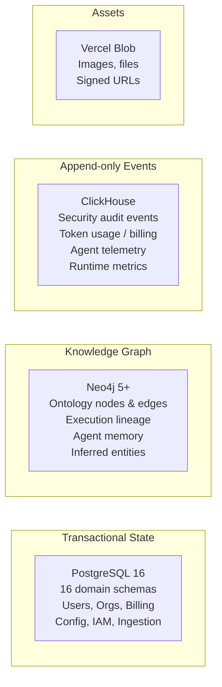
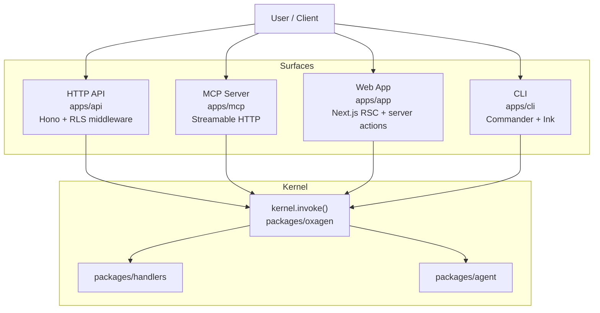
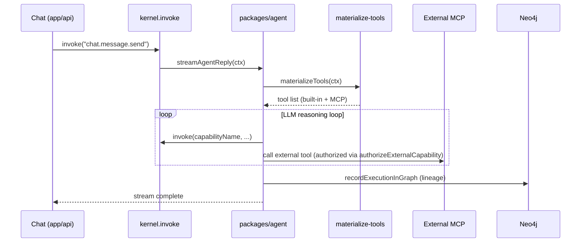

# Architecture

## Overview

Oxagen is an enterprise AI platform built on a **capability kernel** pattern. Every user action, API call, MCP tool invocation, and agent action flows through a single `invoke()` function in `packages/oxagen/src/kernel.ts`. Capabilities are defined once and exposed identically across all surfaces.

## Capability Kernel

The three gates — IAM, billing, entitlement — are **injected** at surface bootstrap. The kernel has no static imports from `@oxagen/billing`, `@oxagen/iam`, or `@oxagen/plugins`. Tests can omit any gate.

> **Decision:** Tools ARE capabilities — a single registry exposes the same handler across `api`/`mcp`/`agent` surfaces via the `surfaces` field, rather than a separate tool registry. See [ADR-009 — Unified capability/tool model via `surfaces`](../../docs/adr/ADR-009-unified-capability-tool-model.md). The entitlement gate that fronts installable capability packs is [ADR-013 — Oxagen Plugins](../../docs/adr/ADR-013-oxagen-plugins-capability-packs.md).

## Single Source of Truth Pattern

The `check:manifest` script enforces that every capability present on the `api` surface also exists on the `mcp` surface. `check:contracts` enforces that every contract file is imported from the barrel index.

## Data Storage Boundaries

**Hard rule**: never put graph relationships in Postgres; never put analytics in Neo4j; never put ACID state in ClickHouse.

> **Decisions:** [ADR-001 — Drizzle as Postgres ORM](../../docs/adr/ADR-001-drizzle-as-postgres-orm.md), [ADR-003 — Neo4j as vector store](../../docs/adr/ADR-003-neo4j-as-vector-store.md), [ADR-012 — Connector dual-write to Postgres + Neo4j](../../docs/adr/ADR-012-connector-dual-write-pattern.md).

## Surface Architecture

## Multi-tenancy

Row-Level Security is enforced at the Postgres driver level via `packages/tenancy`. Every scoped capability call wraps its DB queries in `runInTenantScope({ orgId, workspaceId })`. The RLS role is provisioned by `tools/scripts/provision-rls-role.ts` and all tenant-specific queries receive predicates via `withTenantDb`.

> **Decision:** Identity is bound to a canonical `auth.users` table that Better Auth adapts onto — see [ADR-006 — Better Auth bound to canonical `auth.users`](../../docs/adr/ADR-006-better-auth-bound-to-canonical-users.md). MCP registries are workspace-scoped with a single-default state machine ([ADR-014](../../docs/adr/ADR-014-workspace-scoped-mcp-registry-single-default.md)).

## Agent Runtime

## Background Job Architecture

Inngest (`packages/inngest-functions`) provides durable, retryable execution for:
- **Ingestion pipeline**: normalize → upsert → embed → infer semantic edges
- **Agent workflows**: subagent fanout (`agent.execute-subagent`), background task execution
- **Playbook execution**: trigger matching → step execution with event hashing
- **Billing**: usage rollup, dunning sweep
- **Privacy**: GDPR export and erasure

> **Decisions:** [ADR-002 — Inngest as job orchestration](../../docs/adr/ADR-002-inngest-as-job-orchestration.md), [ADR-010 — Subagent fanout via Inngest invoke](../../docs/adr/ADR-010-subagent-fanout-via-inngest.md). Code execution runs in a vendor-neutral sandbox ([ADR-007 — Docker as code sandbox](../../docs/adr/ADR-007-docker-as-code-sandbox.md), [ADR-011 — Vercel Sandbox driver](../../docs/adr/ADR-011-vercel-sandbox-driver.md)).

## Architecture Decision Records

The decisions above are recorded in full under [`docs/adr/`](../../docs/adr/) — context, alternatives, and consequences per call. ADRs are sequentially numbered and never edited after acceptance; a changed call is captured by a new superseding ADR.

| ADR | Decision | Relevant section |
|---|---|---|
| [001](../../docs/adr/ADR-001-drizzle-as-postgres-orm.md) | Drizzle as Postgres ORM | Data Storage Boundaries |
| [002](../../docs/adr/ADR-002-inngest-as-job-orchestration.md) | Inngest as job orchestration | Background Job Architecture |
| [003](../../docs/adr/ADR-003-neo4j-as-vector-store.md) | Neo4j as vector store | Data Storage Boundaries |
| [004](../../docs/adr/ADR-004-env-vars-not-secret-manager.md) | Env vars, not Secret Manager | (dependencies / config) |
| [005](../../docs/adr/ADR-005-single-version-monorepo.md) | Single-version monorepo | (repo layout) |
| [006](../../docs/adr/ADR-006-better-auth-bound-to-canonical-users.md) | Better Auth bound to `auth.users` | Multi-tenancy |
| [007](../../docs/adr/ADR-007-docker-as-code-sandbox.md) | Docker as code sandbox | Background Job Architecture |
| [008](../../docs/adr/ADR-008-skills-filesystem-first.md) | Skills filesystem-first | Agent Runtime |
| [009](../../docs/adr/ADR-009-unified-capability-tool-model.md) | Unified capability/tool model via `surfaces` | Capability Kernel |
| [010](../../docs/adr/ADR-010-subagent-fanout-via-inngest.md) | Subagent fanout via Inngest | Background Job Architecture |
| [011](../../docs/adr/ADR-011-vercel-sandbox-driver.md) | Vercel Sandbox driver | Background Job Architecture |
| [012](../../docs/adr/ADR-012-connector-dual-write-pattern.md) | Connector dual-write (Postgres + Neo4j) | Data Storage Boundaries |
| [013](../../docs/adr/ADR-013-oxagen-plugins-capability-packs.md) | Oxagen Plugins capability packs | Capability Kernel (entitlement gate) |
| [014](../../docs/adr/ADR-014-workspace-scoped-mcp-registry-single-default.md) | Workspace-scoped MCP registries | Surface Architecture / Multi-tenancy |
