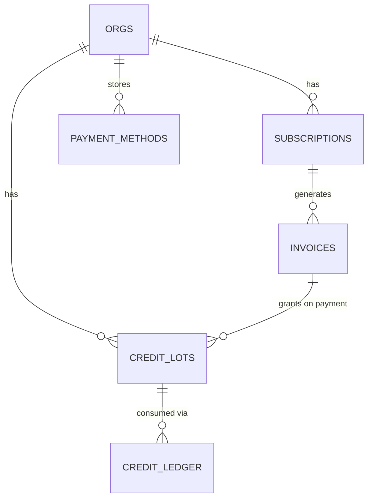
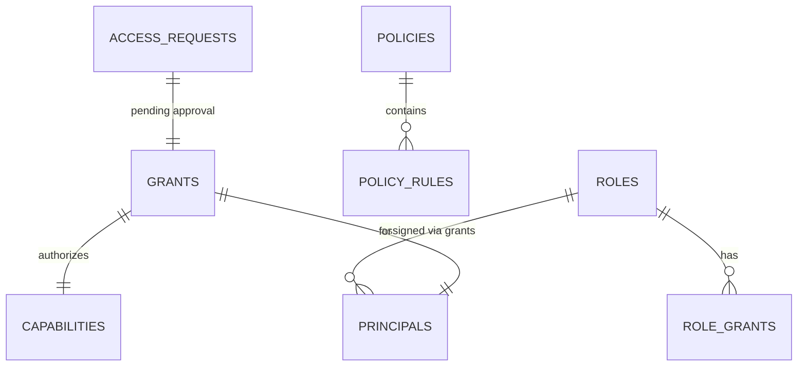
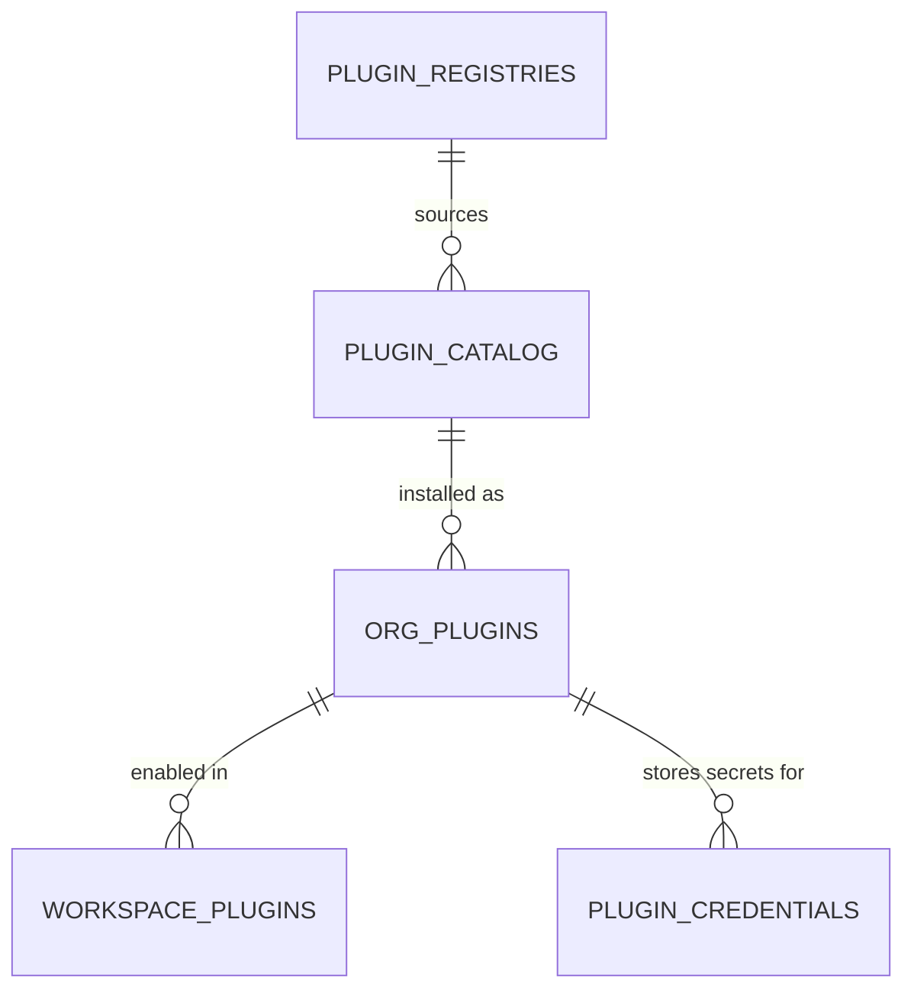
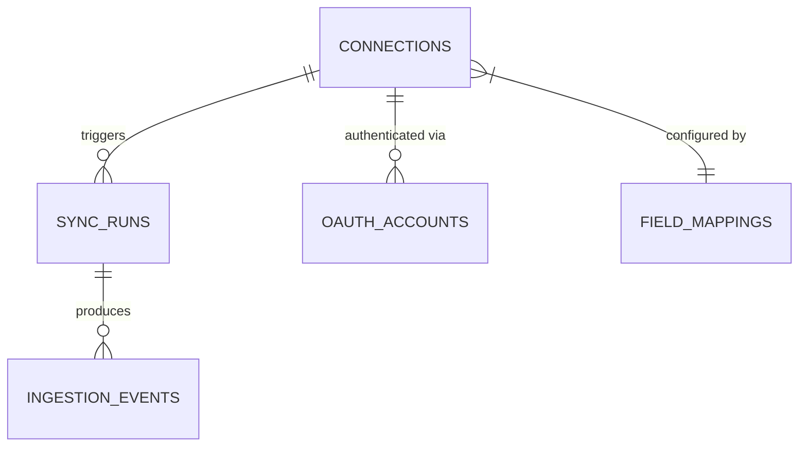

# Data Models

## Postgres Schemas (Drizzle + Atlas)

16 domain schemas defined in `packages/database/src/schema/_schemas.ts`, each namespaced via `pgSchema()`:

| Schema | Domain | Key Tables |
|---|---|---|
| `auth` | Authentication | sessions, accounts, users, verifications |
| `org` | Organizations | orgs, org_members, invitations |
| `workspace` | Workspaces | workspaces, workspace_members, model_settings |
| `agent` | Agent State | agents, plans, plan_steps, approvals, background_tasks, memories, executions |
| `workflow` | Workflows | workflow_runs, workflow_steps |
| `chat` | Conversations | conversations, messages, message_branches |
| `content` | Documents & Assets | documents, assets, brand_kits |
| `billing` | Billing | subscriptions, invoices, credit_lots, credit_ledger, payment_methods |
| `security` | Audit | security_events (partitioned), audit_export_tokens |
| `mcp` | MCP Registries | mcp_registries, mcp_servers |
| `plugin` | Plugins | catalog, org_plugins, workspace_plugins, plugin_registries, plugin_credentials, oauth_states |
| `notification` | Notifications | notifications |
| `ingestion` | Data Connectors | connections, sync_runs, ingestion_events, field_mappings, oauth_accounts |
| `iam` | IAM | roles, role_grants, policies, grants, access_requests |
| `privacy` | GDPR | data_export_requests, data_erasure_requests |
| `graph` | Graph Sync | node_sync_meta |

> **Maintenance — keep this list in sync.** The schema list is the single most drift-prone table in these docs. The source of truth is `packages/database/src/schema/_schemas.ts` (one `pgSchema()` declaration per schema). When a schema is added or removed, update this table in the same change. Verify the count with:
> ```bash
> grep -c 'pgSchema(' packages/database/src/schema/_schemas.ts   # currently 16
> ```
> The same count is asserted in `architecture.md`, `codebase_info.md`, and `index.md` — update all four together.

## Key Entity Shapes

### CapabilityContext (runtime)
```typescript
{ orgId, workspaceId, userId, apiKeyId, requestId, surface, messageId, planTier?, clientIp? }
```

### ResolvedPrincipal (IAM)
```typescript
{ id: string; kind: "human" | "agent" | "service"; orgId: string; workspaceId: string | null }
```

### CapabilityDeclaration (contracts)
See `packages/oxagen/src/types.ts` — includes Zod input/output schemas, surfaces, IAM defaults.

## Neo4j Graph Schema (`packages/ontology`)

All Neo4j data is tenant-scoped via `orgId` + `workspaceId` labels/properties.

### Core Node Labels
- `:Entity` — base label for all ingested/inferred entities
- `:Execution` — agent run record (lineage)
- `:Memory` — agent memory entry (vector-indexed)
- `:Worker` — agent definition
- `:OntologyType` — declared business entity types

### Core Relationship Types
- `[:RELATED_TO]` — generic source-based relationship
- `[:DERIVED_FROM]` — inferred relationship with confidence score + source evidence
- `[:EXECUTED]` — execution → tool/document/entity link (lineage)
- `[:REMEMBERS]` — agent → memory node
- `[:HAS_MEMBER]` / `[:BELONGS_TO]` — org/workspace membership

### Semantic Edge Properties
```
{ confidence: float, source: string, evidenceIds: string[], workspaceId: string, orgId: string, inferredAt: datetime }
```

## Billing Data Model



Credit flow: `createCreditLot` → `insertLotAndMirrorBalance` → `consumeCredits` (debits ledger) → `effectiveBalance` (sum of active lots).

## IAM Data Model



IAM resolution order (in `packages/oxagen/src/iam/resolve.ts`):
1. Explicit user grants
2. User's role grants
3. Policy rules (with conditions: IP ranges, time windows)
4. Inherited workspace role
5. Inherited org role
6. `require_approval` check
7. Default deny
8. Contract `defaultEffect`

## Plugin Data Model



## Ingestion Pipeline Model



## ClickHouse Events

All events are append-only rows with `(org_id, workspace_id, created_at)` partition predicates.

Key tables:
- `security_events` — capability invocations: `(capability, outcome, surface, org_id, user_id, duration_ms, error_code)`
- `token_usage` — LLM token consumption: `(model, provider, prompt_tokens, completion_tokens, cost_usd_micros)`
- `claude_sessions` — Claude Code telemetry (developer productivity)
