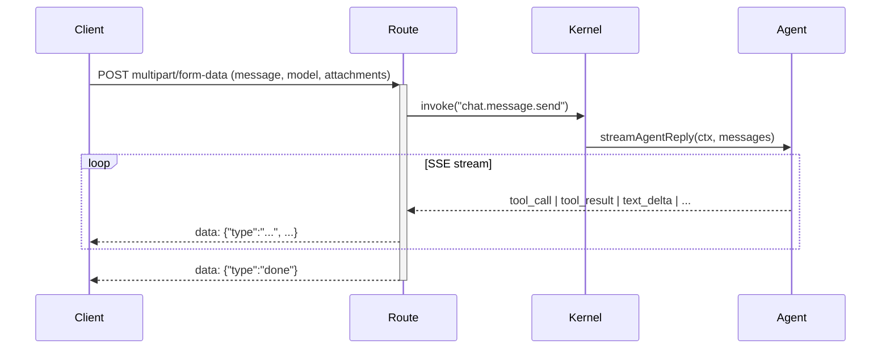

# Interfaces

## Capability Contract Interface

Every capability is declared via `CapabilityDeclaration<TInput, TOutput>` from `packages/oxagen/src/types.ts`:

```typescript
interface CapabilityDeclaration {
  name: string;               // Dot-notation id, e.g. "chat.message.send"
  domain: string;             // Grouping domain
  description: string;
  mode: "sync" | "async" | "batch";
  surfaces?: ("api" | "mcp" | "agent" | "cli")[];  // Default: ["api", "mcp"]
  layers: ("schema" | "api" | "mcp" | "unit" | "e2e" | "docs")[];
  input: z.ZodTypeAny;        // Validated by kernel before handler runs
  output: z.ZodTypeAny;       // Validated by kernel after handler runs
  scoped?: boolean;           // Default true — wraps in runInTenantScope
  noBillingGate?: boolean;    // Default false — skip credit check
  sensitivity: "low" | "medium" | "high" | "destructive";
  defaultEffect: "allow" | "deny" | "require_approval";
  defaultRoles: {
    org: Partial<Record<"Owner"|"Admin"|"Compliance"|"Billing", GrantEffect>>;
    workspace: Partial<Record<"Owner"|"Member"|"Viewer", GrantEffect>>;
  };
  agent?: { requiresApproval?: boolean; riskLevel?: RiskLevel; category?: string };
}
```

## CapabilityContext

Passed to every handler. Built at each surface entry seam:

```typescript
interface CapabilityContext {
  orgId: string;
  workspaceId: string;
  userId: string | null;
  apiKeyId: string | null;
  requestId: string;
  surface: "api" | "mcp" | "app" | "runner";
  messageId: string | null;   // Non-null when called mid-chat by the agent
  planTier?: PlanTier;        // "free" | "build" | "scale" | "enterprise"
  clientIp?: string | null;   // For IAM IP-range conditions
}
```

## Kernel Gate Injection Interfaces

Gates are injected at bootstrap and replaced by `null` in tests:

```typescript
// packages/oxagen/src/kernel.ts
type BillingAdmissionGateFn = (orgId: string) => Promise<void>;
type CapabilityEntitlementGateFn = (capabilityName: string, orgId: string) => Promise<void>;
type KernelIAMCheckFn = (args: {
  capability: string;
  ctx: CapabilityContext;
  defaultEffect: CapabilityEffect;
  rawInputJson: string;
}) => Promise<{ outcome: "allow" | "deny" | "pending_approval"; reason?: string; principal: ResolvedPrincipal | null }>;
```

## HTTP API Routes (`apps/api/src/routes/v1/`)

| Route file | Endpoints |
|---|---|
| `chat.stream.ts` | `POST /v1/chat/stream` — SSE agent stream |
| `connection.ts` | CRUD `/v1/connections/*` |
| `integration.ts` | `/v1/integrations/*` |
| `semantic-edge.ts` | `/v1/semantic-edges/*` |
| `workflow.ts` | `/v1/workflows/*` |
| `repo.ts` | `/v1/repos/*` |
| `webhook.ts` | `/v1/webhooks/*` |
| `github-oauth.ts` | OAuth callback + state encode/decode |
| `github-webhook.ts` | GitHub webhook verification |
| `plugin-schema.ts` | Plugin schema endpoints |
| `privacy.data.export.ts` | GDPR export trigger |
| `graph.node.list.ts` | Graph node list |
| `notifications.list.ts` | Notification feed |
| `conversation.list.ts` | Conversation list |

All routes share a consistent auth middleware chain: session/API-key resolution → org scope resolution → capability context build → `kernel.invoke()`.

## MCP Tool Protocol

MCP tools live in `apps/mcp/src/tools/`. Each tool file exports a single function that:
1. Calls `kernel.invoke(capabilityName, input, ctx, { surface: "mcp" })`
2. Returns `{ content: [{ type: "text", text: JSON.stringify(result) }] }`

Authentication via `Authorization: Bearer <session-token>` or `x-api-key` header.

## Streaming Chat API

`POST /api/v1/chat/stream` (Next.js route, `apps/app/src/app/api/v1/chat/stream/route.ts`):



Stream part types defined in `src/components/chat/stream-event-types.ts`.

## Plugin Schema Interface

Plugin manifests (from `packages/oxagen/src/plugins/manifest.ts`) declare:
- `id`, `name`, `version`
- `contracts`: capability names the plugin claims
- `tools`: MCP-style tool definitions
- `credentials`: required OAuth/secret fields
- `auth.kind`: `"oauth2"` | `"secret"` | `"none"`

## Ingestion Connector Interface

All connectors implement:
```typescript
interface Connector {
  verifyWebhook(req, secret): Promise<boolean>;
  normalizeRecord(raw): NormalizedRecord;
  previewRecordTypes(): RecordType[];
}
```

Connectors: `github`, `linear`, `slack`, `google` (gmail/drive/calendar/meet/contacts/tasks/bigquery), `salesforce`, `microsoft`, `zoom`, `custom-webhook`, `custom-sql`.

## Environment Variables

Managed via `packages/config/src/registry.ts`. All env vars are declared with Zod validation, required/optional flags, and client-safe marking. Validate the entire `.env.local` with `pnpm env:check`.
