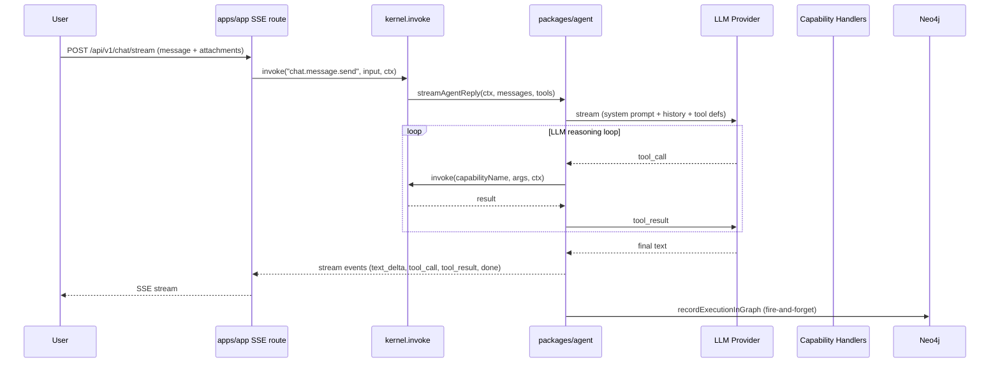
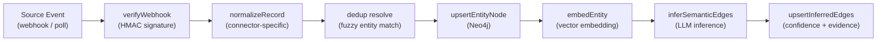
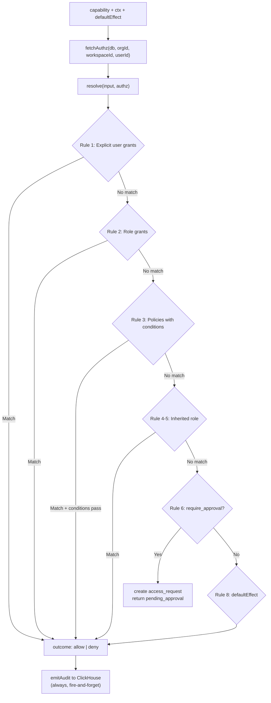
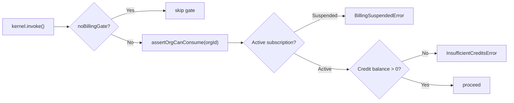
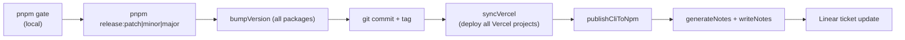
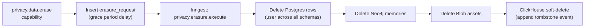
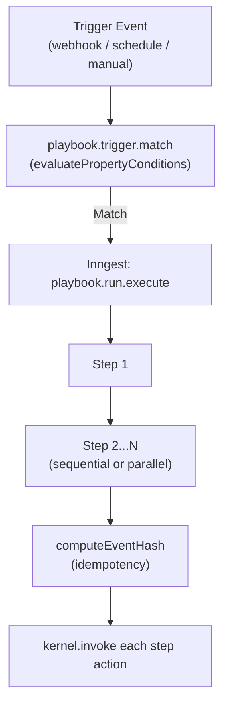
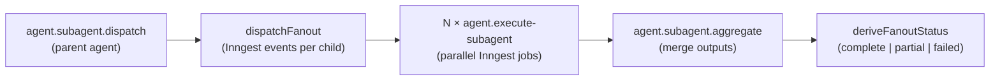
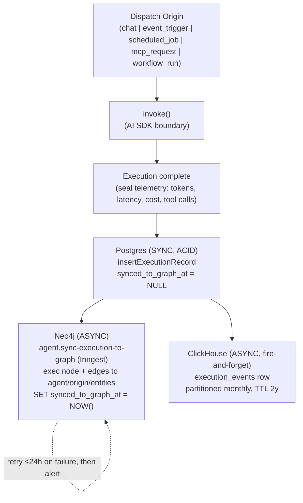
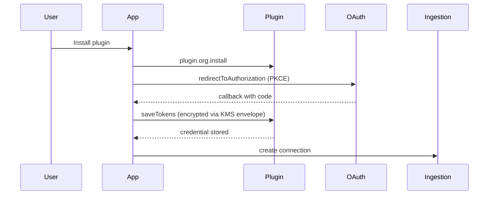

# Workflows

## Chat Turn (Synchronous)

## Ingestion Pipeline

Triggered by webhook or scheduled sync. Runs as an Inngest function.

Connectors: GitHub, Linear, Slack, Google (7 services), Salesforce, Microsoft, Zoom, custom-webhook, custom-sql.

## IAM Resolution

Invoked on every `kernel.invoke()` call when `_iamCheckFn` is registered.

## Billing Turn Gate

## Release Workflow

## GDPR Data Erasure

## Playbook (Automation) Execution

## Subagent Fanout

## Agent Execution Telemetry (Four-Store Sync)

Every agent invocation — regardless of dispatch origin (chat, event trigger, scheduled job, MCP request, or workflow run) — is logged to a unified `agent.agent_executions` record with nested `agent_execution_steps` and `agent_tool_calls`. The record is written synchronously to Postgres (billing source of truth), then mirrored asynchronously to Neo4j (graph lineage) and ClickHouse (time-series analytics).

| Store | Freshness | Consistency | Use case |
|---|---|---|---|
| Postgres | Immediate | ACID | Billing, status, cost reconciliation |
| Neo4j | 5–30 sec | Eventual | Graph queries, entity discovery, lineage |
| ClickHouse | 5–10 min | Eventual | Trends, aggregates, immutable audit |

**`workflow_runs` vs `agent_executions`** — orthogonal, not redundant. `agent.workflow_runs` is the orchestration **container** (plan structure, progress: totalTasks/completedTasks/failedTasks). `agent.agent_executions` is the per-invocation **telemetry log**, linked back via `origin_type = 'workflow_run'` + `origin_id`. Query "all executions for a run" by joining on those two columns.

> Source: `docs/specs/agent-execution/{design-spec,implementation-plan,workflow-runs-clarification}.md`. The design spec also covers the dead-schema sunset (dropping `execution.*`, `workflow.playbooks`, `event.triggers`, `integration.connections`, `content.documents`, `agent.tools`).

## OAuth Plugin Credential Flow

