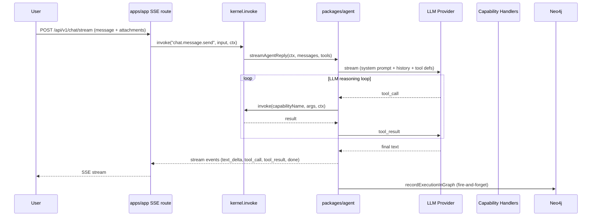
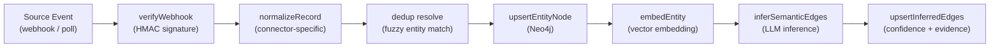
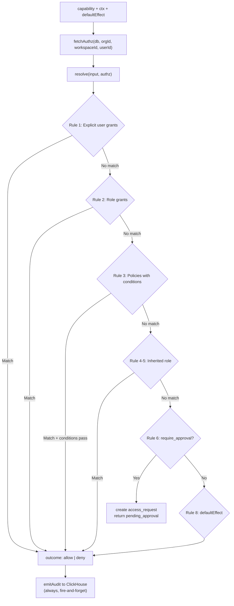
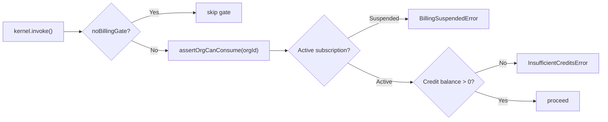
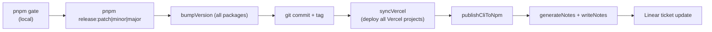
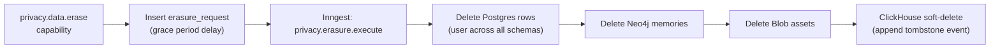
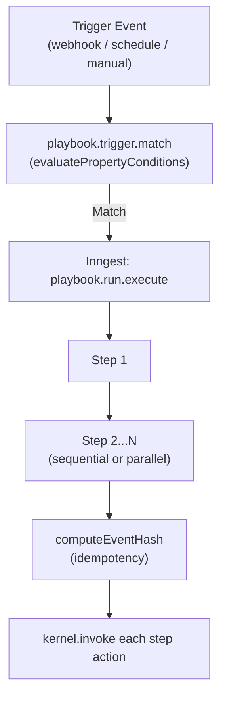
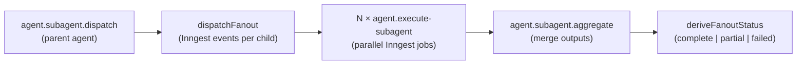
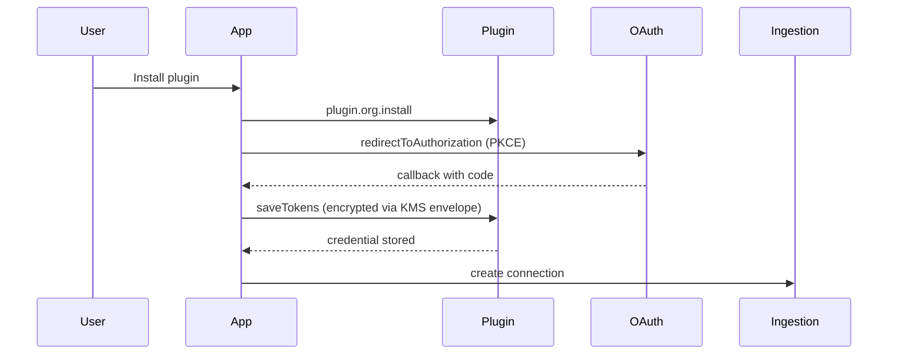

# Workflows

## Chat Turn (Synchronous)

## Ingestion Pipeline

Triggered by webhook or scheduled sync. Runs as an Inngest function.

Connectors: GitHub, Linear, Slack, Google (7 services), Salesforce, Microsoft, Zoom, custom-webhook, custom-sql.

## IAM Resolution

Invoked on every `kernel.invoke()` call when `_iamCheckFn` is registered.

## Billing Turn Gate

## Release Workflow

## GDPR Data Erasure

## Playbook (Automation) Execution

## Subagent Fanout

## OAuth Plugin Credential Flow

