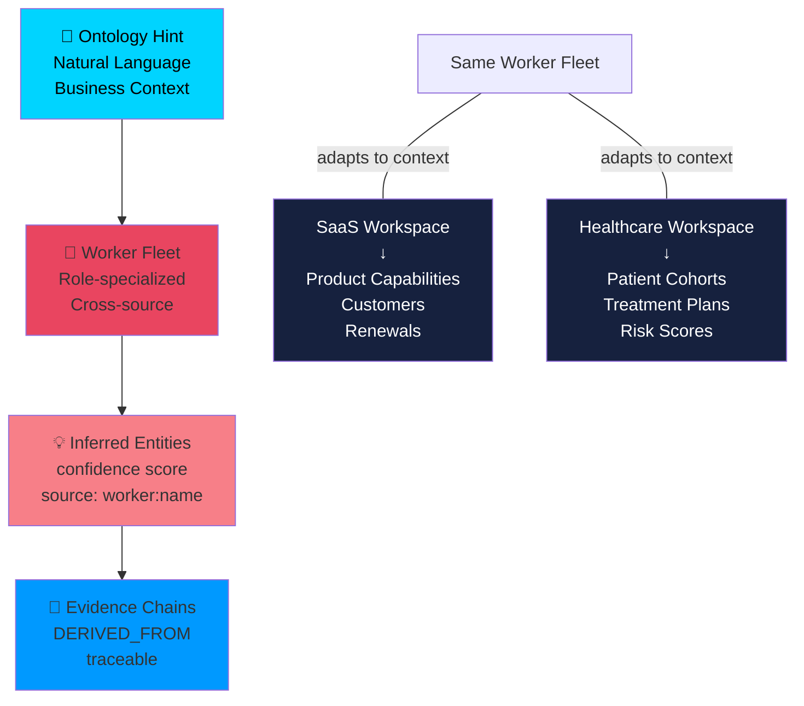
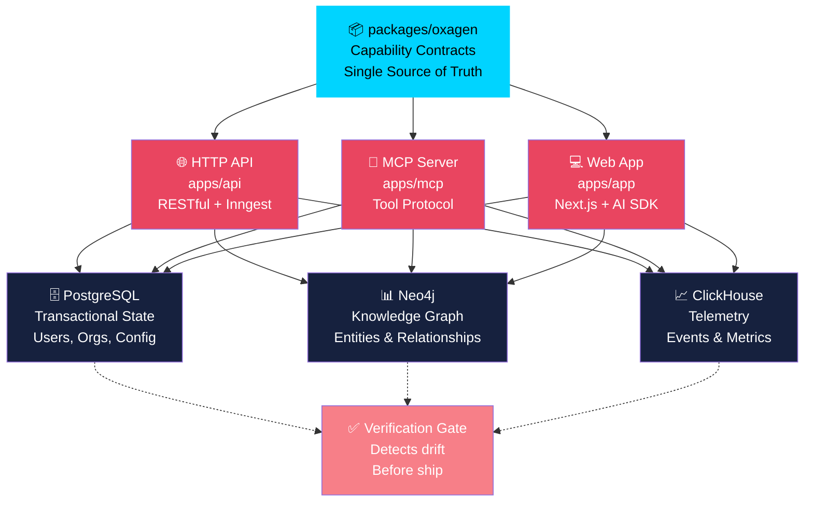
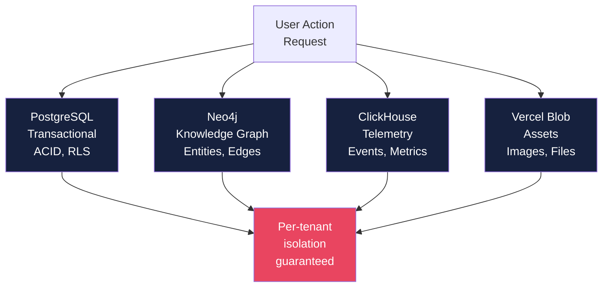

```text
═══════════════════════════════════════════════════════════════════════
        ██████╗  ██╗  ██╗ █████╗  ██████╗ ███████╗███╗   ██╗
        ██╔═══██╗╚██╗██╔╝██╔══██╗██╔════╝ ██╔════╝████╗  ██║
        ██║   ██║ ╚███╔╝ ███████║██║  ███╗█████╗  ██╔██╗ ██║
        ██║   ██║ ██╔██╗ ██╔══██║██║   ██║██╔══╝  ██║╚██╗██║
        ╚██████╔╝██╔╝ ██╗██║  ██║╚██████╔╝███████╗██║ ╚████║
        ╚═════╝ ╚═╝  ╚═╝╚═╝  ╚═╝ ╚═════╝ ╚══════╝╚═╝  ╚═══╝
                          by Mac Anderson
═══════════════════════════════════════════════════════════════════════
```

# Oxagen Platform

> **Building the future, so we'll be ready to meet you when you get there.**

<p align="center">
  <a href="https://github.com/oxagenai/oxagen-monorepo/actions/workflows/pipeline.yml">
    
  </a>
  
  
  
  
  
  
  
  
</p>

> v0.4.0 · [CONTRIBUTING.md](CONTRIBUTING.md) · [AGENTS.md](AGENTS.md) · [Docs](.agents/summary/index.md)

---

## What Is Oxagen?

Oxagen transforms your business's fragmented data—from SQL databases, document stores, SaaS apps, and event streams—into a **live, queryable knowledge graph**. Then it unleashes a swarm of intelligent AI agents who don't just query the graph; they **enrich it**, infer the entities your business actually cares about, and bind every decision back to the evidence that justified it.

**Every action is auditable. Every decision is traceable. Every insight compounds.**

### The Oxagen Advantage

```mermaid
graph TB
    A["📊 Fragmented Data Sources"] 
    B["🔄 Universal Pipeline"]
    C["🧠 Live Knowledge Graph"]
    D["🤖 Intelligent Agents"]
    E["✅ Auditable Actions"]
    
    A --> B --> C --> D --> E
    
    F["SQL<br/>Postgres<br/>"]
    G["Events<br/>Webhooks<br/>"]
    H["Documents<br/>Gmail<br/>"]
    I["SaaS<br/>Linear, GitHub<br/>"]
    
    F --> A
    G --> A
    H --> A
    I --> A
    
    D --> J["Inferred<br/>Entities"]
    D --> K["Worker<br/>Enrichment"]
    D --> L["Autonomous<br/>Workflows"]
    
    E --> M["Full Audit<br/>Trail"]
    E --> N["Evidence<br/>Binding"]
    E --> O["Decision<br/>Trees"]
    
    style A fill:#1a1a2e
    style B fill:#0f3460
    style C fill:#16213e
    style D fill:#e94560
    style E fill:#00d4ff
    style F fill:#6c757d
    style G fill:#6c757d
    style H fill:#6c757d
    style I fill:#6c757d
```



---

## Vision: Autonomous, Auditable Intelligence

An Oxagen workspace should be able to:
- **Communicate with customers** autonomously
- **Approve refunds** without human review
- **Prospect new accounts** intelligently
- **Monitor and tune ad spend** in real-time
- **Explain every decision** all the way back to the source

---

## How It Works

### Universal Ingestion Pipeline

Every connector flows through the same deterministic, auditable pipeline:

```mermaid
graph LR
    A["SOURCE<br/>Linear, Gmail<br/>GitHub, Postgres<br/>Webhooks"] --> B["INGEST<br/>Raw pull<br/>stream/webhook"]
    B --> C["PREPROCESS<br/>Parse<br/>normalize"]
    C --> D["NODE UPSERT<br/>Entities<br/>created/updated"]
    D --> E["INITIAL EDGES<br/>Same-source<br/>relationships"]
    E --> F["ENRICH<br/>Cross-source<br/>reasoning"]
    F --> G["QUALITY GATE<br/>Confidence<br/>validation"]
    G --> H["📊 GRAPH<br/>Neo4j<br/>Live & queryable"]
    
    I["AGENT RUN<br/>Every mutation<br/>traces back to source"]
    
    H -.->|"auditable"| I
    I -.->|"enriches"| H
    
    style A fill:#e94560
    style B fill:#f77f88
    style C fill:#ff9ba5
    style D fill:#00d4ff
    style E fill:#00b4ff
    style F fill:#0099ff
    style G fill:#0077dd
    style H fill:#16213e,color:#fff
    style I fill:#e94560
```



**Every step is declarative, observable, and reproducible.**

### Inferred Entities: Core Intelligence

Declare your business context:
> *"We're B2B SaaS. We care about Product Capabilities, Customers, Renewals, Champions."*

Workers infer **exactly the entities your business needs** across all sources:



**Same worker fleet. Infinite verticals.**

---

## Enterprise by Design

### Security & Compliance Built In

| Feature | How |
|---------|-----|
| **Per-org isolation** | Postgres RLS, ClickHouse predicates, per-workspace Neo4j graphs |
| **Bring your own infra** | Neo4j endpoint, LLM provider keys—your contracts, your data |
| **Least-privilege access** | Per-capability policies; deny by default |
| **Full audit trail** | Every invocation: org, workspace, user, run, model, timestamp, source |
| **Governed memory** | Agent memories carry weights and decay policies you control |
| **Marketplace ready** | Manifest-driven architecture; partners extend without forking |

---

## Architecture

### Single Source of Truth

Every feature is declared **once** in `packages/oxagen` and exposed identically across three surfaces:



**No drift. Ever.**

### Workspace Structure

```
oxagen-monorepo/
├── 🎯 apps/
│   ├── api              REST API + Inngest handler (Hono)
│   ├── app              Next.js interactive UI (App Router, RSC)
│   ├── mcp              MCP server (tool protocol)
│   ├── cli              Developer CLI (Ink + Commander)
│   ├── website          Marketing site (static)
│   └── docs             Capability specs & architecture
│
├── 📦 packages/
│   ├── oxagen           Capability registry (source of truth)
│   ├── handlers         Foundation implementations
│   ├── agent            Agent runtime & tool dispatch
│   ├── inngest-functions Async job definitions
│   ├── database         Drizzle + 13 Postgres domains
│   ├── config           Zod environment loader
│   ├── auth             Better Auth integration
│   ├── ai               Vercel AI SDK helpers
│   ├── billing          Stripe ledger logic
│   ├── ontology         Neo4j schema & indexes
│   ├── telemetry        ClickHouse client
│   └── ui               Component system
│
├── 🛠️  tools/scripts     Dev orchestration
└── 📚 docs/             Specs, ADRs, architecture
```

---

## Getting Started

### Prerequisites

- **Node.js** 24+ LTS (`node -v`)
- **pnpm** 9+ (`npm i -g pnpm`)
- **Docker** (for local Postgres, Neo4j, ClickHouse)

### 5-Minute Setup

```bash
# Clone and enter
git clone <repo> oxagen
cd oxagen

# Configure environment
cp .env.example .env.local    # fill in required values
pnpm install

# Start everything (migrations + all apps)
pnpm dev
```

That's it. Open `http://localhost:3000` in your browser.

### When You're Done

```bash
pnpm kill                     # stop apps + Docker
pnpm kill -- --volumes       # full reset (delete volumes)
```

### Access Points

| App | URL | Purpose |
|-----|-----|---------|
| **Web App** | `http://localhost:3000` | Interactive UI |
| **API** | `http://localhost:4000` | REST endpoints |
| **MCP** | `http://localhost:4100` | Tool protocol |
| **Docs** | `http://localhost:3300` | Documentation |

---

## Verification & Quality

### The Gate

Everything must pass the local gate before pushing:

```bash
pnpm gate
```

This runs:
```
✅ ESLint          (zero warnings allowed)
✅ TypeScript      (strict mode, no `any`)
✅ Manifest Check  (API ↔ MCP parity)
✅ Unit Tests      (coverage thresholds enforced)
✅ E2E Tests       (full user flows with screenshots)
✅ Build           (all packages compile)
✅ Migrations      (dry-run executed)
```

**Every commit to `main` must pass the gate locally first.**

### Test-Driven Development

- **New code = new tests.** Routes, handlers, utilities—all require tests.
- **User flows = E2E tests.** Capture screenshots of success states.
- **Thresholds only go up.** Coverage is a ratchet; never lower.
- **Run `pnpm gate` before push.** CI enforces the same gates.

---

## Tech Stack

| Layer | Technology | Why |
|-------|-----------|-----|
| **Frontend** | Next.js 16 + React 19 | App Router, streaming RSC, Turbopack |
| **API** | Hono | Type-safe routes, zero-overhead middleware |
| **AI** | Vercel AI SDK Core | Streaming, structured output, multi-model |
| **DB** | PostgreSQL 16 | ACID, RLS, JSON, CDC |
| **Graph** | Neo4j 5+ | APOC, vectors, traversal |
| **Analytics** | ClickHouse | Append-only events, fast queries |
| **Jobs** | Inngest | Durable workflows, retries, scheduling |
| **Auth** | Better Auth | Passkeys, OAuth, role-based access |
| **Storage** | Vercel Blob | Signed URLs, private/public |
| **Language** | TypeScript 6 | Strict mode, no `any` |
| **Testing** | Vitest + Playwright | Fast unit, real browser e2e |

---

## Development Workflow

### One-Time Setup

```bash
pnpm env:check              # validate .env.local
pnpm db:migrate             # apply pending migrations
pnpm db:seed-iam            # seed roles + permissions
pnpm db:seed-skills         # seed agent skill definitions
```

### Daily Development

```bash
pnpm dev                    # watch all apps + Docker
pnpm test                   # unit + integration tests
pnpm test:e2e               # e2e tests in real browser
pnpm check:manifest         # verify API ↔ MCP sync
pnpm typecheck              # full monorepo type check
```

### Before Pushing to Main

```bash
git fetch origin && git rebase origin/main    # sync
pnpm gate                                      # full verification
gh run watch                                   # verify CI is green
```

---

## Documentation

| Resource | Path |
|----------|------|
| **Foundations Spec** | [`docs/epics/foundations/spec.md`](docs/epics/foundations/spec.md) |
| **Capability Docs** | [`docs/capabilities/`](docs/capabilities/) |
| **Architecture & ADRs** | [`docs/adr/`](docs/adr/) |
| **Database Schema** | [`packages/database/`](packages/database/) |
| **API Routes** | [`apps/api/src/routes/v1/`](apps/api/src/routes/v1/) |
| **MCP Tools** | [`apps/mcp/src/tools/`](apps/mcp/src/tools/) |

---

## Production Infrastructure

### Hosted Services

| Service | Domain | Purpose |
|---------|--------|---------|
| **Web App** | `oxagen-v2-app.vercel.app` | Interactive UI |
| **API** | `oxagen-v2-api.vercel.app` | REST endpoints |
| **MCP** | `oxagen-v2-mcp.vercel.app` | Tool protocol |
| **Docs** | `oxagen-v2-docs.vercel.app` | Documentation |

### Data Architecture



**Data sovereignty:** Your infrastructure, your encryption, your compliance.

---

## Philosophy

### Build Fast, Ship Complete

- **No pre-launch customers** → dangerous edits are allowed
- **Branch, commit, never push** → `main` is contested; run `pnpm gate`, commit on a branch, and leave it for a maintainer to push (the pre-push hook gates on the test suite)
- **Fix every bug you find** → investigate root cause, fix instances, verify
- **Everything shipped must be complete** → fully wired, every layer, tests passing

### Verification First

- **Never claim done without proof** → test output, CI green, or rendered result
- **UI changes need screenshots** → e2e tests capture success states
- **Forms tested end-to-end** → submit data, verify via DB or API
- **Deployments verified** → health check or query after ship

---

## Contributing

We believe in:
- **Direct main commits** after local verification
- **Comprehensive testing** for every change
- **Auditable decisions** via git history and Linear tickets
- **Complete implementations** with no half-finished work

---

## Common Commands

```bash
# Development
pnpm dev                         # start all apps + Docker
pnpm kill                        # stop everything
pnpm gate                        # full CI locally

# Testing & Verification
pnpm test                        # unit + integration tests
pnpm test:e2e                    # e2e tests (real browser)
pnpm typecheck                   # TypeScript strict
pnpm check:manifest              # API ↔ MCP parity

# Database
pnpm db:migrate                  # apply pending migrations
pnpm db:lint-migrations          # verify migration integrity
pnpm db:seed-iam                 # seed roles + permissions

# Releases
pnpm release:patch               # bump patch version
pnpm release:minor               # bump minor version
pnpm release:major               # bump major version

# Utilities
pnpm env:check                   # validate .env.local
lsof -ti:3000                    # check app server status
lsof -ti:4000                    # check API server status
lsof -ti:4100                    # check MCP server status
```

---

## License

**Proprietary.** Copyright © 2024–present Oxagen Inc. All rights reserved.

---

<div align="center">

### We're building the future, so we'll be ready to meet you when you get there.

[**Web App**](https://oxagen-v2-app.vercel.app) · [**API**](https://oxagen-v2-api.vercel.app) · [**Docs**](https://oxagen-v2-docs.vercel.app) · [**GitHub**](https://github.com/oxagenai/oxagen-monorepo)

Made with ❤️ by the Oxagen team.

</div>
