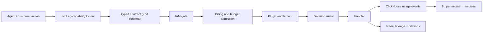
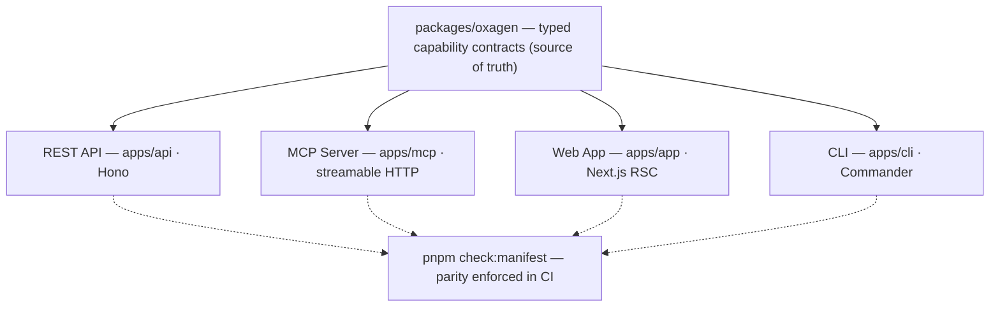

# Oxagen Platform

Workforce management for autonomous agents. Every agent gets its own identity and a mandate (its authority, budget, tools, and skills), set by the teams accountable for it and enforced on the actions routed through Oxagen, the agent control plane.

<p align="center">
  <a href="https://github.com/macanderson/oxagen/actions/workflows/pipeline.yml">
    
  </a>
  <a href="https://github.com/macanderson/oxagen/actions/workflows/vision-gate.yml">
    
  </a>
  
  
  
  
  
  
  
</p>

> [Vision](docs/VISION.md) · [Contributing](CONTRIBUTING.md) · [Security](SECURITY.md) · [Support](SUPPORT.md) · [Agents Guide](AGENTS.md) · [Telemetry](TELEMETRY.md)

---

## What It Does

Oxagen does not run agents — Stella and any other agent do the work. Oxagen is where the company sets the terms under which that work may happen, and where it goes to find out what happened. Three teams each write one clause of an agent's **mandate**, and the platform applies those terms to actions routed through Oxagen:

1. **Access** — security sets the identity the agent acts as, the systems it is connected to, the data and graph scope it may read, and the actions it is permitted. Typed capability contracts declare the supported surfaces and meet the gates installed by each surface bootstrap.
2. **Budget & rules** — FinOps sets what it may spend, under which commercial terms, and the business rules it must obey. Every governed action is metered from ClickHouse through to Stripe.
3. **Equipment** — engineering sets the knowledge it is handed (a Neo4j graph plus ontology, grounding answers in cited, time-aware context), the skills and tools it may use, and the steering it runs under.
4. **Record** — the platform keeps one trace per run: who asked, what it read, what it changed, what proved it, what it cost.

The platform is vendor-neutral: bring your own model keys and your own Neo4j endpoint.

The full positioning and drift tests live in [`docs/VISION.md`](docs/VISION.md). CI enforces it via the **Vision Gate** ([`vision-gate.yml`](.github/workflows/vision-gate.yml), `pnpm check:vision`), which LLM-judges every PR diff against the vision and posts an advisory verdict.



---

## How It Works

### The capability kernel

Every feature is a **capability**: a verb-first snake_case name (`send_message`, `query_ontology`, `get_ontology_neighbors`; ADR-025) declared once as a typed contract in `packages/oxagen/src/contracts/` and dispatched through a single `invoke()` path. Surface bootstraps install the kernel gates. Scoped calls pass IAM, billing and budget admission, entitlement, and decision rules before the handler where those gates apply. Billing admission skips `noBillingGate` contracts, and entitlement applies to plugin-claimed contracts. The kernel records the resulting activity through its configured sinks.

Contracts declare their supported API, MCP, agent, and CLI surfaces. The `app` layer records a UI promise separately. `pnpm check:manifest` checks declared artifacts, and `pnpm check:ui-parity` checks app bindings. A contract declaration alone does not prove that a surface is wired.



### The metering→billing loop

Every `invoke()` call, agent step, and LLM call (all LLM traffic goes through `@oxagen/ai`, never raw SDK imports) emits usage events into ClickHouse: org, workspace, user, run, model, tokens, duration, surface. Those events price against Stripe meters (`pnpm billing:stripe-sync`), so spend resolves to a workspace, an agent, a rule, and a run instead of to one monthly total. The run-ledger (`packages/run-ledger`) carries the same discipline into externally-run agent fleets: evidence ingress (`client_attested`, e.g. Stella's drain) records every run, attempt, and event with typed lineage plus cost — Oxagen governs and rates the trace, it never re-runs it (ADR-043).

### The knowledge graph

Connectors ingest fragmented sources (SaaS apps, databases, documents, events) through a universal pipeline into a per-workspace Neo4j graph governed by an ontology. Agents query it through governed capabilities (`query_ontology`, `get_ontology_neighbors`) and answer with citations to nodes and edges carrying time-aware validity, inspectable in the UI down to the property bag. Ingestion dual-writes: Postgres holds the operational record (sync cursors, connection health), Neo4j holds the graph index, ClickHouse observes the telemetry.

### Steering, gating and the gateway

Published steering reaches supported wrapped runs through the host control envelope in [`tacho-host.ts`](packages/handlers/src/lib/tacho-host.ts). Steering is advisory context for the model. Kernel decision rules gate actions routed through Oxagen.

The collector includes a loopback model proxy in [`model-proxy.ts`](packages/tacho/src/collector/model-proxy.ts), wired by [`daemon.ts`](packages/tacho/src/collector/daemon.ts). Its presence does not mean every harness routes model calls through it. Inspect the wrapper configuration and recorded routing evidence before claiming gateway coverage. Hook-only records remain client-attested.

ADRs 093 through 097 describe the steering and gateway design. Use the [source map](docs/CODEMAPS/architecture.md#steering-gating-and-the-gateway) to find the implementation, and distinguish shipped behavior from the remaining design targets.

### Vendor neutrality

Model resolution goes through `modelIdOf()` and an AI gateway — no hard-coded vendor slugs. Customers bring their own model keys and their own Neo4j endpoint. No feature may couple the platform to a single cloud or model vendor where a neutral abstraction exists; the Vision Gate flags it as drift.

---

## Monorepo Layout

```
oxagen/
├── apps/
│   ├── api          REST API + Inngest handler (Hono) — api.oxagen.sh
│   ├── app          Next.js web app (App Router, RSC) — app.oxagen.sh
│   ├── mcp          MCP server (streamable HTTP at /mcp) — mcp.oxagen.sh
│   ├── cli          Governance-operations CLI (Commander; no agent loop — ADR-043)
│   ├── docs         Documentation site (Fumadocs) — docs.oxagen.sh
│   └── web          Public website + research blog (static, built to dist/) — oxagen.sh
│
├── packages/        Shared platform libraries
│   ├── oxagen       Capability kernel, contracts, IAM resolution (source of truth)
│   ├── handlers     Built-in capability handler implementations
│   ├── agent        Governed in-app Q&A turn loop, MCP tool gateway, agent registry handlers
│   ├── run-ledger   Durable run/attempt/event/seal evidence ledger (was agent-runner)
│   ├── run-evidence CGP frame normalisation + RFC-8785 canonical digests for evidence
│   ├── tacho        Wrapper that records agents Oxagen does not run and can stop them; hook tier today, growing into the gateway (ADR-094)
│   ├── rules        Workspace decision-rules gate inside the kernel's invoke() chain
│   ├── ai           LLM access layer — all model calls go through here (metered)
│   ├── billing      Credit gate, usage metering, Stripe meter/ledger sync
│   ├── database     Drizzle schemas + Atlas migrations (Postgres)
│   ├── ontology     Neo4j schema, indexes, graph query layer
│   ├── steering-assembler  The one assembler: ranks steering candidates, fits them to a budget, records the manifest
│   ├── telemetry    ClickHouse client + event schemas + circuit breaker
│   ├── tenancy      Tenant scoping (RLS seam) — withTenantDb / runInTenantScope / data planes
│   ├── iam          Roles, permissions, policy seeds
│   ├── auth         Better Auth integration
│   ├── plugins      Plugin registry, entitlement gating, OAuth, workspace credentials
│   ├── ingestion    Universal connector pipeline
│   ├── functions    Provider-agnostic durable-function contracts
│   ├── inngest-functions  Inngest adapter + the durable background jobs
│   ├── ui           Component system (@oxagen/ui)
│   └── …            compliance, config, crypto, github, glob, mcp-config,
│                    notifications, storage
│
│   (ADR-043 removed the agent runtime: agent-engine, agent-worker, sandbox,
│   skills, and agent-artifacts packages are gone. stella-engine-client is a
│   client for the external Stella engine; it does not embed that engine.)
│
├── tools/           scripts (dev orchestration, CI checks), env-manager, codemods
└── docs/            VISION.md, capability registry, ADRs, SCRs, specs
```

---

## Four-Store Architecture

Storage boundaries are enforced (see [`AGENTS.md`](AGENTS.md) and `docs/adr/`):

| Store | Holds | Never holds |
|---|---|---|
| **PostgreSQL** | Transactional state: users, orgs, IAM, billing, configs, job metadata | Analytics, graph relationships |
| **Neo4j** | Graph data: ontology entities, relationships, workflow lineage, agent memory | Transactional state, counters |
| **ClickHouse** | Append-only runtime events: usage, logs, metrics, traces, token analytics | Mutable state, graph data |
| **Blob storage** | Binary assets (reference row lives in Postgres) | — |

Tenant isolation is enforced at every layer: Postgres RLS (raw `db()` is banned — `withTenantDb` / `withSystemDb` / `scopedSession` only), ClickHouse predicates, per-workspace Neo4j scoping.

ClickHouse migrations require `DATABASE_URL` for a shared Postgres advisory lock. Use the same coordination database for every migration process targeting one ClickHouse deployment. The runner fails before ClickHouse DDL if it cannot acquire the lock. See [ADR-116](docs/adr/ADR-116-clickhouse-reads-scope-the-source-and-migrations-share-a-lock.md).

---

## Getting Started

### Prerequisites

- **Node.js** 24+ LTS (`node -v`)
- **pnpm** 11+ (`npm i -g pnpm`) — the repo pins `pnpm@11.7.0` via `packageManager`
- **Docker** (local Postgres :5433, Neo4j :7687, ClickHouse :8123)

### Setup

```bash
git clone https://github.com/macanderson/oxagen.git
cd oxagen

cp .env.example .env.local    # fill in required values
pnpm install
pnpm env:check                # validate .env.local against the env registry

pnpm dev                      # Docker + migrations + all apps
```

Open `http://localhost:3000`. When you're done: `pnpm kill` (add `-- --volumes` for a full reset).

### Access Points

| Surface | Local | Production |
|---|---|---|
| **Web App** | `http://localhost:3000` | `https://app.oxagen.sh` |
| **API** | `http://localhost:4000` | `https://api.oxagen.sh` |
| **MCP** | `http://localhost:4100/mcp` | `https://mcp.oxagen.sh/mcp` |
| **Docs** | `http://localhost:3300` | `https://docs.oxagen.sh` |

MCP connects over streamable HTTP; org + workspace scope is carried by the API key.

---

## The `oxagen` CLI

A thin governance-operations CLI over the platform API: spend ceilings and cost, run traces, knowledge-graph search, agent memory, environments, the credential vault, audit logs. It makes no LLM calls and runs no agent loop — the coding agent this CLI used to ship moved to Stella (ADR-043), and every retired command is kept as a stub that prints exactly that. Install from the working tree with live rebuilds:

```bash
pnpm cli:dev          # build → install `oxagen` to PATH → watch + auto-rebuild
pnpm cli:install      # one-shot install, no watcher
```

```bash
oxagen --help
oxagen login          # browser-based PKCE login; oxagen logout to clear the session
oxagen budget         # spend ceilings; oxagen cost, oxagen trace, oxagen graph search, oxagen memory, oxagen secret, oxagen env
```

It collects anonymous, allowlist-validated usage telemetry — see [`TELEMETRY.md`](TELEMETRY.md) for the disclosure and one-command opt-out (`oxagen telemetry off`). Full command reference: [`apps/cli/README.md`](apps/cli/README.md).

---

## Development Workflow

`main` is a shared branch worked in parallel by multiple humans and agents. **Never commit or push directly to `main`.**

```bash
git fetch origin                                # sync first
git switch main && git rebase origin/main       # if origin/main is ahead
git switch -c feat/<slug>                       # cut your branch
git push -u origin feat/<slug>                  # push it immediately
# … commit small, push often, open a PR (draft early is fine) …
gh pr checks                                    # inspect checks for the final commit
gh run watch                                    # confirm CI green
```

### The gate

CI runs lint, typecheck, unit tests, coverage, builds, contract checks, and integration checks through [pipeline.yml](.github/workflows/pipeline.yml). The [Vision Gate](.github/workflows/vision-gate.yml) reviews the diff against `docs/VISION.md`.

`pnpm gate` and `pnpm gate:full` are heavy verification entry points. Do not run them on the shared development machine. The local exception is one test file for code the task changed, in isolation. Lightweight integrity checks and git hooks still apply. See [CLAUDE.md](CLAUDE.md) for the full policy.

### Quality rules

- **New code requires new tests.** Coverage thresholds are ratchets — they only go up.
- **Prove UI changes with component and action tests.** `apps/app/e2e/` has exactly `login`, `pay`, and `page-load`. See `apps/app/ARCHITECTURE.md` §6.3.
- **New capabilities require the full parity stack**: contract → API route → MCP tool → CLI command → docs. See [`CONTRIBUTING.md`](CONTRIBUTING.md) for the step-by-step.
- **Nothing merges unverified.** Always include proof: test output, CI status, or a rendered result.

---

## Documentation

| Resource | Path |
|---|---|
| **Vision & positioning** | [`docs/VISION.md`](docs/VISION.md) |
| **Capability registry** | [`docs/capabilities/`](docs/capabilities/) |
| **Architecture & ADRs** | [`docs/adr/`](docs/adr/) |
| **Agent/contributor architecture guide** | [`AGENTS.md`](AGENTS.md) |
| **Database schemas** | [`packages/database/`](packages/database/) |
| **API routes** | [`apps/api/src/routes/v1/`](apps/api/src/routes/v1/) |
| **MCP tools** | [`apps/mcp/src/tools/`](apps/mcp/src/tools/) |
| **CLI telemetry disclosure** | [`TELEMETRY.md`](TELEMETRY.md) |

---

## Tech Stack

| Layer | Technology | Notes |
|---|---|---|
| **Frontend** | Next.js 16 + React 19 | App Router, streaming RSC, Turbopack |
| **API** | Hono | Type-safe routes |
| **AI** | Vercel AI SDK via `@oxagen/ai` | Streaming, structured output, metered + vendor-neutral |
| **Transactional DB** | PostgreSQL 16 | ACID, RLS, Drizzle + Atlas migrations |
| **Graph** | Neo4j 5+ | Ontology, lineage, vectors, time-aware facts |
| **Analytics** | ClickHouse | Append-only usage events → Stripe meters |
| **Billing** | Stripe | Meters, ledgers, customer invoicing |
| **Jobs** | Inngest | Durable workflows, retries, scheduling |
| **Auth** | Better Auth | Email and password, Google and GitHub sign-in, TOTP two-factor, SSO over OIDC and SAML with IdP group mapping, org/workspace RBAC, database-backed rate limiting |
| **Storage** | Vercel Blob via `@oxagen/storage` | Signed URLs, Postgres reference rows |
| **Language** | TypeScript 6 | Strict mode, no `any` |
| **Testing** | Vitest + Playwright | Unit + browser E2E |

---

## Deployment

Everything ships to AWS account `916294258235` on merge to `main`, from the
`deploy-web` and `deploy-node` jobs at the bottom of
`.github/workflows/pipeline.yml`. There is no hosting dashboard in the path and
no stored AWS key. (`578673726240` was the pre-cutover account; the 2026-08-27
migration to `916294258235` is what #2542 traced the deploy pipeline's
contradictory database comments back to.)

This replaced Vercel, whose account was suspended over an unpaid balance —
every site behind it answers `402`. Vercel is not a fallback and nothing here
may depend on it.

| App | Where it runs | Hostname |
| --- | --- | --- |
| `apps/web` | S3 + CloudFront | `oxagen.sh` |
| `apps/docs` | Node on the shared instance | `docs.oxagen.sh` |
| `apps/app` | Node on the shared instance | `app.oxagen.sh` |
| `apps/api` | Node on the shared instance | `api.oxagen.sh` |
| `apps/mcp` | Node on the shared instance | `mcp.oxagen.sh` |

Four of the five are processes on one EC2 instance rather than functions,
because three of them reach Neo4j and ClickHouse over `127.0.0.1`. Those ports
are bound to loopback and the security group opens nothing to them, so a
VPC-attached Lambda would need a NAT gateway costing more per month than
everything else in this account combined. Postgres is not one of the loopback
services — it moved to a separate Aurora PostgreSQL Serverless v2 cluster
(`oxagen-postgres`) reached over a connection string from Parameter Store, not
over the instance's loopback (see `infra/stacks-new/oxagen/data-services.tf`
and #2542). Caddy on the instance terminates TLS and routes by hostname.

### Packaging

`tools/scripts/package-for-node.sh <service>` builds one app and lays it out as
an artifact, writing `dist-deploy/<service>/oxagen-run.json` — the manifest the
instance reads to learn which image to start, on which port, with which command,
and where to read its configuration. The four services are packaged in genuinely
different ways (Next standalone, an esbuild bundle, an xmcp bundle plus a
`pnpm deploy` install), and that script is where the differences are readable
next to each other.

Run it locally the same way CI does:

```bash
tools/scripts/package-for-node.sh api
```

### Four things that will bite

- **The instance is `arm64`** (a `t4g.large`, verified 2026-09-10 via the
  `where-is-production` workflow). `deploy-node` runs on
  `ubuntu-24.04-arm` for that reason. An artifact built on an x86 runner
  installs and tests green and then fails to load a native module at first
  request.
- **`STANDALONE=1` is required for the Next apps.** `apps/docs` and `apps/app`
  emit `output: standalone` only under that flag. Without it there is no
  `.next/standalone` and nothing to package.
- **`environment: production` is load-bearing.** Both deploy jobs exchange a
  GitHub OIDC token for a session on `gha-deploy-oxagen-platform`, which trusts
  exactly `repo:macanderson/oxagen:environment:production`. Removing the
  line breaks the deploy rather than loosening it.
- **`deploy-web` syncs with `--delete`.** This repository is the source of truth
  for that bucket. Anything added to it out of band is removed on the next
  merge.

### Configuration and secrets

Runtime configuration comes from Parameter Store under `/oxagen/production/`,
read by the instance when the container starts — not baked into the artifact, so
rotating a secret is a parameter write plus a restart rather than a rebuild, and
no secret rides in a tarball built by CI. `apps/docs` is given no prefix at all:
it renders MDX and holds no credentials.

`NEXT_PUBLIC_*` values are the exception. They are compiled into the client
bundle, so they have to be a build input rather than something the container
reads at start. `deploy-node`'s "Resolve the build environment" step reads the
same `/oxagen/production` Parameter Store prefix used at runtime — recursively,
with decryption — and pipes the result through `tools/scripts/build-env.ts`,
which derives the exact variable set from `ENV_REGISTRY`
(`packages/config/src/registry.ts`, the same registry behind `.env.example` and
`pnpm env:check`) instead of a hand-written list in the workflow. That keeps
configuration in one system: a `requiredIn`-this-environment registry entry
missing from both the registry's static values and Parameter Store fails the
build; an optional `clientExposed` entry that's missing instead emits a
`::warning::` naming the variable, so an unset public value is loud rather than
silently `undefined` (#1182). The `gha-deploy-oxagen-platform` role already
carries `ssm:GetParameter`/`GetParameters`/`GetParametersByPath` and
`kms:Decrypt` scoped to `/oxagen/production` and `/oxagen/production/*`
(`infra/stacks-new/ci-deploy/roles.tf`, `node.tf`), so this needed no new IAM
and no second configuration system such as a GitHub Actions environment
variable.

`NEXT_PUBLIC_APP_URL`/`API_URL`/`DOCS_URL` come from the registry's own
per-environment static values, not Parameter Store. Of the client values #1182
originally flagged, `NEXT_PUBLIC_STRIPE_PUBLISHABLE_KEY` is the one still read
by shipping code (`apps/app/src/app/[orgSlug]/billing/subscription/subscription-body.tsx`);
Parameter Store now carries the shared Stripe sandbox's `pk_test_…` key for it,
as it does for every environment until the production cutover
(`docs/ops/stripe-sandbox-mode.md`). Swapping in a `pk_live_…` key is the
maintainer's cutover step and needs a credential this repository does not
hold. `NEXT_PUBLIC_POSTHOG_KEY`/`_HOST` have no reader anywhere in the tree (no
PostHog client is wired up yet), so setting them would only bake two unused
strings into the bundle; the Google Maps pair was never wired to a consumer
either and was deleted as dead config rather than supplied.

### Rollback

The instance keeps the last three releases per service. If a new one does not
answer its health check within 60 seconds, the container and the `current`
symlink go back to the previous release — and the job still fails, so a merge
that boots red shows up red rather than quietly serving old code. Deploys are
serialized (`max-parallel: 1`) because all four land on the same 8 GB instance,
alongside Neo4j and ClickHouse. Postgres is not on this instance — see
"Deployment" above.

The infrastructure, the node-side script and the `oxagen-run.json` contract live
in this repository under [`infra/`](infra/) — `infra/stacks-new/ci-deploy/`,
`infra/tools/node/` and `infra/tools/caddy/`. They used to live in a separate
`oxagen-aws-infra` repository; that repository is archived, and the OIDC trust
policy on `gha-infra-apply` names this one, so `infra/` here is the only place
production infrastructure can be changed from.

### Workflows nothing triggers for you

Four things reach production only when a human dispatches them. None runs on a
push, and each was made a workflow of its own rather than a step inside a job
gated on something else — a step buried in a job whose gating is about
something adjacent is how the Stripe sync became unreachable for months without
anybody noticing (#1371). The fifth row is the read-only check that notices
when a committed store migration has not been applied.

Production migrations are no longer one of those things. Since 2026-09-23 the
`migration-gate` job in `pipeline.yml` applies pending Postgres, ClickHouse and
Neo4j migrations on every push to `main`, re-checks all three stores, and holds
`deploy-node` until they read current (#3653). The two migrate workflows below
stay for the cases the gate refuses: an unreadable store, a Postgres revision
table that lists every migration as pending, and an apply that failed.

| Workflow | What it does | Safe default |
| --- | --- | --- |
| `db-migrate.yml` | For `target: production`, runs `infra/tools/run-db-migrations.sh packages/database` under the deploy role, which executes Atlas on the app node over SSM because Aurora admits 5432 from the app node only. The same script run from a laptop with AWS credentials, on a checkout of `origin/main`, is the other way to apply. For `target: preview`, runs Atlas on the runner against `PREVIEW_DATABASE_URL` | `apply=false` (and the script without `--apply`) prints the pending list and changes nothing |
| `store-migrate.yml` | Applies ClickHouse and Neo4j migrations over an SSM tunnel through the app node | `apply=false` prints the pending list |
| `store-migrate-drift.yml` | Scheduled daily (also dispatchable): reads production ClickHouse and Neo4j over the same tunnel and compares them with the committed schema; opens or closes a `store-drift` issue | read-only by construction — it never applies |
| `stripe-sync.yml` | Reconciles Stripe products and prices with `packages/billing/src/pricing.ts` | `apply=false` is a dry run that writes nothing |
| `infra.yml` | Plans and applies OpenTofu — this one *does* apply on a push to `main` | plans on every pull request |

Each of the three manual ones refuses to run when the credential it needs is
absent, and says which secret to set. That is deliberate: a dispatch that
quietly does nothing and reports success is worse than one that fails, because
the person who dispatched it goes away believing the work happened.


## Security

Read [SECURITY.md](SECURITY.md) for security reporting. Control scope depends on the configured runtime gates, tenant scope, and the actions routed through Oxagen. Report vulnerabilities through that private process.

---

## License

**Proprietary.** Copyright © 2024–present Oxagen Inc. All rights reserved. See [`LICENSE`](LICENSE).
