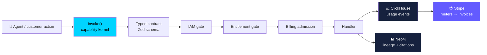
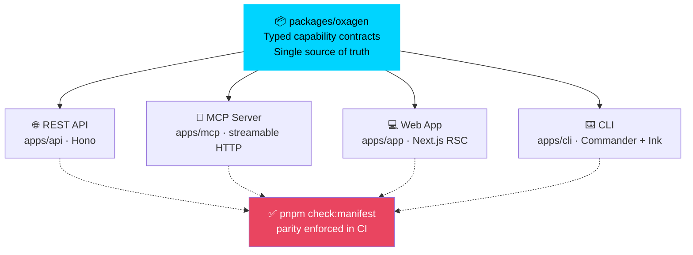

```text
═══════════════════════════════════════════════════════════════════════
        ██████╗  ██╗  ██╗ █████╗  ██████╗ ███████╗███╗   ██╗
        ██╔═══██╗╚██╗██╔╝██╔══██╗██╔════╝ ██╔════╝████╗  ██║
        ██║   ██║ ╚███╔╝ ███████║██║  ███╗█████╗  ██╔██╗ ██║
        ██║   ██║ ██╔██╗ ██╔══██║██║   ██║██╔══╝  ██║╚██╗██║
        ╚██████╔╝██╔╝ ██╗██║  ██║╚██████╔╝███████╗██║ ╚████║
        ╚═════╝ ╚═╝  ╚═╝╚═╝  ╚═╝ ╚═════╝ ╚══════╝╚═╝  ╚═══╝
═══════════════════════════════════════════════════════════════════════
```

# Oxagen Platform

> **The metered, governed, graph-grounded control plane for teams that build and resell AI agents — the neutral Stripe for agents.**

<p align="center">
  <a href="https://github.com/oxageninc/oxagen-platform/actions/workflows/pipeline.yml">
    
  </a>
  <a href="https://github.com/oxageninc/oxagen-platform/actions/workflows/vision-gate.yml">
    
  </a>
  
  
  
  
  
  
  
</p>

> [Vision](docs/VISION.md) · [Contributing](CONTRIBUTING.md) · [Security](SECURITY.md) · [Support](SUPPORT.md) · [Agents Guide](AGENTS.md) · [Telemetry](TELEMETRY.md)

---

## What Is Oxagen?

Companies that build and resell AI agents have no infrastructure layer of their own. Observability tools show them their spend; nothing lets them **meter what their agents actually did and bill their customers for it**. Agent frameworks give them orchestration; nothing makes every tool call **governed, typed, and un-poisonable by construction**. RAG stacks give them retrieval; nothing grounds agent answers in a **cited, time-aware knowledge graph** they can defend to an enterprise buyer.

Oxagen is that layer. It owns the intersection no incumbent bundles:

1. **Governance** — every capability on the platform is a typed contract with IAM and entitlement enforcement, exposed with parity across API, MCP, CLI, and UI. There is no ungoverned tool surface; MCP tools are inherently schema-enforced and metered, which is a structurally stronger answer to tool poisoning than gateway inspection.
2. **Grounding** — a Neo4j knowledge graph plus ontology grounds agent answers in cited, time-aware context. Accuracy is the product; citations are the proof.
3. **Monetization** — a ClickHouse→Stripe loop turns observed agent usage directly into customer billing. Not a spend dashboard: revenue infrastructure for teams reselling AI.

The knowledge graph is the **accuracy moat**. Vendor-neutral BYOK — your model keys, your Neo4j endpoint, no cloud gravity — is the **trust moat**.

The full positioning, market analysis, and drift tests live in [`docs/VISION.md`](docs/VISION.md). It is the north star for every feature decision, and CI enforces it: the **Vision Gate** ([`vision-gate.yml`](.github/workflows/vision-gate.yml), `pnpm check:vision`) LLM-judges every PR diff against the vision and posts an advisory verdict.



**Every action is governed. Every token is metered. Every answer is cited. Every step is billable.**

---

## How It Works

### The capability kernel

Every feature on the platform is a **capability**: a dot-notation name (`chat.message.send`, `workflow.run`, `semantic.edge.suggest`) declared once as a typed contract in `packages/oxagen/src/contracts/` and dispatched through a single `invoke()` path. The kernel injects three gates on every call — IAM policy resolution, plugin entitlement, and billing admission — and emits metering and lineage as a side effect of execution, not as optional instrumentation.

Capabilities are exposed with **parity across four surfaces**: the REST API (`apps/api`), the MCP server (`apps/mcp`), the CLI (`apps/cli`), and the web app (`apps/app`). `pnpm check:manifest` verifies the parity; nothing ships as a one-off endpoint or an ungoverned tool.



### The metering→billing loop

Every `invoke()` call, agent step, and LLM call (all LLM traffic goes through `@oxagen/ai`, never raw SDK imports) emits usage events into ClickHouse: org, workspace, user, run, model, tokens, duration, surface. Those events price against Stripe meters (`pnpm billing:stripe-sync`), so a team reselling agents can meter observed usage and bill *their* customers through it. Fan-out primitives (`agent.subagent.dispatch` / `agent.subagent.aggregate`) carry the same discipline into fleets: every subagent step emits typed lineage plus cost.

### The knowledge graph

Connectors ingest fragmented sources (SaaS apps, databases, documents, events) through a universal pipeline into a per-workspace Neo4j graph governed by an ontology. Agents query it through governed capabilities (`ontology.query`, `ontology.neighbors`) and answer with **citations to nodes and edges carrying time-aware validity** — inspectable in the UI down to the property bag. Ingestion dual-writes: Postgres holds the operational record (sync cursors, connection health), Neo4j holds the graph index, ClickHouse observes the telemetry.

### Vendor neutrality

Model resolution goes through `modelIdOf()` and an AI gateway — no hard-coded vendor slugs. Customers bring their own model keys and their own Neo4j endpoint. No feature may couple the platform to a single cloud or model vendor where a neutral abstraction exists; the Vision Gate flags it as drift.

---

## Monorepo Layout

```
oxagen-platform/
├── apps/
│   ├── api          REST API + Inngest handler (Hono) — api.oxagen.sh
│   ├── app          Next.js web app (App Router, RSC) — app.oxagen.sh
│   ├── mcp          MCP server (streamable HTTP at /mcp) — mcp.oxagen.sh
│   ├── cli          Developer CLI + coding agent (Commander + Ink)
│   ├── docs         Documentation site (Fumadocs) — docs.oxagen.sh
│   ├── schemas      JSON Schema hosting, generated from Zod — schemas.oxagen.sh
│   └── web          Public website — oxagen.sh
│
├── packages/
│   ├── oxagen       Capability kernel, contracts, IAM resolution (source of truth)
│   ├── handlers     Built-in capability handler implementations
│   ├── agent        Agent runtime & tool dispatch
│   ├── agent-engine Agent execution engine (planning, steps, fleet coordination)
│   ├── ai           LLM access layer — all model calls go through here (metered)
│   ├── billing      Credit gate, usage metering, Stripe meter/ledger sync
│   ├── database     Drizzle schemas + Atlas migrations (Postgres)
│   ├── ontology     Neo4j schema, indexes, graph query layer
│   ├── telemetry    ClickHouse client + event schemas
│   ├── tenancy      Tenant scoping (RLS seam) — withTenantDb / runInTenantScope
│   ├── iam          Roles, permissions, policy seeds
│   ├── auth         Better Auth integration
│   ├── plugins      Plugin registry + entitlement gating
│   ├── ingestion    Universal connector pipeline
│   ├── inngest-functions  Durable background jobs
│   ├── ui           Component system (@oxagen/ui)
│   └── …            code-graph, compliance, config, crypto, engram, functions,
│                    github, mcp-config, notifications, prompt-templates,
│                    sandbox, skills, storage, and more
│
├── tools/scripts    Dev orchestration, CI checks (manifest, vision gate)
└── docs/            VISION.md, capability registry, ADRs, architecture
```

---

## Four-Store Architecture

Storage boundaries are hard architectural law (see [`AGENTS.md`](AGENTS.md) and `docs/adr/`):

| Store | Holds | Never holds |
|---|---|---|
| **PostgreSQL** | Transactional state: users, orgs, IAM, billing, configs, job metadata | Analytics, graph relationships |
| **Neo4j** | Graph data: ontology entities, relationships, workflow lineage, agent memory | Transactional state, counters |
| **ClickHouse** | Append-only runtime events: usage, logs, metrics, traces, token analytics | Mutable state, graph data |
| **Blob storage** | Binary assets (reference row lives in Postgres) | — |

Tenant isolation is enforced at every layer: Postgres RLS (raw `db()` is banned — `withTenantDb` / `withSystemDb` / `scopedSession` only), ClickHouse predicates, per-workspace Neo4j scoping.

---

## Getting Started

### Prerequisites

- **Node.js** 24+ LTS (`node -v`)
- **pnpm** 11+ (`npm i -g pnpm`) — the repo pins `pnpm@11.7.0` via `packageManager`
- **Docker** (local Postgres :5433, Neo4j :7687, ClickHouse :8123)

### 5-Minute Setup

```bash
git clone https://github.com/oxageninc/oxagen-platform.git
cd oxagen-platform

cp .env.example .env.local    # fill in required values
pnpm install
pnpm env:check                # validate .env.local against the env registry

pnpm dev                      # Docker + migrations + all apps
```

Open `http://localhost:3000`. When you're done: `pnpm kill` (add `-- --volumes` for a full reset).

### Access Points

| Surface | Local | Production |
|---|---|---|
| **Web App** | `http://localhost:3000` | `https://app.oxagen.sh` |
| **API** | `http://localhost:4000` | `https://api.oxagen.sh` |
| **MCP** | `http://localhost:4100/mcp` | `https://mcp.oxagen.sh/mcp` |
| **Docs** | `http://localhost:3300` | `https://docs.oxagen.sh` |

MCP connects over streamable HTTP; org + workspace scope is carried by the API key.

---

## The `oxagen` CLI

Running `oxagen` with no args opens an interactive TUI (`OXAGEN_NO_TUI=1` or any subcommand/pipe keeps classic behavior). Install from the working tree with live rebuilds:

```bash
pnpm cli:dev          # build → install `oxagen` to PATH → watch + auto-rebuild
pnpm cli:install      # one-shot install, no watcher
```

```bash
oxagen --help
oxagen login                    # browser OAuth + PKCE; oxagen logout to clear the session
oxagen "summarize this repo"    # one-shot agent prompt (omit the prompt for the interactive TUI)
```

The CLI supports a local BYOK mode (no platform login) via `AI_GATEWAY_API_KEY` or `ANTHROPIC_API_KEY`. It collects anonymous, allowlist-validated usage telemetry — see [`TELEMETRY.md`](TELEMETRY.md) for the exact disclosure and one-command opt-out. Full command reference: [`apps/cli/README.md`](apps/cli/README.md).

---

## Development Workflow

`main` is a shared, contested branch worked in parallel by multiple humans and agents. **Never commit or push directly to `main`.**

```bash
git fetch origin                                # sync first
git switch main && git rebase origin/main       # if origin/main is ahead
git switch -c feat/<slug>                       # cut your branch
git push -u origin feat/<slug>                  # push it immediately
# … commit small, push often, open a PR (draft early is fine) …
pnpm gate                                       # full local gate before marking ready
gh run watch                                    # confirm CI green
```

### The gate

`pnpm gate` runs the same checks as CI: ESLint (zero warnings) → TypeScript (strict, no `any`) → unit tests (coverage ratchets, capped at 90) → build → `check:manifest` (API↔MCP parity) → `check:contracts` → env check → migration lint. CI additionally runs the **Vision Gate**, which judges the PR diff against [`docs/VISION.md`](docs/VISION.md).

### Quality rules

- **New code requires new tests.** Coverage thresholds are ratchets — they only go up.
- **New user-facing flows require E2E tests** in `apps/app/e2e/` with screenshots of success states.
- **New capabilities require the full parity stack**: contract → API route → MCP tool → CLI command → docs. See [`CONTRIBUTING.md`](CONTRIBUTING.md) for the step-by-step.
- **Nothing merges unverified.** Test output, CI status, or a rendered result — always proof, never "should work."

---

## Documentation

| Resource | Path |
|---|---|
| **Vision & positioning** | [`docs/VISION.md`](docs/VISION.md) |
| **Capability registry** | [`docs/capabilities/`](docs/capabilities/) |
| **Architecture & ADRs** | [`docs/adr/`](docs/adr/) |
| **Agent/contributor architecture guide** | [`AGENTS.md`](AGENTS.md) |
| **Database schemas** | [`packages/database/`](packages/database/) |
| **API routes** | [`apps/api/src/routes/v1/`](apps/api/src/routes/v1/) |
| **MCP tools** | [`apps/mcp/src/tools/`](apps/mcp/src/tools/) |
| **CLI telemetry disclosure** | [`TELEMETRY.md`](TELEMETRY.md) |

---

## Tech Stack

| Layer | Technology | Why |
|---|---|---|
| **Frontend** | Next.js 16 + React 19 | App Router, streaming RSC, Turbopack |
| **API** | Hono | Type-safe routes, zero-overhead middleware |
| **AI** | Vercel AI SDK via `@oxagen/ai` | Streaming, structured output, metered + vendor-neutral |
| **Transactional DB** | PostgreSQL 16 | ACID, RLS, Drizzle + Atlas migrations |
| **Graph** | Neo4j 5+ | Ontology, lineage, vectors, time-aware facts |
| **Analytics** | ClickHouse | Append-only usage events → Stripe meters |
| **Billing** | Stripe | Meters, ledgers, customer invoicing |
| **Jobs** | Inngest | Durable workflows, retries, scheduling |
| **Auth** | Better Auth | Passkeys, OAuth, org/workspace RBAC |
| **Storage** | Vercel Blob via `@oxagen/storage` | Signed URLs, Postgres reference rows |
| **Language** | TypeScript 6 | Strict mode, no `any` |
| **Testing** | Vitest + Playwright | Fast unit, real-browser E2E |

---

## Security

Security posture in brief: typed contracts with deny-by-default IAM on every capability, tenant isolation across all four stores, BYOK secrets that never leave your control, and full audit lineage on every invocation. To report a vulnerability, see [`SECURITY.md`](SECURITY.md) — please do not open public issues for security reports.

---

## License

**Proprietary.** Copyright © 2024–present Oxagen Inc. All rights reserved. See [`LICENSE`](LICENSE).

---

<div align="center">

### Meter it. Govern it. Ground it. Bill it.

[**Web App**](https://app.oxagen.sh) · [**API**](https://api.oxagen.sh) · [**Docs**](https://docs.oxagen.sh) · [**GitHub**](https://github.com/oxageninc/oxagen-platform)

Made with ❤️ by the Oxagen team.

</div>
