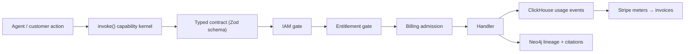
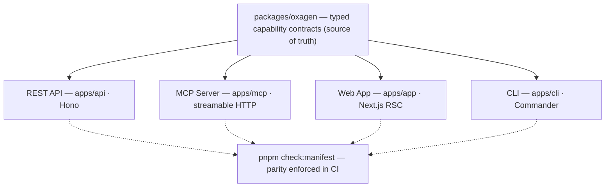

# Oxagen Platform

The control plane that teaches, governs, explains, and learns from every AI agent an enterprise runs.

<p align="center">
  <a href="https://github.com/macanderson/oxagen/actions/workflows/pipeline.yml">
    
  </a>
  <a href="https://github.com/macanderson/oxagen/actions/workflows/vision-gate.yml">
    
  </a>
  
  
  
  
  
  
  
</p>

> [Vision](docs/VISION.md) · [Contributing](CONTRIBUTING.md) · [Security](SECURITY.md) · [Support](SUPPORT.md) · [Agents Guide](AGENTS.md) · [Telemetry](TELEMETRY.md)

---

## What It Does

Oxagen combines three concerns that agent frameworks, observability tools, and RAG stacks each handle separately:

1. **Governance** — every capability is a typed contract with IAM and entitlement enforcement, exposed with parity across API, MCP, CLI, and UI. There is no ungoverned tool surface; MCP tools are schema-enforced and metered.
2. **Grounding** — a Neo4j knowledge graph plus ontology grounds agent answers in cited, time-aware context.
3. **Explain and meter** — every run is saved as one trace (who asked, what it read, what it changed, what proved it, what it cost), and a ClickHouse→Stripe loop prices the platform by use, per governed action.

The platform is vendor-neutral: bring your own model keys and your own Neo4j endpoint.

The full positioning and drift tests live in [`docs/VISION.md`](docs/VISION.md). CI enforces it via the **Vision Gate** ([`vision-gate.yml`](.github/workflows/vision-gate.yml), `pnpm check:vision`), which LLM-judges every PR diff against the vision and posts an advisory verdict.



---

## How It Works

### The capability kernel

Every feature is a **capability**: a verb-first snake_case name (`send_message`, `query_ontology`, `get_ontology_neighbors`; ADR-025) declared once as a typed contract in `packages/oxagen/src/contracts/` and dispatched through a single `invoke()` path. The kernel injects three gates on every call — IAM policy resolution, plugin entitlement, and billing admission — and emits metering and lineage as a side effect of execution.

Capabilities are exposed with parity across four surfaces: the REST API (`apps/api`), the MCP server (`apps/mcp`), the CLI (`apps/cli`), and the web app (`apps/app`). `pnpm check:manifest` verifies the parity.



### The metering→billing loop

Every `invoke()` call, agent step, and LLM call (all LLM traffic goes through `@oxagen/ai`, never raw SDK imports) emits usage events into ClickHouse: org, workspace, user, run, model, tokens, duration, surface. Those events price against Stripe meters (`pnpm billing:stripe-sync`), so spend resolves to a workspace, an agent, a rule, and a run instead of to one monthly total. The run-ledger (`packages/run-ledger`) carries the same discipline into externally-run agent fleets: evidence ingress (`client_attested`, e.g. Stella's drain) records every run, attempt, and event with typed lineage plus cost — Oxagen governs and rates the trace, it never re-runs it (ADR-043).

### The knowledge graph

Connectors ingest fragmented sources (SaaS apps, databases, documents, events) through a universal pipeline into a per-workspace Neo4j graph governed by an ontology. Agents query it through governed capabilities (`query_ontology`, `get_ontology_neighbors`) and answer with citations to nodes and edges carrying time-aware validity, inspectable in the UI down to the property bag. Ingestion dual-writes: Postgres holds the operational record (sync cursors, connection health), Neo4j holds the graph index, ClickHouse observes the telemetry.

### Vendor neutrality

Model resolution goes through `modelIdOf()` and an AI gateway — no hard-coded vendor slugs. Customers bring their own model keys and their own Neo4j endpoint. No feature may couple the platform to a single cloud or model vendor where a neutral abstraction exists; the Vision Gate flags it as drift.

---

## Monorepo Layout

```
oxagen/
├── apps/
│   ├── api          REST API + Inngest handler (Hono) — api.oxagen.sh
│   ├── app          Next.js web app (App Router, RSC) — app.oxagen.sh
│   ├── mcp          MCP server (streamable HTTP at /mcp) — mcp.oxagen.sh
│   ├── cli          Governance-operations CLI (Commander; no agent loop — ADR-043)
│   ├── docs         Documentation site (Fumadocs) — docs.oxagen.sh
│   └── web          Public website (static, no build step) — oxagen.sh
│
├── packages/        (30 workspace packages)
│   ├── oxagen       Capability kernel, contracts, IAM resolution (source of truth)
│   ├── handlers     Built-in capability handler implementations
│   ├── agent        Governed in-app Q&A turn loop, MCP tool gateway, agent registry handlers
│   ├── run-ledger   Durable run/attempt/event/seal evidence ledger (was agent-runner)
│   ├── run-evidence CGP frame normalisation + RFC-8785 canonical digests for evidence
│   ├── tacho        Wrapper that records, gates and evidences agents Oxagen does not run
│   ├── rules        Workspace decision-rules gate inside the kernel's invoke() chain
│   ├── ai           LLM access layer — all model calls go through here (metered)
│   ├── billing      Credit gate, usage metering, Stripe meter/ledger sync
│   ├── database     Drizzle schemas + Atlas migrations (Postgres)
│   ├── ontology     Neo4j schema, indexes, graph query layer
│   ├── engram       Agent memory substrate (content-addressed, consolidated, decaying)
│   ├── context-provider  Serves a workspace's memory as Context Graph Protocol frames
│   ├── telemetry    ClickHouse client + event schemas + circuit breaker
│   ├── tenancy      Tenant scoping (RLS seam) — withTenantDb / runInTenantScope / data planes
│   ├── iam          Roles, permissions, policy seeds
│   ├── auth         Better Auth integration
│   ├── plugins      Plugin registry, entitlement gating, OAuth, workspace credentials
│   ├── ingestion    Universal connector pipeline
│   ├── functions    Provider-agnostic durable-function contracts
│   ├── inngest-functions  Inngest adapter + the durable background jobs
│   ├── ui           Component system (@oxagen/ui)
│   └── …            compliance, config, crypto, github, glob, mcp-config,
│                    notifications, storage
│
│   (ADR-043 removed the agent runtime: agent-engine, agent-worker, sandbox,
│   skills, agent-artifacts, and stella-engine-client packages are gone.)
│
├── tools/           scripts (dev orchestration, CI checks), env-manager, codemods
└── docs/            VISION.md, capability registry, ADRs, SCRs, specs
```

---

## Four-Store Architecture

Storage boundaries are enforced (see [`AGENTS.md`](AGENTS.md) and `docs/adr/`):

| Store | Holds | Never holds |
|---|---|---|
| **PostgreSQL** | Transactional state: users, orgs, IAM, billing, configs, job metadata | Analytics, graph relationships |
| **Neo4j** | Graph data: ontology entities, relationships, workflow lineage, agent memory | Transactional state, counters |
| **ClickHouse** | Append-only runtime events: usage, logs, metrics, traces, token analytics | Mutable state, graph data |
| **Blob storage** | Binary assets (reference row lives in Postgres) | — |

Tenant isolation is enforced at every layer: Postgres RLS (raw `db()` is banned — `withTenantDb` / `withSystemDb` / `scopedSession` only), ClickHouse predicates, per-workspace Neo4j scoping.

---

## Getting Started

### Prerequisites

- **Node.js** 24+ LTS (`node -v`)
- **pnpm** 11+ (`npm i -g pnpm`) — the repo pins `pnpm@11.7.0` via `packageManager`
- **Docker** (local Postgres :5433, Neo4j :7687, ClickHouse :8123)

### Setup

```bash
git clone https://github.com/macanderson/oxagen.git
cd oxagen

cp .env.example .env.local    # fill in required values
pnpm install
pnpm env:check                # validate .env.local against the env registry

pnpm dev                      # Docker + migrations + all apps
```

Open `http://localhost:3000`. When you're done: `pnpm kill` (add `-- --volumes` for a full reset).

### Access Points

| Surface | Local | Production |
|---|---|---|
| **Web App** | `http://localhost:3000` | `https://app.oxagen.sh` |
| **API** | `http://localhost:4000` | `https://api.oxagen.sh` |
| **MCP** | `http://localhost:4100/mcp` | `https://mcp.oxagen.sh/mcp` |
| **Docs** | `http://localhost:3300` | `https://docs.oxagen.sh` |

MCP connects over streamable HTTP; org + workspace scope is carried by the API key.

---

## The `oxagen` CLI

A thin governance-operations CLI over the platform API: spend ceilings and cost, run traces, knowledge-graph search, agent memory, environments, the credential vault, audit logs. It makes no LLM calls and runs no agent loop — the coding agent this CLI used to ship moved to Stella (ADR-043), and every retired command is kept as a stub that prints exactly that. Install from the working tree with live rebuilds:

```bash
pnpm cli:dev          # build → install `oxagen` to PATH → watch + auto-rebuild
pnpm cli:install      # one-shot install, no watcher
```

```bash
oxagen --help
oxagen login          # browser-based PKCE login; oxagen logout to clear the session
oxagen budget         # spend ceilings; oxagen cost, oxagen trace, oxagen graph search, oxagen memory, oxagen secret, oxagen env
```

It collects anonymous, allowlist-validated usage telemetry — see [`TELEMETRY.md`](TELEMETRY.md) for the disclosure and one-command opt-out (`oxagen telemetry off`). Full command reference: [`apps/cli/README.md`](apps/cli/README.md).

---

## Development Workflow

`main` is a shared branch worked in parallel by multiple humans and agents. **Never commit or push directly to `main`.**

```bash
git fetch origin                                # sync first
git switch main && git rebase origin/main       # if origin/main is ahead
git switch -c feat/<slug>                       # cut your branch
git push -u origin feat/<slug>                  # push it immediately
# … commit small, push often, open a PR (draft early is fine) …
pnpm gate                                       # full local gate before marking ready
gh run watch                                    # confirm CI green
```

### The gate

`pnpm gate` runs the same checks as CI against the packages changed since `origin/main`: ESLint (zero warnings) → TypeScript (strict, no `any`) → unit tests + coverage (ratchets, capped at 90) → build → `check:brand` → `check:manifest` (API↔MCP parity) → `check:ui-parity` → `check:mobile-parity` → `check:contracts` → `check:connector-schemas` → `check:contextgraph-fixtures` → `check:mcp-externals` → `env:check` → `db:lint-migrations` → `db:atlas-validate`. `pnpm gate:full` runs the same over every package and adds the Playwright e2e suite. CI additionally runs the SOC 2 audit-coverage check, the RLS and RDS integration jobs, and the **Vision Gate**, which judges the PR diff against [`docs/VISION.md`](docs/VISION.md).

### Quality rules

- **New code requires new tests.** Coverage thresholds are ratchets — they only go up.
- **New user-facing flows require E2E tests** in `apps/app/e2e/` with screenshots of success states.
- **New capabilities require the full parity stack**: contract → API route → MCP tool → CLI command → docs. See [`CONTRIBUTING.md`](CONTRIBUTING.md) for the step-by-step.
- **Nothing merges unverified.** Always include proof: test output, CI status, or a rendered result.

---

## Documentation

| Resource | Path |
|---|---|
| **Vision & positioning** | [`docs/VISION.md`](docs/VISION.md) |
| **Capability registry** | [`docs/capabilities/`](docs/capabilities/) |
| **Architecture & ADRs** | [`docs/adr/`](docs/adr/) |
| **Agent/contributor architecture guide** | [`AGENTS.md`](AGENTS.md) |
| **Database schemas** | [`packages/database/`](packages/database/) |
| **API routes** | [`apps/api/src/routes/v1/`](apps/api/src/routes/v1/) |
| **MCP tools** | [`apps/mcp/src/tools/`](apps/mcp/src/tools/) |
| **CLI telemetry disclosure** | [`TELEMETRY.md`](TELEMETRY.md) |

---

## Tech Stack

| Layer | Technology | Notes |
|---|---|---|
| **Frontend** | Next.js 16 + React 19 | App Router, streaming RSC, Turbopack |
| **API** | Hono | Type-safe routes |
| **AI** | Vercel AI SDK via `@oxagen/ai` | Streaming, structured output, metered + vendor-neutral |
| **Transactional DB** | PostgreSQL 16 | ACID, RLS, Drizzle + Atlas migrations |
| **Graph** | Neo4j 5+ | Ontology, lineage, vectors, time-aware facts |
| **Analytics** | ClickHouse | Append-only usage events → Stripe meters |
| **Billing** | Stripe | Meters, ledgers, customer invoicing |
| **Jobs** | Inngest | Durable workflows, retries, scheduling |
| **Auth** | Better Auth | Passkeys, OAuth, org/workspace RBAC |
| **Storage** | Vercel Blob via `@oxagen/storage` | Signed URLs, Postgres reference rows |
| **Language** | TypeScript 6 | Strict mode, no `any` |
| **Testing** | Vitest + Playwright | Unit + browser E2E |

---

## Deployment

Everything ships to AWS account `578673726240` on merge to `main`, from the
`deploy-web` and `deploy-node` jobs at the bottom of
`.github/workflows/pipeline.yml`. There is no hosting dashboard in the path and
no stored AWS key.

This replaced Vercel, whose account was suspended over an unpaid balance —
every site behind it answers `402`. Vercel is not a fallback and nothing here
may depend on it.

| App | Where it runs | Hostname |
| --- | --- | --- |
| `apps/web` | S3 + CloudFront | `oxagen.sh` |
| `apps/docs` | Node on the shared instance | `docs.oxagen.sh` |
| `apps/app` | Node on the shared instance | `app.oxagen.sh` |
| `apps/api` | Node on the shared instance | `api.oxagen.sh` |
| `apps/mcp` | Node on the shared instance | `mcp.oxagen.sh` |

Four of the five are processes on one EC2 instance rather than functions,
because three of them reach Postgres, Neo4j and ClickHouse over `127.0.0.1`.
Those ports are bound to loopback and the security group opens nothing to them,
so a VPC-attached Lambda would need a NAT gateway costing more per month than
everything else in this account combined. Caddy on the instance terminates TLS
and routes by hostname.

### Packaging

`tools/scripts/package-for-node.sh <service>` builds one app and lays it out as
an artifact, writing `dist-deploy/<service>/oxagen-run.json` — the manifest the
instance reads to learn which image to start, on which port, with which command,
and where to read its configuration. The four services are packaged in genuinely
different ways (Next standalone, an esbuild bundle, an xmcp bundle plus a
`pnpm deploy` install), and that script is where the differences are readable
next to each other.

Run it locally the same way CI does:

```bash
tools/scripts/package-for-node.sh api
```

### Four things that will bite

- **The instance is `arm64`** (a `t4g.medium`). `deploy-node` runs on
  `ubuntu-24.04-arm` for that reason. An artifact built on an x86 runner
  installs and tests green and then fails to load a native module at first
  request.
- **`STANDALONE=1` is required for the Next apps.** `apps/docs` and `apps/app`
  emit `output: standalone` only under that flag. Without it there is no
  `.next/standalone` and nothing to package.
- **`environment: production` is load-bearing.** Both deploy jobs exchange a
  GitHub OIDC token for a session on `gha-deploy-oxagen-platform`, which trusts
  exactly `repo:macanderson/oxagen:environment:production`. Removing the
  line breaks the deploy rather than loosening it.
- **`deploy-web` syncs with `--delete`.** This repository is the source of truth
  for that bucket. Anything added to it out of band is removed on the next
  merge.

### Configuration and secrets

Runtime configuration comes from Parameter Store under `/oxagen/production/`,
read by the instance when the container starts — not baked into the artifact, so
rotating a secret is a parameter write plus a restart rather than a rebuild, and
no secret rides in a tarball built by CI. `apps/docs` is given no prefix at all:
it renders MDX and holds no credentials.

`NEXT_PUBLIC_*` values are the exception. They are compiled into the client
bundle, so they are build inputs and are set in the workflow. Only the three
hostnames are set today; PostHog, the Stripe publishable key and Google Maps are
not wired, and those features degrade until they are.

### Rollback

The instance keeps the last three releases per service. If a new one does not
answer its health check within 60 seconds, the container and the `current`
symlink go back to the previous release — and the job still fails, so a merge
that boots red shows up red rather than quietly serving old code. Deploys are
serialized (`max-parallel: 1`) because all four land on the same 4 GB instance,
alongside the three databases.

The infrastructure, the node-side script and the `oxagen-run.json` contract live
in this repository under [`infra/`](infra/) — `infra/stacks-new/ci-deploy/`,
`infra/tools/node/` and `infra/tools/caddy/`. They used to live in a separate
`oxagen-aws-infra` repository; that repository is archived, and the OIDC trust
policy on `gha-infra-apply` names this one, so `infra/` here is the only place
production infrastructure can be changed from.


## Security

Typed contracts with deny-by-default IAM on every capability, tenant isolation across all four stores, BYOK secrets, and audit lineage on every invocation. To report a vulnerability, see [`SECURITY.md`](SECURITY.md) — please do not open public issues for security reports.

---

## License

**Proprietary.** Copyright © 2024–present Oxagen Inc. All rights reserved. See [`LICENSE`](LICENSE).
