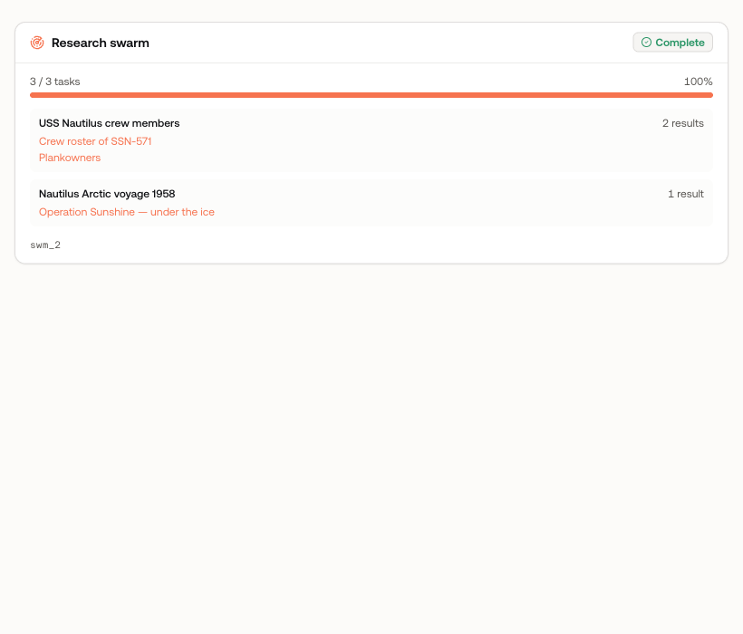
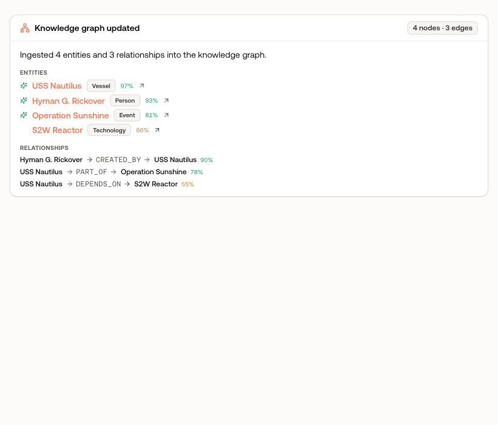
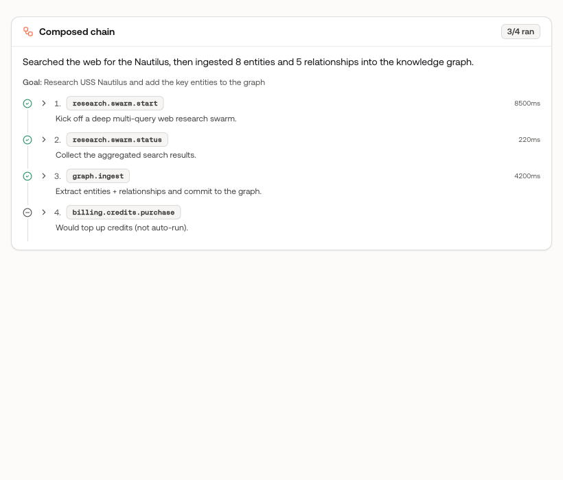
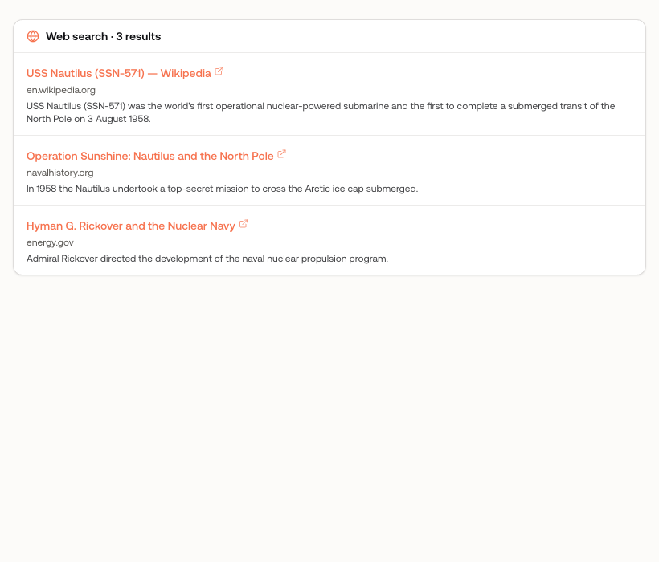
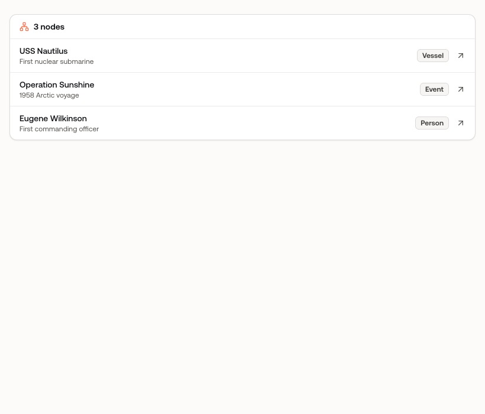
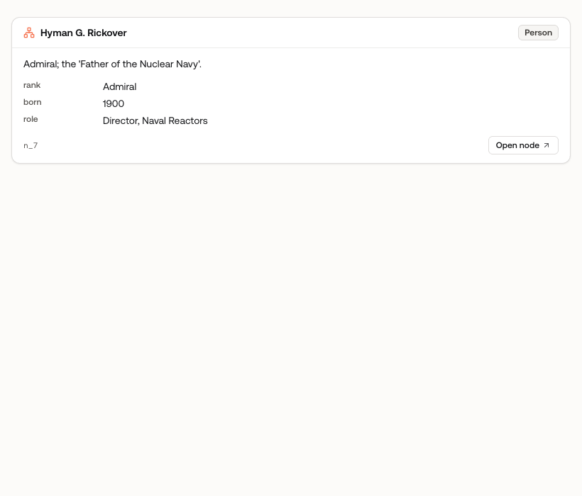
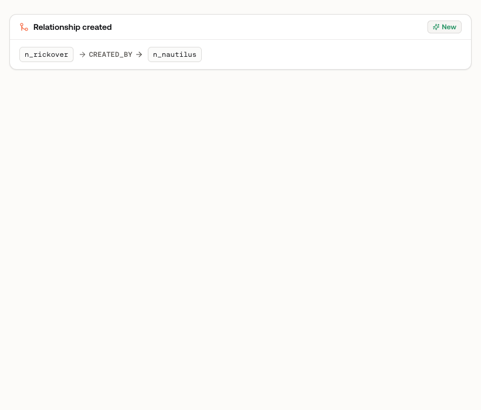
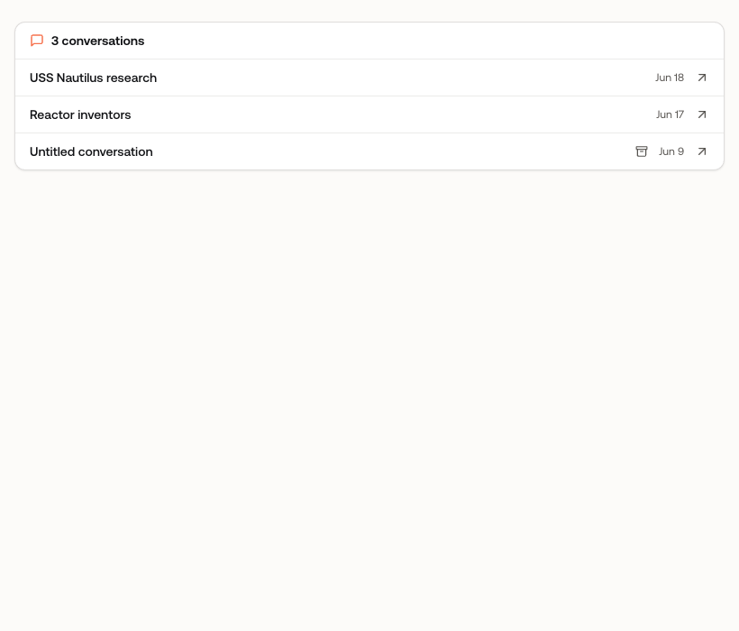
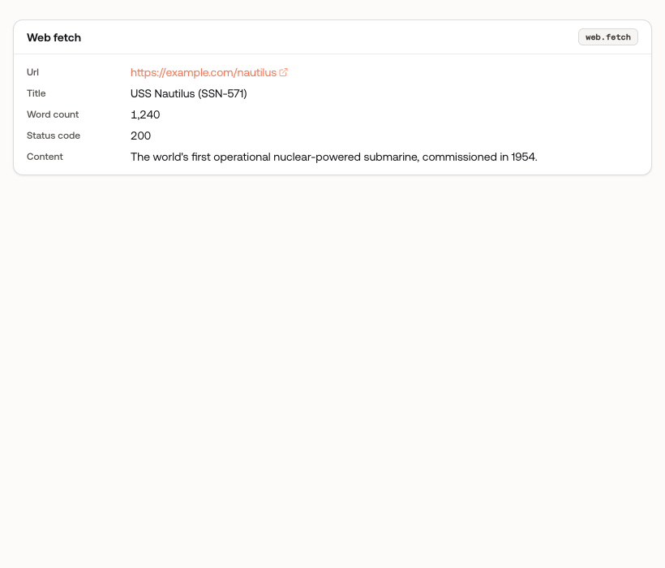

# Chat capability component screenshots

Rendered from Storybook (`apps/app/.storybook`) — the generative-UI layer that
maps a capability's output to a typed, deep-linked React component so the user
never sees raw JSON. Regenerate by running `pnpm --filter @oxagen/app storybook`
and capturing each story's `iframe.html?id=…` view.

| Component | Renders | Screenshot |
| --- | --- | --- |
| `research-swarm-card` | `research.swarm.start` / `.status` — live progress + the actual web-search hits per query (links) |  |
| `graph-ingest-card` | `graph.ingest` — extracted entities + relationships with confidence labels, deep-linked nodes |  |
| `capability-chain-card` | `agent.compose` — the composed chain with per-step status + expandable input/output |  |
| `web-search-card` | `web.search` — ranked results with title, domain, snippet |  |
| `graph-node-list-card` | `graph.node.list` / `.search` — nodes deep-linked to detail pages |  |
| `graph-node-card` | `graph.node.get` / `.upsert` — a single node with properties + open link |  |
| `graph-edge-card` | `graph.edge.upsert` — relationship with deep-linked endpoints |  |
| `conversation-list-card` | `conversation.list` — conversations deep-linked to their chat pages |  |
| `capability-result` | generic fallback — any capability's output as typed key/value + record links |  |
