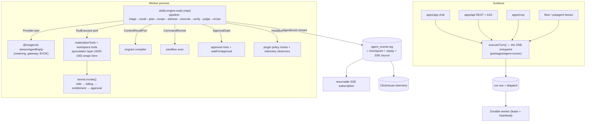

# Agent Engine V2 — Stella core, Oxagen governance

**Status:** proposed (ADR-033). **Date:** 2026-07-18. **Owner:** Mac Anderson.
**Companions:** `plan.md` (phases + exit criteria), `README.md` (index).

The one-sentence version: **Stella supplies the engine, Oxagen remains the
law.** The Rust core that already exists, benches well, and is property-tested
becomes the platform's turn driver; every side effect it requests still flows
through the capability kernel, the sandbox, engram, and billing — none of which
Stella has and all of which are the platform's moat.

---

## 1. Where we are (evidence, not vibes)

An audit of the live code (2026-07-18, `main` @ a4331a985) found:

| # | Finding | Evidence |
|---|---------|----------|
| 1 | The judged pipeline never runs in production. Evaluate→enhance→route→execute→judge→revise exists (`packages/agent-engine/src/pipeline/index.ts`, 1,968 lines) but only the CLI and `agent.repo.edit` call `runTurn`. Chat, REST, and A2A call bare `runCodingAgent`. | `apps/app/src/app/api/v1/chat/stream/route.ts:40,1579`; `apps/api/src/routes/v1/chat.stream.ts:442`; `apps/api/src/routes/a2a/bridge.ts:517`; `packages/handlers/src/agent.repo.edit.ts:102` |
| 2 | No durability. Turn state is an in-memory `conversation` array inside a request-scoped stream; disconnect/timeout loses the turn. No checkpoint, no resume, anywhere in the loop path. `chat.persist-stream` only mirrors the *final* output after the fact. | `packages/agent-engine/src/engine.ts:306`; `route.ts:700` (1,856-line handler); `packages/inngest-functions/src/functions/chat.persist-stream.ts` |
| 3 | No hook/event bus. "Hooks" are three fixed log-only functions; blocking policy is the hardcoded kernel gate order (IAM → billing → entitlement). Plugins cannot register policy; extending policy means editing `kernel.ts` (1,183 lines, six module-global injected singletons). | `packages/agent/src/hooks/runtime.ts:45-48`; `packages/oxagen/src/kernel.ts:504` |
| 4 | Tool parallelism is inherited and unguarded. The AI SDK fires each tool call without awaiting ("we don't await the tool execution here"), so calls in a step run concurrently — with no cap and no read/write distinction. Parallel `write_file` + `bash` can interleave in the sandbox. | `ai@7.0.14` (the engine's resolved version) `src/generate-text/execute-tools-from-stream.ts:200-205`; same behavior in `ai@6.0.224` `run-tools-transformation.ts:351-386` |
| 5 | Compaction fires on a chars/4 estimate with no feedback loop; overflow is caught reactively. | `packages/agent-engine/src/loop-driver.ts:158`; `engine.ts:644` |
| 6 | Loop control is nudge-by-prompt (inject a corrective message after 3 repeats) plus a 256-step backstop; no structured loop verdict. | `loop-driver.ts:34,43,49,67` |
| 7 | Cost/budget is priced outside the engine; estimate (rate-card) vs. actual (billing ledger) can drift per caller. | `packages/agent-engine/src/types.ts:394-410` |

What is genuinely strong and must not be disturbed:

- **The capability kernel** — `invoke()` over ~300 Zod contracts with IAM,
  billing admission, entitlement, and approval gates; surface parity across
  API/MCP/CLI/UI (`packages/oxagen/src/kernel.ts:504`, `_invokeCore:545`).
- **`materializeTools`** — capabilities → governed AI-SDK tools with approval
  waits, consent, metering, and OTEL (`packages/agent/src/runtime/materialize-tools.ts:303`).
- **Engram** — episodic+graph memory with a token-budgeted context compiler,
  hybrid retrieval, consolidation (`packages/engram`).
- **Sandbox drivers** (Modal/Vercel/Docker), **edit-integrity** (hash-anchored,
  syntax-gated edits), **ADR-030 speculation**, **replay record-v1**
  (`packages/replay`), and the engine's own DI ports (`agent-engine/src/ports.ts`).

## 2. The reference bar (what "elite" looks like in Stella)

Stella (`macanderson/stella`, Rust 2024, MIT OR Apache-2.0) is layered
`stella-protocol` (pure types) ← `stella-core` (step driver) ← `stella-pipeline`
(staged orchestration) ← host. All I/O is behind injected traits; all decision
logic is pure, synchronous, and property-tested. The ideas worth importing, in
priority order:

1. **Deterministic-first verification ladder** (`stella-pipeline/src/verify.rs`).
   A *flip oracle* — `None→Failing→Flipped` keyed on a normalized test command —
   where only a fail→pass flip of the *same* command counts as verified.
   Evidence ladder: touched-tests-red → revise (no judge); flip+green+in-budget →
   **SubmitFast** (judge skipped — cost win); anything inconclusive → model
   judge, which sees goal+diff+evidence, never the worker transcript. This is
   ADR-021's doctrine implemented at engine level, and it structurally kills
   the "it passed, ship it" false positive that ADR-029 chases heuristically.
2. **Witness authoring with tamper exclusion** (`stella-pipeline/src/witness.rs`).
   Before execution, an independent model writes the *failing* test that
   defines "done" (checked to actually fail). The worker can see it —
   convergence comes from iterating against it — and integrity comes from
   fingerprinting the witness files: if they changed at verify time, the flip
   degrades to inconclusive. SWE-bench-grade rigor, minimal machinery.
3. **Structured tool dispatch** (`stella-core/src/driver.rs:702-759`).
   Consecutive read-only calls run concurrently (`buffer_unordered`, cap 8);
   every mutating call is a serial barrier; results re-ordered to call order
   for deterministic history. The `read_only` flag lives on the tool schema
   (`stella-protocol/src/tool.rs:17`), default false — safe direction.
4. **The hook bus** (`stella-core/src/bus.rs`). Observers (`on`, `:549`) and
   blocking policy (`on_blocking`, `:579`) over an 87-name dotted catalog with
   an explicit 9-name interceptable allowlist. Verdicts:
   `Allow / Deny{reason} / RequireApproval{reason} / Modify{payload}` (`:360`).
   Panicking policy handler fails **closed**; panicking observer is isolated.
   Payload hygiene built in (secret scan, sensitive-path detection, sanitized
   payloads for observers).
5. **Token-drift self-calibration** (`stella-core/src/estimator.rs`). Every step
   emits the raw pre-call estimate alongside the provider's actual; a
   per-model `CalibrationMap` corrects future compaction thresholds. The
   estimator *measures its own error* instead of trusting chars/4.
6. **One event vocabulary** (`stella-protocol/src/event.rs`). ~30-variant
   `AgentEvent` enum; the stream-json output format is literally the serialized
   enum; nothing user-visible derives from state not in the stream. `StageKind`
   (`event.rs:22`) — Triage, ContextRecall, Plan, ScopeReview, **Witness**,
   Execute, Verify, Judge, Reflect, ContextWrite, Complete — is the canonical
   stage vocabulary.
7. **Reliability invariants as architecture**: retry only around the model call
   (never tools); deferred event flush so retried steps never double-emit
   (Oxagen's engine independently converged on this — good sign); budget checks
   between steps, never mid-tool; per-provider circuit breaker with explicit
   `ProviderFallback` events (no silent model switch); empty/truncated-turn
   guard; prompt-cache discipline (byte-stable system prefix, volatile recall
   as a following message, schemas sorted).
8. **`ReadOnlyTools` capability view** (`stella-core/src/ports.rs:28`): the
   judge gets real evidence-gathering with a structurally enforced no-mutation
   guarantee — same registry, restricted at execution time.

Known Stella weaknesses (we are not importing a myth): the bus is only emitted
from the tool registry today (no general lifecycle host); there is no resume
*reader* despite resume-ready design (`&mut messages`, full event persistence);
cancellation is host-level future-drop. §6 turns each of these into an upstream
work item — and the platform integration is itself the "general host" the bus
has been missing.

## 3. Options considered

| Option | Reuse of tested code | Ops fit | Latency | Drift risk | Verdict |
|--------|---------------------|---------|---------|-----------|---------|
| **A. Embed via napi-rs** (`stella-engine-node`) | Full — flip oracle, ladder, witness, bus, calibration as-is | Ships as a node module inside the (new) worker; prebuilt binaries | In-process FFI, negligible vs. network I/O | Low — one engine, two hosts | **Chosen** |
| B. Rust sidecar (JSONL `AgentEvent` + reverse tool-call RPC) | Full | New stateful service; every tool/model callback becomes IPC/HTTP | Per-call network hop (ports are chatty) | Low | Fallback — same port surface, transport swappable |
| C. TS re-implementation of the designs | None — rewrite + retest | No new runtime | n/a | High — permanent two-engine drift | Rejected as end-state; Track 1 ports the *architecture* only |

Decisive factors for A: the Stella core is I/O-free by construction, which is
exactly the shape napi embeds well (TS implements the ports, Rust owns the
loop); the durable worker we need *anyway* (finding #2) is a natural native-
module host, sidestepping serverless build pain; and one shared engine means
CLI bench wins (arena/SWE-bench) transfer to the platform verbatim.

## 4. Target architecture



**The sovereignty rule.** The engine never gains ambient authority. Every tool
call it dispatches re-enters `kernel.invoke()` with the full gate stack;
IAM/billing/entitlement/approval stay exactly where they are. Kernel gates are
*defense in depth* below the bus — a bus `Deny` short-circuits earlier and
cheaper, but removing the bus must never weaken the platform's guarantees.

### 4.1 Port mapping

| Stella port (trait) | Platform implementation | Notes |
|---|---|---|
| `Provider` (`stella-protocol/src/provider.rs:14`) | Adapter over `streamAgentReply` (`@oxagen/ai`) | Metering/billing per step preserved. The adapter receives a delta sink so Text/Reasoning deltas surface as engine events; classify errors into Stella's taxonomy (`Transport/RateLimited/Auth/Malformed/Terminal`) at the adapter — classification at the source, never re-derived. |
| `ProviderResolver` (`stella-pipeline/src/ports.rs:31`) | Model router / market router | Role-based (`Worker/Triage/Plan/Judge` — `stella-protocol/src/role.rs`). The verified-outcome market router (`docs/specs/verified-outcome-router/`) plugs in here *unchanged* — and gains flip-oracle verdicts as its verified-history evidence source. |
| `ToolExecutor` (`stella-core/src/ports.rs:12`) | One executor wrapping the materialized tool set | `schemas()` from materialized tools + workspace tools; `execute()` = the existing closures (approval wait, `invoke()`, metering, OTEL, consent — untouched). Map `read_only` from capability metadata (sensitivity `low` + no mutation semantics) to unlock partitioned concurrency; default false. MCP naming already agrees (`mcp__<server>__<tool>` in both systems). |
| `ContextRecallPort` (`stella-pipeline/src/ports.rs:70`) | Engram context compiler (`compile`/`pack`) | Engram is *stronger* than Stella's workspace-memory — keep it. Recall rides as a volatile user message after the byte-stable system prefix (both systems already follow this cache discipline independently). |
| `CommandRunner` (`stella-pipeline/src/ports.rs:143`) | Sandbox exec (`ModalSandboxWorkspace.exec` et al.) | Witness + flip-oracle test runs execute inside the tenant sandbox. Diff/status ports likewise back onto `workspace.diff()`. |
| `ApprovalGate` (`stella-pipeline/src/ports.rs:172`) | `createApprovalRequest` + `waitForApproval` | Scope review above blast-radius thresholds becomes a real HITL approval row. Headless without bypass = hard error (Stella semantics: never silent auto-approve). |
| `HookBus` (`stella-core/src/bus.rs`) | The new platform extension surface | See §4.4. |
| `Clock`/`Sleeper` | Trivial impls | Injected for testability, as upstream. |
| `stella-core::hooks` (shell hooks) | **Explicitly not used server-side** | Tenant-supplied shell commands in the worker are a non-starter; the bus + kernel gates cover policy. CLI keeps them. |
| `stella-store` (SQLite) | **Not used server-side** | Persistence is the platform's: `agent_events` (Postgres) + ClickHouse. The store stays a CLI concern. |

### 4.2 Durable turn runner (engine-independent; Track 1)

New `packages/agent-runner`:

- **`executeTurn(runSpec)`** — the single entrypoint. Chat, REST, A2A, MCP,
  and fleet all construct a `RunSpec` (tenant ctx, goal, workspace binding,
  tool policy, budget, model pins) and call it. The 1,856-line route shrinks to
  parse-request → `executeTurn` → subscribe-SSE.
- **Run records:** `agent_runs` row + append-only `agent_events` log (Postgres,
  `UNIQUE(run_id, seq)` — mirroring Stella's `events` table discipline). The
  event log is *canonical*: SSE is a replayable subscription (client reconnect
  = resume from last seq), ClickHouse ingestion tails it, and ADR-028 replay
  reads it instead of a parallel recorder. Large payloads (tool outputs, diffs)
  go to content-addressed blobs (`packages/replay`'s `RecordStore` pattern).
- **Workers:** a small pool of long-lived Node processes (the napi host).
  Claim via `FOR UPDATE SKIP LOCKED` + lease heartbeat — the exact pattern
  `agent.execute-subagent.ts` already uses. Inngest keeps dispatch, cancel
  (`cancelOn`), lease-sweep, and post-run projection duties. A crashed worker's
  runs are re-claimed and **resumed from the last checkpoint**.
- **Checkpoints:** after every committed engine step, persist
  `(messages_digest, budget_state, oracle_state, calibration_state)` alongside
  the event append (one transaction). Cheap because messages are append-mostly;
  blobs are content-addressed.
- **Cancellation:** user cancel → Inngest cancel event → worker aborts the run
  future (Stella-style structured drop), marks the run `cancelled`, closes the
  tool_use/tool_result pairing with synthetic errors (Stella's
  budget-overshoot discipline, `driver.rs:542-572`).

This track alone fixes findings #2 and #1's fragmentation, works with the
*current* TS engine, and is the seam the Rust core swaps into.

### 4.3 The embedded engine (`stella-engine-node`; Track 2)

New crates in the Stella repo (consumed here as a pinned git dep, like the OCP
crates were):

- `stella-engine` — a facade over `stella-core` + `stella-pipeline` exposing a
  **step-scoped** API for external checkpointing:
  `TurnState::new(spec) → engine.run_step(&mut state) → StepOutcome`
  (today's `Engine::run_turn` at `driver.rs:275` owns the whole loop; the
  phase functions are already separate — extraction, not redesign).
- `stella-engine-node` — napi-rs bindings. TS surface (sketch):

```ts
import { createEngine } from "@stella/engine-node";

const engine = createEngine({
  pipeline: { stages: "auto", witness: true, scopeThresholds, maxRevisions: 2 },
  provider: {                     // Provider port — JS callbacks
    complete: (req, deltaSink) => agentAi.stream(req, deltaSink),
  },
  tools: {                        // ToolExecutor port
    schemas: () => materializedSchemas,      // incl. readOnly flags
    execute: (name, input) => materializedExecute(name, input),
  },
  recall: (query, budget) => engram.compile(query, budget),
  commandRunner: (cmd) => sandbox.exec(cmd),
  approvalGate: (review) => approvals.requestAndWait(review),
  onEvent: (evt: AgentEvent) => eventLog.append(evt),   // serde-stable JSON
});

let state = engine.newTurn(spec, resumedCheckpoint /* optional */);
while (true) {
  const outcome = await engine.runStep(state);  // one committed step
  await checkpoints.save(state.serialize(), eventLog.seq);
  if (outcome.done) break;
}
```

- Callbacks are napi `ThreadsafeFunction`s returning promises; the engine's
  tokio runtime lives in the addon; one engine instance per run, many runs per
  worker process.
- **Typed events end-to-end:** generate TS types from the `AgentEvent` enum
  (ts-rs or schemars → JSON Schema → zod) so `translate-stream` consumes typed
  events. Stella's `replay.rs::validate_stream` (stage-ordering, tool pairing,
  single terminal Complete, monotonic budget) runs in CI as a conformance gate
  over recorded platform streams.
- Prebuilt binaries: linux-x64-gnu, linux-arm64-gnu, darwin-arm64 (worker
  image + local dev). Note: org Actions is billing-locked (2026-07); builds are
  produced from the Stella repo's CI or locally until that clears.

### 4.4 Tool plane details

- **Partitioned dispatch (fixes finding #4).** The engine's driver partitions
  consecutive read-only calls into concurrent groups (cap 8) with mutating
  calls as serial barriers (`driver.rs:702-759`). Because dispatch moves into
  the engine, the AI SDK's unbounded fire-and-forget path is no longer load-
  bearing. *Track 1 interim:* add the same semantics in `engine.ts` (cap +
  mutating barrier over `MUTATING_TOOL_NAMES`) so production is safe before the
  swap.
- **Speculation (ADR-030) survives.** It wraps the ToolSet; the `ToolExecutor`
  adapter wraps the speculation layer. **Immediate addition:** `code_graph`
  joins `SPECULATABLE_TOOLS` (`speculate/layer.ts:35`) for its four
  deterministic operations (`search`, `file_symbols`, `dependents`, `imports`)
  with predictor rules: `read_file`/`grep` on a path → prefetch
  `file_symbols`/`dependents` for it; `code_graph` results listing paths →
  prefetch `read_file` of top hits. `semantic_search` stays out of prefetch
  (each speculation would spend an embedding call on a prediction that may
  never be consumed); cache-serving it is fine. Existing
  invalidate-all-on-mutation already covers graph-vs-FS staleness
  conservatively.
- **Judge evidence via `ReadOnlyTools`.** The judge/verify stages get the same
  registry through the read-only view — real evidence-gathering, structural
  no-mutation guarantee, no approval prompts triggered by a judge.

### 4.5 Verification plane in production

- Code-mode runs (chat code-binding, `agent.repo.edit`, fleet, PR-fix) get the
  full ladder: witness authoring when no test command exists → execute →
  deterministic verify (flip oracle + tamper exclusion, tests run via sandbox
  `CommandRunner`) → SubmitFast on flip / bounded revise on red / judge only on
  inconclusive. Distress guidance (one judge steer after 2 consecutive
  deterministic failures) comes along free.
- Non-code chat gets the cheap front half: triage (hard latency ceiling,
  deterministic fallback — `pipeline.rs:575`), recall, optional plan, scope
  review mapped to approvals. Judge/revise off by default for conversational
  turns.
- **Product tie-in:** every flip-oracle verdict is exactly the "verified
  outcome" the market router (`docs/specs/verified-outcome-router/`) needs as
  ground truth. The engine becomes the evidence source for priced accuracy
  SLAs; ADR-029's mutation gate is absorbed rather than duplicated.

### 4.6 Hook bus as the platform extension surface

- The worker attaches the bus and becomes the "general host" Stella lacks:
  session/model/tool lifecycle events emitted onto it, plus the tool-registry
  events already wired upstream.
- **Plugins gain a `policyHooks` contribution** (manifest-declared, alongside
  `contracts`): JS handlers registered via `on_blocking` on the 9-name
  interceptable set (`tool.call.requested`, `file.*`, `command.started`,
  `git.*`, `deployment.requested`, `pull_request.requested`). Verdict mapping:
  `Deny` → tool error surfaced to the model; `RequireApproval` → existing
  approval row + wait; `Modify` → payload rewrite (e.g., tenant redaction).
  Fail-closed semantics come from upstream (`bus.rs:666-677`).
- Observers replace the three hardcoded hooks: ClickHouse `execution_logs`,
  `tool_invocations`, engram capture, and graph-sync all become bus observers —
  sanitized payloads by construction (`bus.rs:954`), secret-scan events for
  free (`bus.rs:891`).

## 5. Keep / retire

| Keep (platform moat) | Retire (after parity gate) |
|---|---|
| Capability kernel + gates, `materializeTools`, approvals/consent | `pipeline/index.ts` (1,968 lines: evaluate/enhance/judge/revise) |
| Engram (as `ContextRecallPort`), sandbox drivers, edit-integrity | `engine.ts` loop internals + `loop-driver.ts` heuristics (compaction, loop-nudges, retry classification move into the engine) |
| ADR-030 speculation layer (wrapped, now incl. `code_graph`) | Route-inlined turn logic in the three god-handlers |
| Market/model router (as `ProviderResolver`) | `router/` tier plumbing that duplicates resolver duties |
| `packages/replay` blob store + bisect/distill (re-pointed at the event log) | Bespoke `translate-stream` state once typed `AgentEvent` lands (it becomes a thin projection) |

## 6. Upstream work in Stella (coordination-cheap: same owner)

1. `stella-engine` facade + `run_step` state-scoped API (checkpointable turns).
2. `stella-engine-node` napi crate + prebuilt binaries + npm publish.
3. Serde-stable `AgentEvent` → TS codegen.
4. Bus lifecycle emitters from the host side (or blessed `emit_named` helpers) —
   closes "bus is only emitted from the tool registry."
5. Cancellation token through `run_step` (retiring dead
   `ProviderError::Cancelled`) — or documented future-drop semantics.
6. Close the circuit-breaker feedback loop in the pipeline path
   (`record_success/record_failure` wiring — noted open at `pipeline.rs:30-36`).
7. Multi-run hosting review: engine instances are per-run and cheap, but audit
   `stella-tools` global state (file-touch mutex) for per-instance isolation.

## 7. Risks

| Risk | Mitigation |
|---|---|
| napi async-callback complexity (ThreadsafeFunction + promises both ways) | Smallest possible surface (6 callbacks); Option B sidecar shares the identical port contract as escape hatch |
| Native builds in CI while org Actions is billing-locked | Build from the Stella repo's CI / locally; prebuilds vendored into the worker image |
| Event-schema drift between repos | Codegen + `validate_stream` conformance gate in CI; pin Stella by git rev |
| Checkpoint serialization cost | Content-addressed blobs; checkpoint = digest + small state structs, amortized per step, not per event |
| Rust bus + JS handlers = cross-language policy debugging | Every verdict is an `AgentEvent` in the log; policy decisions are replayable by construction |
| Team Rust capacity | The platform side writes TS (ports + worker); Rust changes are upstream in Stella where the engine work already lives |
| Regression vs. current behavior | Shadow mode + arena/SWE-bench parity gate before any surface flips (see `plan.md`) |

## 8. Open questions

1. Worker substrate: dedicated pool (Fly/Railway/ECS) vs. Inngest
   step-per-engine-step. Recommendation: dedicated pool (per-step serverless
   fights the in-process engine and adds cold-start latency per step); Inngest
   keeps dispatch/cancel/sweep. Needs an infra decision.
2. Does fleet subagent fanout move onto `stella-fleet`'s wave scheduler, or
   stay on graph-mediated Inngest fanout? (Default: stay; revisit after Track 2.)
3. Public npm (`@stella/engine-node`) vs. private registry for the binding.
   Stella is MIT/Apache — public is fine and is good OCP-ecosystem marketing.
4. Per-tenant bus policy (tenant-authored guardrails, not just plugin-authored)
   — powerful, but needs a sandboxing story for tenant JS. Deferred.
