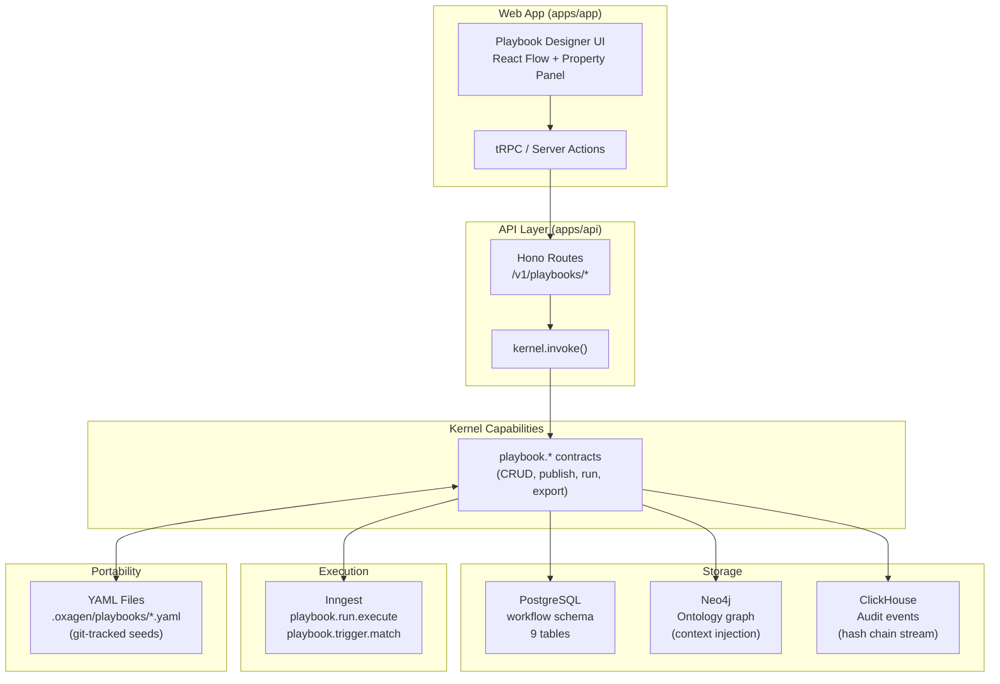
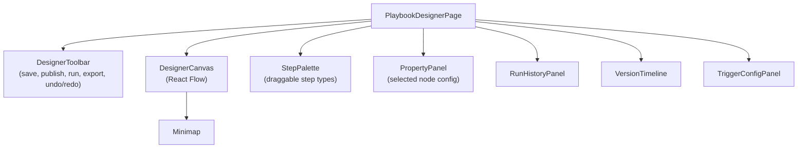
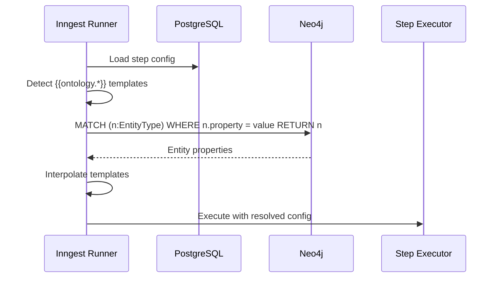
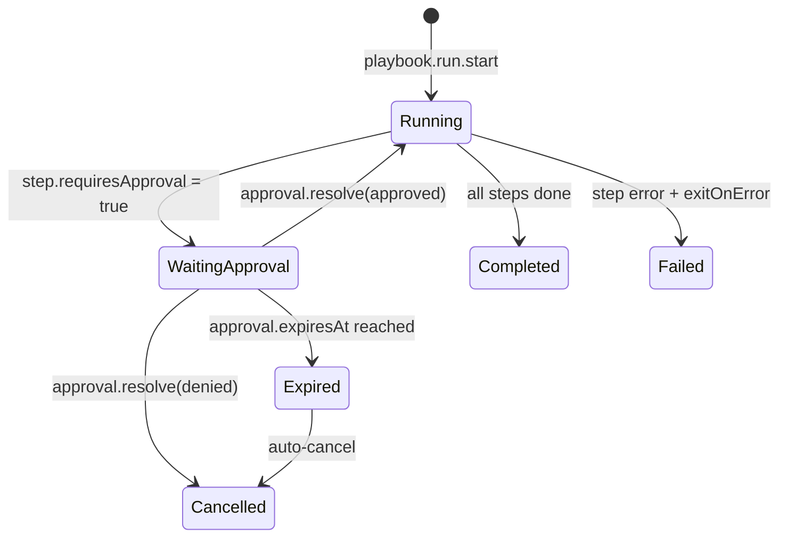
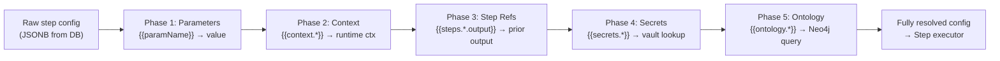

# Playbook Designer

Archived spec & plan — status: not started (audited 2026-07-03).

> **Status: Not started** — verified against the codebase on 2026-07-03 by an automated audit.
>
> The Playbook Designer spec is a comprehensive product document outlining a visual workflow editor with YAML export/import, ontology integration, and marketplace features. While the foundational playbook database schema (9 tables) and Inngest execution infrastructure exist, none of the spec's core designer deliverables have been implemented. No playbook-specific capability contracts, API routes, MCP tools, UI components, YAML serialization logic, or CLI commands are present. The spec remains in draft status with no implementation work started.

**Implementation evidence**

- packages/database/src/schema/workflow.ts - 9-table playbook schema (playbooks, versions, steps, edges, triggers, runs, step_runs, events, approvals) as foundational infrastructure
- packages/inngest-functions/src/functions/playbook.run.execute.ts - Inngest execution engine for running playbooks
- packages/inngest-functions/src/functions/playbook.trigger.match.ts - Trigger matching logic
- docs/specs/playbook-designer/SPEC.md - Complete spec document (draft status, created 2026-06-16)
- apps/docs/content/docs/specs-and-plans/playbook-designer.mdx - Archived spec in docs (marked unverified 2026-07-03)

**Known gaps at time of archive**

- Playbook capability contracts (playbook.list, playbook.get, playbook.create, playbook.update, playbook.delete, version, step, edge, run, approval operations)
- API routes for /v1/playbooks/* endpoints
- MCP tools for playbook operations
- Visual designer UI components (PlaybookDesignerPage, React Flow canvas, StepPalette, PropertyPanel, VersionTimeline, TriggerConfigPanel, Minimap)
- YAML schema validation and serialization code (PlaybookYamlSchema, type definitions, serializers)
- Zustand designer store and state management
- Database tables: playbook_parameters, playbook_canvas_state, playbook_marketplace_listings
- Additional database columns (display_config, notes, yaml_source_path, last_synced_at, sync_direction)
- Seed playbooks directory (.oxagen/playbooks/)
- CLI commands (oxagen playbook push/pull)
- React Flow dependency and canvas rendering infrastructure

**Source documents** (archived verbatim below)

- `docs/specs/playbook-designer/SPEC.md`

## Spec — `SPEC.md`

## Playbook Designer — Product & Engineering Spec

> **Status**: Draft  
> **Author**: Product & Engineering  
> **Created**: 2026-06-16  
> **Target Release**: v0.5.0  
> **Inspired by**: [cc-wf-studio](https://github.com/breaking-brake/cc-wf-studio) visual workflow editor

---

### 1. Executive Summary

The Playbook Designer is a visual, web-native workflow editor embedded in the Oxagen
application that allows users to author, version, test, and deploy automation playbooks.
Unlike the inspiration project (cc-wf-studio, a VSCode extension that exports Markdown
for AI coding agents), our designer is a **server-rendered, multi-tenant, enterprise-grade
workflow builder** that:

1. Stores playbooks as **portable YAML** files (trackable in git, shippable as seed content)
2. Persists the canonical graph in **Postgres** (immutable versions, RLS-scoped)
3. Leverages the **Ontology Knowledge Graph** (Neo4j) to inject entity context into steps
4. Provides **SOC 2-compliant audit** via hash-chained event spine
5. Supports a **Marketplace** for sharing playbooks across organizations

This document covers the product vision, data model enhancements, YAML format specification,
API surface, UI architecture, and phased delivery plan.


---

### 2. Problem Statement

#### Current State
- 9-table Drizzle schema exists (`workflow` pgSchema) with steps, edges, triggers, runs, events
- Inngest execution engine handles tool/agent/prompt/condition/webhook step types
- Hash-chained audit event spine (SOC 2 ready)
- **No API routes** wired to the playbook tables
- **No visual builder** — UI page says "coming soon"
- **No YAML portability** — playbooks are database-only, not trackable in source control
- **No ontology integration** — steps cannot query the knowledge graph for context

#### User Pain Points
| Persona | Pain |
|---------|------|
| Platform Engineer | Cannot version playbooks in git alongside IaC |
| SOC 2 Auditor | No visual diff of playbook changes between versions |
| Solutions Architect | Cannot share proven playbooks across customer deployments |
| AI Operator | Cannot inject knowledge graph context (entity properties) into step prompts |
| Security Lead | No approval-gate visibility before playbook goes live |

#### Success Criteria
- Users can visually design playbooks with drag-and-drop in the web app
- Playbooks export to / import from a well-specified YAML format
- Seed playbooks ship in the repository and auto-provision on workspace creation
- Every published version is immutable with a SHA-256 graph hash
- Steps can reference ontology entities and inject their properties at runtime
- Approval workflows pause execution and notify designated reviewers


---

### 3. Architecture Overview




---

### 4. YAML Playbook Format Specification

#### 4.1 Design Principles

| Principle | Rationale |
|-----------|-----------|
| Human-readable YAML | Engineers can review playbooks in PRs without specialized tooling |
| Single-file self-contained | One `.yaml` = one playbook (no cross-file references for portability) |
| Deterministic serialization | Canonical key order enables meaningful git diffs |
| Schema-versioned | `schemaVersion` field allows non-breaking evolution |
| Position-optional | Canvas positions are metadata; execution semantics are edge-based |

#### 4.2 File Location Convention

```
.oxagen/
  playbooks/
    monthly-kg-audit.yaml        # seed playbook (shipped to customers)
    new-source-onboarding.yaml
    billing-anomaly-check.yaml
  playbooks.lock                 # SHA-256 manifest of deployed versions
```

#### 4.3 YAML Schema (v1.0.0)

```yaml
# .oxagen/playbooks/monthly-kg-audit.yaml
schemaVersion: "1.0.0"

metadata:
  name: Monthly Knowledge Graph Audit
  slug: monthly-kg-audit
  description: >
    Validates entity freshness, removes stale nodes older than 90 days,
    and generates a reconciliation report.
  version: "1.2.0"
  tags: [knowledge-graph, maintenance]
  visibility: workspace          # private | workspace | organization | marketplace
  author: platform-team
  requiresApproval: true

parameters:
  staleness_days:
    type: integer
    default: 90
    description: Days after which an entity is considered stale
    validation:
      minimum: 7
      maximum: 365
  report_channel:
    type: string
    default: "#kg-alerts"
    description: Slack channel for the reconciliation report

triggers:
  - type: schedule
    config:
      cron: "0 9 1 * *"        # First of month, 09:00 UTC
  - type: event
    config:
      entityType: knowledge_node
      eventType: node.stale_detected
      propertyConditions:
        - property: days_since_update
          operator: gt
          toValue: "{{staleness_days}}"

steps:
  - key: validate_freshness
    name: Validate Entity Freshness
    type: tool
    config:
      capability: ontology.entity.audit
      input:
        staleness_threshold: "{{staleness_days}}"
        workspace_id: "{{context.workspaceId}}"
    position: { x: 100, y: 100 }

  - key: check_stale_count
    name: Check Stale Count
    type: condition
    config:
      propertyConditions:
        - property: stale_count
          operator: gt
          toValue: 0
    position: { x: 300, y: 100 }

  - key: remove_stale_nodes
    name: Remove Stale Nodes
    type: tool
    config:
      capability: ontology.entity.bulk_archive
      input:
        entity_ids: "{{steps.validate_freshness.output.stale_entity_ids}}"
    exitOnError: true
    requiresApproval: true
    position: { x: 500, y: 50 }

  - key: generate_report
    name: Generate Reconciliation Report
    type: agent
    config:
      prompt: >
        Summarize the knowledge graph audit results.
        {{steps.validate_freshness.output.summary}}
        Stale nodes archived: {{steps.remove_stale_nodes.output.archived_count}}
      model: sonnet
    position: { x: 500, y: 200 }

  - key: notify_channel
    name: Notify Slack Channel
    type: webhook
    config:
      url: "{{secrets.SLACK_WEBHOOK_URL}}"
      method: POST
      headers:
        Content-Type: application/json
      body: |
        {
          "channel": "{{report_channel}}",
          "text": "{{steps.generate_report.output}}"
        }
    position: { x: 700, y: 100 }

edges:
  - from: validate_freshness
    to: check_stale_count
    type: default

  - from: check_stale_count
    to: remove_stale_nodes
    type: default
    condition: { passed: true }

  - from: check_stale_count
    to: generate_report
    type: conditional
    condition: { passed: false }

  - from: remove_stale_nodes
    to: generate_report
    type: default

  - from: generate_report
    to: notify_channel
    type: default
```


#### 4.4 Step Types Reference

| Step Type | Description | Config Shape |
|-----------|-------------|--------------|
| `tool` | Invokes a capability via the kernel | `{ capability, input }` |
| `agent` | Single-shot LLM completion | `{ prompt, model?, agentSlug? }` |
| `prompt` | Template interpolation + LLM | `{ prompt, model?, variables? }` |
| `condition` | Boolean gate on properties | `{ propertyConditions[] }` |
| `webhook` | HTTPS outbound call | `{ url, method, headers?, body? }` |
| `approval` | Human approval gate | `{ assignee?, role?, expiresIn? }` |
| `human_input` | Pause for user data entry | `{ formSchema, assignee? }` |
| `transform` | JQ/JSONata data transformation | `{ expression, inputPath }` |
| `loop` | Iterate over array output | `{ over, stepKeys[], maxIterations }` |
| `parallel` | Fan-out concurrent execution | `{ stepKeys[], joinStrategy }` |
| `delay` | Time-based pause | `{ duration, unit }` |
| `sub_playbook` | Invoke another playbook | `{ playbookSlug, input }` |
| `knowledge_search` | Query ontology graph | `{ query, entityType?, limit? }` |
| `code_execution` | Sandboxed script | `{ runtime, code, timeout? }` |

#### 4.5 Template Interpolation

Playbook YAML supports Mustache-style `{{...}}` interpolation:

| Expression | Resolves To |
|------------|-------------|
| `{{paramName}}` | Playbook parameter value |
| `{{context.orgId}}` | Runtime context field |
| `{{context.workspaceId}}` | Runtime context field |
| `{{context.userId}}` | Triggering user (null for event triggers) |
| `{{steps.<key>.output}}` | Output of a previously executed step |
| `{{steps.<key>.output.<field>}}` | Specific field from step output |
| `{{secrets.<KEY>}}` | Workspace secret (resolved at runtime, never persisted) |
| `{{ontology.<entityType>.<property>}}` | Ontology node property (v2) |
| `{{trigger.payload.<field>}}` | Trigger event payload field |

#### 4.6 Portability Contract

The YAML format is the **interchange format**. It supports:

1. **Export**: `playbook.export` capability serializes a DB playbook version to YAML
2. **Import**: `playbook.import` capability parses YAML, validates, and creates a draft version
3. **Seed**: On workspace creation, `seed-playbooks` Inngest job reads `.oxagen/playbooks/*.yaml`
4. **CLI**: `oxagen playbook push/pull` syncs between filesystem and workspace
5. **MCP**: `playbook.export` / `playbook.import` exposed as MCP tools


---

### 5. Data Model Enhancements

#### 5.1 Existing Schema (No Changes Required)

The current 9-table schema in `packages/database/src/schema/workflow.ts` is
well-designed and requires **no structural changes** for the designer. Key points:

- `playbook_steps.positionX` / `positionY` already support canvas layout
- `playbook_steps.config` JSONB holds typed step configuration
- `playbook_edges` with `edgeType` and `condition` support branching
- `playbook_versions` are immutable with `graphHash` for integrity
- `playbook_events` provides hash-chained audit spine

#### 5.2 New Table: `playbook_parameters`

```sql
-- Formal parameter declarations (runtime inputs to the playbook)
CREATE TABLE workflow.playbook_parameters (
  id              UUID PRIMARY KEY DEFAULT uuidv7(),
  playbook_version_id UUID NOT NULL REFERENCES workflow.playbook_versions(id),
  param_key       CITEXT NOT NULL,
  param_type      TEXT NOT NULL CHECK (param_type IN (
    'string','integer','number','boolean','array','object','secret'
  )),
  description     TEXT,
  default_value   JSONB,
  validation      JSONB,         -- { minimum, maximum, pattern, enum, ... }
  is_required     BOOLEAN NOT NULL DEFAULT true,
  display_order   INTEGER NOT NULL DEFAULT 0,
  created_at      TIMESTAMPTZ NOT NULL DEFAULT NOW(),

  UNIQUE (playbook_version_id, param_key)
);
```

#### 5.3 New Table: `playbook_canvas_state`

```sql
-- Ephemeral designer state (viewport, selection, draft edits)
-- This is NOT versioned — it's per-user working state
CREATE TABLE workflow.playbook_canvas_state (
  id              UUID PRIMARY KEY DEFAULT uuidv7(),
  org_id          UUID NOT NULL,
  workspace_id    UUID NOT NULL,
  playbook_id     UUID NOT NULL REFERENCES workflow.playbooks(id),
  user_id         UUID NOT NULL,
  viewport        JSONB NOT NULL DEFAULT '{"x":0,"y":0,"zoom":1}',
  selected_nodes  JSONB NOT NULL DEFAULT '[]',
  panel_state     JSONB NOT NULL DEFAULT '{}',
  updated_at      TIMESTAMPTZ NOT NULL DEFAULT NOW(),

  UNIQUE (playbook_id, user_id)
);
```

#### 5.4 New Table: `playbook_marketplace_listings`

```sql
-- Published playbooks available for cross-org installation
CREATE TABLE workflow.playbook_marketplace_listings (
  id              UUID PRIMARY KEY DEFAULT uuidv7(),
  org_id          UUID NOT NULL,
  playbook_id     UUID NOT NULL REFERENCES workflow.playbooks(id),
  version_id      UUID NOT NULL REFERENCES workflow.playbook_versions(id),
  title           TEXT NOT NULL,
  description     TEXT,
  category        TEXT NOT NULL,
  tags            JSONB NOT NULL DEFAULT '[]',
  install_count   INTEGER NOT NULL DEFAULT 0,
  is_verified     BOOLEAN NOT NULL DEFAULT false,
  is_featured     BOOLEAN NOT NULL DEFAULT false,
  published_at    TIMESTAMPTZ NOT NULL DEFAULT NOW(),
  unpublished_at  TIMESTAMPTZ,

  UNIQUE (playbook_id, version_id)
);
CREATE INDEX idx_marketplace_category ON workflow.playbook_marketplace_listings(category)
  WHERE unpublished_at IS NULL;
```

#### 5.5 New Column Additions

```sql
-- Add to playbook_steps for enhanced designer support
ALTER TABLE workflow.playbook_steps
  ADD COLUMN display_config JSONB DEFAULT '{}',  -- { color, icon, width, collapsed }
  ADD COLUMN notes TEXT;                         -- Designer-only annotation

-- Add to playbooks for YAML sync tracking
ALTER TABLE workflow.playbooks
  ADD COLUMN yaml_source_path TEXT,              -- e.g. ".oxagen/playbooks/monthly-kg-audit.yaml"
  ADD COLUMN last_synced_at TIMESTAMPTZ,
  ADD COLUMN sync_direction TEXT CHECK (sync_direction IN ('push', 'pull', 'bidirectional'));
```


---

### 6. Capability Contracts (API Surface)

All playbook operations are kernel capabilities — exposed identically across
API, MCP, App, and CLI surfaces.

#### 6.1 CRUD Capabilities

| Capability | Surface | Description |
|------------|---------|-------------|
| `playbook.list` | all | List playbooks (paginated, filterable) |
| `playbook.get` | all | Get playbook with active version details |
| `playbook.create` | all | Create new playbook (draft status) |
| `playbook.update` | all | Update playbook metadata |
| `playbook.delete` | all | Soft-delete playbook |
| `playbook.archive` | all | Move to archived status |

#### 6.2 Version & Graph Capabilities

| Capability | Surface | Description |
|------------|---------|-------------|
| `playbook.version.create` | all | Create new draft version (copies graph from active) |
| `playbook.version.get` | all | Get version with full graph (steps + edges) |
| `playbook.version.publish` | all | Publish draft → computes graphHash, immutable |
| `playbook.version.diff` | all | Diff two versions (added/removed/modified steps) |
| `playbook.version.rollback` | all | Set active version to a previous published version |

#### 6.3 Graph Editing Capabilities (Designer)

| Capability | Surface | Description |
|------------|---------|-------------|
| `playbook.step.create` | app, api | Add step to draft version |
| `playbook.step.update` | app, api | Update step config/position |
| `playbook.step.delete` | app, api | Remove step and connected edges |
| `playbook.step.reorder` | app, api | Bulk update positions |
| `playbook.edge.create` | app, api | Connect two steps |
| `playbook.edge.delete` | app, api | Remove edge |
| `playbook.edge.update` | app, api | Update edge condition |

#### 6.4 Execution Capabilities

| Capability | Surface | Description |
|------------|---------|-------------|
| `playbook.run.start` | all | Manually trigger a playbook run |
| `playbook.run.get` | all | Get run status + step run details |
| `playbook.run.list` | all | List runs (filterable by status) |
| `playbook.run.cancel` | all | Cancel a running/paused run |
| `playbook.run.resume` | all | Resume after approval granted |
| `playbook.approval.resolve` | all | Approve or deny a pending approval |

#### 6.5 Portability Capabilities

| Capability | Surface | Description |
|------------|---------|-------------|
| `playbook.export` | all | Export playbook version as YAML string |
| `playbook.import` | all | Import YAML → create playbook + draft version |
| `playbook.validate` | all | Validate YAML without persisting |
| `playbook.seed` | api | Bulk-import from `.oxagen/playbooks/` directory |

#### 6.6 Ontology Integration Capabilities

| Capability | Surface | Description |
|------------|---------|-------------|
| `playbook.context.resolve` | runner | Resolve `{{ontology.*}}` templates at runtime |
| `playbook.context.preview` | app, api | Preview resolved context for a step (dry-run) |


---

### 7. UI Architecture — Playbook Designer

#### 7.1 Component Hierarchy



#### 7.2 Technology Choices

| Concern | Choice | Rationale |
|---------|--------|-----------|
| Canvas | [React Flow](https://reactflow.dev/) v12 | Same as cc-wf-studio; proven for workflow UIs |
| State Management | Zustand | Lightweight, works with React Flow's node/edge state |
| Undo/Redo | Custom command stack | Playbook-specific operations (add step, move, connect) |
| Property Forms | React Hook Form + Zod | Matches existing oxagen patterns |
| Drag & Drop | React Flow's built-in + dnd-kit for palette | Native feel |
| Layout Algorithm | Dagre (auto-layout) | For initial import / "tidy" operation |
| Serialization | YAML via `yaml` npm package | Round-trip fidelity for playbook files |
| Real-time Sync | Optimistic updates + server confirm | No WebSocket needed for single-user editing |

#### 7.3 Node Types (Visual)

Each step type renders as a distinct node on the canvas:

| Node Type | Shape | Color | Icon |
|-----------|-------|-------|------|
| Tool | Rectangle | Blue | Wrench |
| Agent | Rectangle | Purple | Bot |
| Prompt | Rectangle | Amber | MessageSquare |
| Condition | Diamond | Gray | GitBranch |
| Webhook | Rectangle | Green | Globe |
| Approval | Hexagon | Orange | ShieldCheck |
| Human Input | Hexagon | Teal | UserCheck |
| Transform | Rectangle | Slate | Code |
| Loop | Rounded rect | Indigo | Repeat |
| Parallel | Rounded rect | Cyan | GitFork |
| Delay | Pill | Gray | Clock |
| Sub-playbook | Double-border rect | Pink | BookCopy |
| Knowledge Search | Rectangle | Emerald | Search |
| Code Execution | Rectangle | Dark | Terminal |

#### 7.4 Property Panel

The property panel renders contextually based on selected node type:

```
┌──────────────────────────────────┐
│ Step: Remove Stale Nodes         │
│ Type: Tool                       │
├──────────────────────────────────┤
│ Capability: ontology.entity.*    │ ← Autocomplete from registry
│ Input Mapping:                   │
│   entity_ids: {{steps.validate   │ ← Expression editor with
│     _freshness.output.stale_...}}│   autocomplete for step refs
├──────────────────────────────────┤
│ ☑ Exit on Error                  │
│ ☑ Requires Approval              │
│ Timeout: 30s                     │
│ Retry: { maxAttempts: 3 }        │
├──────────────────────────────────┤
│ Notes: This step archives nodes  │ ← Designer annotation
│ that haven't been updated...     │
└──────────────────────────────────┘
```

#### 7.5 Designer Features Matrix

| Feature | Phase 1 | Phase 2 | Phase 3 |
|---------|---------|---------|---------|
| Drag-and-drop step creation | ✅ | | |
| Edge drawing (click-to-connect) | ✅ | | |
| Property panel editing | ✅ | | |
| Undo / Redo | ✅ | | |
| Auto-layout (Dagre) | ✅ | | |
| Step palette with search | ✅ | | |
| Version timeline sidebar | ✅ | | |
| YAML export / import | ✅ | | |
| Run playbook from designer | | ✅ | |
| Live run visualization (step highlighting) | | ✅ | |
| Version diff (side-by-side) | | ✅ | |
| Approval gate configuration | | ✅ | |
| Ontology context picker | | ✅ | |
| Template expression autocomplete | | ✅ | |
| Collaborative editing (presence) | | | ✅ |
| AI-assisted playbook generation | | | ✅ |
| Marketplace publish / install | | | ✅ |
| Playbook testing / dry-run mode | | | ✅ |
| Custom step type plugins | | | ✅ |


---

### 8. Ontology Knowledge Graph Integration

#### 8.1 Context Injection Model

The killer differentiator: playbooks can query the knowledge graph at runtime
to inject entity context into step configurations. This is what made v1 a hit.



#### 8.2 Ontology Template Syntax

```yaml
# Query a specific entity by natural key
input:
  customer_name: "{{ontology.customer[natural_key='acme-corp'].name}}"
  contract_value: "{{ontology.contract[customer='acme-corp'].annual_value}}"

# Query entities matching conditions (returns array)
input:
  stale_entities: "{{ontology.knowledge_node[days_since_update > staleness_days]}}"

# Traverse relationships
input:
  owner_email: "{{ontology.service[name='auth-api'].owned_by.email}}"
```

#### 8.3 Knowledge Search Step Type

A dedicated step type for querying the ontology:

```yaml
- key: find_related_services
  name: Find Related Services
  type: knowledge_search
  config:
    query: |
      MATCH (s:Service)-[:DEPENDS_ON]->(d:Service)
      WHERE s.name = $service_name
      RETURN d.name, d.health_status
    parameters:
      service_name: "{{trigger.payload.service_name}}"
    limit: 50
    outputMapping:
      dependencies: result.rows
      unhealthy_count: "result.rows | filter(.health_status != 'healthy') | length"
```

#### 8.4 Designer Integration

The property panel provides an **Ontology Context Picker**:

1. User clicks "Insert Ontology Reference" in the expression editor
2. Picker shows available entity types from the workspace's ontology schema
3. User selects entity type → sees available properties
4. User can add filter conditions (property + operator + value)
5. Expression is inserted as `{{ontology.<type>[<filter>].<property>}}`

This is backed by the `ontology.schema.describe` capability (existing) which
returns the node types and property keys available in the workspace's graph.


---

### 9. Enterprise & SOC 2 Controls

#### 9.1 Audit Trail

Every playbook mutation is recorded in the hash-chained event spine:

| Event Type | Trigger |
|------------|---------|
| `playbook.created` | New playbook created |
| `playbook.version.published` | Version published (includes graphHash) |
| `playbook.version.rolled_back` | Active version changed |
| `playbook.run.started` | Run initiated (manual/event/schedule) |
| `playbook.step.approval_requested` | Approval gate reached |
| `playbook.step.approval_resolved` | Approval granted/denied |
| `playbook.run.completed` | Run finished successfully |
| `playbook.run.failed` | Run failed with error |
| `playbook.exported` | Playbook exported as YAML |
| `playbook.imported` | Playbook imported from YAML |
| `playbook.marketplace.published` | Listed on marketplace |

#### 9.2 Version Integrity

```
graphHash = SHA-256(
  canonical_json_sort(steps[].{stepKey, stepType, config}) +
  canonical_json_sort(edges[].{sourceStepKey, targetStepKey, edgeType, condition})
)
```

- Computed at publish time, stored on `playbook_versions.graph_hash`
- Verified before every run execution (detect tampering)
- Included in ClickHouse audit events for external verification

#### 9.3 Approval Workflows



- Approval requests are routable to specific users or IAM roles
- Configurable expiry (default 7 days, minimum 1 hour)
- Denial triggers a `run_cancelled` event with reason
- Emergency override requires `playbook.approval.override` permission

#### 9.4 Access Control (IAM)

| Permission | Grants |
|------------|--------|
| `playbook.read` | View playbooks and run history |
| `playbook.edit` | Create/modify draft versions |
| `playbook.publish` | Publish versions (separate from edit) |
| `playbook.run` | Manually trigger runs |
| `playbook.run.cancel` | Cancel running playbooks |
| `playbook.approval.resolve` | Approve/deny approval requests |
| `playbook.approval.override` | Bypass approval gates (emergency) |
| `playbook.delete` | Soft-delete playbooks |
| `playbook.export` | Export as YAML |
| `playbook.import` | Import from YAML |
| `playbook.marketplace.publish` | Publish to marketplace |

#### 9.5 Secrets Handling

- `{{secrets.*}}` references are resolved at runtime from the workspace secret store
- Secret values are **never** stored in playbook YAML or database config
- Secret references in YAML use the key name only: `{{secrets.SLACK_WEBHOOK_URL}}`
- The designer's property panel shows secret references as masked values
- Audit events log that a secret was accessed but never the value


---

### 10. Seed Playbooks & Marketplace

#### 10.1 Seed Strategy

New workspaces receive a curated set of playbooks from `.oxagen/playbooks/`:

```
.oxagen/playbooks/
  monthly-kg-audit.yaml
  new-source-onboarding.yaml
  stale-entity-cleanup.yaml
  billing-reconciliation.yaml
  competitor-monitoring.yaml
  security-posture-check.yaml
  data-quality-report.yaml
  connector-health-check.yaml
```

These are imported during workspace provisioning via the `playbook.seed` capability
triggered by the `workspace.created` Inngest event.

#### 10.2 Seed Lifecycle

1. Seed playbooks are committed to the repository (reviewed like code)
2. On deploy, a migration job detects new/updated seeds by comparing SHA-256
3. Updated seeds create new draft versions (never auto-publish to avoid breaking running automations)
4. Platform team reviews and publishes via the designer
5. `playbooks.lock` tracks deployed seed versions for drift detection

#### 10.3 Marketplace (Phase 3)

| Feature | Description |
|---------|-------------|
| Publish | Org publishes a verified playbook version to the marketplace |
| Browse | Users browse by category, tags, install count |
| Install | One-click install creates a copy in the target workspace |
| Fork | Installed playbooks are independent copies (no upstream sync) |
| Verify | Oxagen team reviews and badges verified playbooks |
| Revenue | Future: paid marketplace listings with rev-share |


---

### 11. Improvements Over cc-wf-studio

| cc-wf-studio | Oxagen Playbook Designer | Why Better |
|--------------|-------------------------|------------|
| VSCode-only (webview) | Web-native (any browser) | No IDE dependency; accessible to non-engineers |
| JSON workflow files | YAML with formal schema | Human-readable, git-diff friendly, PR reviewable |
| Exports to Markdown for AI agents | Executes directly via Inngest | Real execution engine with retries, approval, audit |
| No persistence layer | Multi-tenant Postgres + RLS | Enterprise-grade, versioned, access-controlled |
| No audit trail | SHA-256 hash-chained events | SOC 2 compliant, tamper-evident |
| No knowledge context | Ontology graph integration | Steps can query entity relationships at runtime |
| Single-user | Multi-user with IAM | Role-based access, approval routing |
| No marketplace | Marketplace + seed playbooks | Share proven automation across organizations |
| File-based samples | Database seeds with lock tracking | Deterministic provisioning, drift detection |
| Manual parameter config only | Template expressions + autocomplete | `{{steps.*.output}}` references with validation |
| No execution visibility | Live run visualization | Watch step-by-step execution on the canvas |
| No testing mode | Dry-run with mocked context | Validate playbooks before publishing |
| No version diffing | Visual graph diff | See exactly what changed between versions |
| No triggers built-in | Event, schedule, and API triggers | Native trigger configuration in the designer |
| Prompt node only | 14 step types | Rich step vocabulary for enterprise automation |
| No secrets management | `{{secrets.*}}` with vault integration | Never expose credentials in config |
| No sub-workflow nesting | `sub_playbook` step type | Compose complex automations from primitives |
| No conditional branching at runtime | Condition steps with property evaluation | Data-driven flow control |


---

### 12. TypeScript Interfaces

#### 12.1 YAML Parse Target

```typescript
// packages/oxagen/src/contracts/playbook/yaml-schema.ts

import { z } from "zod";

export const PlaybookParameterSchema = z.object({
  type: z.enum(["string", "integer", "number", "boolean", "array", "object", "secret"]),
  default: z.unknown().optional(),
  description: z.string().optional(),
  validation: z.object({
    minimum: z.number().optional(),
    maximum: z.number().optional(),
    minLength: z.number().optional(),
    maxLength: z.number().optional(),
    pattern: z.string().optional(),
    enum: z.array(z.union([z.string(), z.number()])).optional(),
  }).optional(),
});

export const TriggerConfigSchema = z.discriminatedUnion("type", [
  z.object({
    type: z.literal("schedule"),
    config: z.object({ cron: z.string() }),
  }),
  z.object({
    type: z.literal("event"),
    config: z.object({
      entityType: z.string(),
      eventType: z.string().optional(),
      propertyConditions: z.array(z.object({
        property: z.string(),
        operator: z.enum(["eq", "gt", "lt", "changed"]),
        toValue: z.union([z.string(), z.number()]).optional(),
      })).optional(),
    }),
  }),
  z.object({
    type: z.literal("api"),
    config: z.object({
      rateLimit: z.object({ maxPerHour: z.number() }).optional(),
    }).optional(),
  }),
]);

export const StepSchema = z.object({
  key: z.string().regex(/^[a-z][a-z0-9_]*$/),
  name: z.string().min(1).max(100),
  type: z.enum([
    "tool", "agent", "prompt", "condition", "webhook", "approval",
    "human_input", "transform", "loop", "parallel", "delay",
    "sub_playbook", "knowledge_search", "code_execution",
  ]),
  config: z.record(z.unknown()),
  position: z.object({ x: z.number(), y: z.number() }).optional(),
  isAsync: z.boolean().optional().default(false),
  exitOnError: z.boolean().optional().default(true),
  timeoutSeconds: z.number().optional(),
  retryPolicy: z.object({
    maxAttempts: z.number().min(1).max(10),
    backoffMs: z.number().optional(),
  }).optional(),
  requiresApproval: z.boolean().optional().default(false),
  notes: z.string().optional(),
});

export const EdgeSchema = z.object({
  from: z.string(),
  to: z.string(),
  type: z.enum(["default", "conditional", "on_error", "loop_back", "parallel"]),
  condition: z.record(z.unknown()).optional(),
  priority: z.number().optional().default(0),
});

export const PlaybookYamlSchema = z.object({
  schemaVersion: z.string().regex(/^\d+\.\d+\.\d+$/),
  metadata: z.object({
    name: z.string().min(1).max(100),
    slug: z.string().regex(/^[a-z0-9]+(-[a-z0-9]+)*$/),
    description: z.string().optional(),
    version: z.string().regex(/^\d+\.\d+\.\d+$/),
    tags: z.array(z.string()).optional().default([]),
    visibility: z.enum(["private", "workspace", "organization", "marketplace"]).default("workspace"),
    author: z.string().optional(),
    requiresApproval: z.boolean().optional().default(false),
  }),
  parameters: z.record(PlaybookParameterSchema).optional().default({}),
  triggers: z.array(TriggerConfigSchema).optional().default([]),
  steps: z.array(StepSchema).min(1),
  edges: z.array(EdgeSchema).optional().default([]),
});

export type PlaybookYaml = z.infer<typeof PlaybookYamlSchema>;
export type PlaybookStep = z.infer<typeof StepSchema>;
export type PlaybookEdge = z.infer<typeof EdgeSchema>;
export type PlaybookParameter = z.infer<typeof PlaybookParameterSchema>;
```

#### 12.2 Designer Canvas State

```typescript
// packages/oxagen/src/contracts/playbook/designer-types.ts

import type { Node, Edge } from "reactflow";

/** Step node data rendered on the canvas */
export interface StepNodeData {
  stepKey: string;
  name: string;
  stepType: PlaybookStepType;
  config: Record<string, unknown>;
  isAsync: boolean;
  exitOnError: boolean;
  requiresApproval: boolean;
  timeoutSeconds?: number;
  retryPolicy?: { maxAttempts: number; backoffMs?: number };
  notes?: string;
  displayConfig?: {
    color?: string;
    icon?: string;
    width?: number;
    collapsed?: boolean;
  };
  // Runtime state (during live run visualization)
  runStatus?: "pending" | "running" | "completed" | "failed" | "skipped" | "waiting_approval";
}

export type StepNode = Node<StepNodeData>;

export interface PlaybookEdgeData {
  edgeType: "default" | "conditional" | "on_error" | "loop_back" | "parallel";
  condition?: Record<string, unknown>;
  priority: number;
  label?: string;
}

export type PlaybookEdge = Edge<PlaybookEdgeData>;

/** Designer store state (Zustand) */
export interface DesignerState {
  // Playbook metadata
  playbookId: string | null;
  versionId: string | null;
  isDraft: boolean;
  isDirty: boolean;

  // Canvas state
  nodes: StepNode[];
  edges: PlaybookEdge[];
  selectedNodeId: string | null;
  viewport: { x: number; y: number; zoom: number };

  // Parameters
  parameters: Record<string, PlaybookParameter>;

  // Triggers
  triggers: TriggerConfig[];

  // History (undo/redo)
  history: DesignerCommand[];
  historyIndex: number;

  // Actions
  addStep: (type: PlaybookStepType, position: { x: number; y: number }) => void;
  updateStep: (nodeId: string, data: Partial<StepNodeData>) => void;
  removeStep: (nodeId: string) => void;
  connectSteps: (from: string, to: string, edgeType?: string) => void;
  disconnectSteps: (edgeId: string) => void;
  undo: () => void;
  redo: () => void;
  save: () => Promise<void>;
  publish: () => Promise<void>;
  exportYaml: () => string;
  importYaml: (yaml: string) => void;
}
```


---

### 13. Execution & Runtime Enhancements

#### 13.1 Template Resolution Pipeline



#### 13.2 New Step Type: `knowledge_search`

Executes a Cypher query against the workspace's Neo4j ontology graph:

```typescript
interface KnowledgeSearchConfig {
  // Raw Cypher query with $param placeholders
  query: string;
  // Parameters to bind (supports template interpolation)
  parameters?: Record<string, unknown>;
  // Max rows returned
  limit?: number;
  // Map result columns to output fields
  outputMapping?: Record<string, string>;
}
```

#### 13.3 New Step Type: `code_execution`

Runs sandboxed code (leverages existing `packages/sandbox`):

```typescript
interface CodeExecutionConfig {
  runtime: "javascript" | "python" | "bash";
  code: string;
  timeout?: number;     // max seconds (default 30)
  memoryMb?: number;    // max memory (default 128)
  // Input variables available as `context` in the script
  inputMapping?: Record<string, string>;
}
```

#### 13.4 Live Run Visualization

During execution, the Inngest function emits step status updates that the
designer UI subscribes to (via polling or SSE):

```typescript
// GET /v1/playbooks/:id/runs/:runId/live
interface LiveRunUpdate {
  runId: string;
  status: "running" | "paused" | "completed" | "failed";
  currentStepId: string | null;
  stepStatuses: Record<string, {
    status: "pending" | "running" | "completed" | "failed" | "waiting_approval";
    startedAt?: string;
    completedAt?: string;
    output?: unknown;
    error?: string;
  }>;
  eventCount: number;
  lastEventHash: string;
}
```

The canvas highlights the currently executing step and shows status badges
on completed steps (green check, red X, orange clock for approval).


---

### 14. Delivery Phases

#### Phase 1: Foundation (4 weeks)

**Goal**: Functional visual editor with CRUD, versioning, and YAML export.

| Task | Effort | Owner |
|------|--------|-------|
| Capability contracts (CRUD, version, graph editing) | 1 week | Backend |
| Hono API routes for all playbook capabilities | 1 week | Backend |
| YAML schema Zod validator + serializer/deserializer | 3 days | Backend |
| React Flow canvas with 6 core step types (tool, agent, prompt, condition, webhook, sub_playbook) | 1.5 weeks | Frontend |
| Property panel with step config forms | 1 week | Frontend |
| Step palette (drag-to-canvas) | 2 days | Frontend |
| Version create/publish flow | 3 days | Full-stack |
| YAML export/import UI | 2 days | Full-stack |
| Seed playbook provisioning (Inngest job) | 2 days | Backend |
| Database migrations (parameters, canvas_state) | 1 day | Backend |

**Exit Criteria**:
- User can create a playbook, add steps, connect them, save, and publish
- Playbook exports as valid YAML that re-imports identically
- Seed playbooks auto-provision in new workspaces

#### Phase 2: Execution & Intelligence (4 weeks)

**Goal**: Run playbooks from the designer, see live execution, use ontology context.

| Task | Effort | Owner |
|------|--------|-------|
| `playbook.run.start` wired through designer UI | 2 days | Full-stack |
| Live run visualization (SSE + step highlighting) | 1 week | Full-stack |
| Approval workflow UI (request/resolve panel) | 1 week | Full-stack |
| Template expression editor with autocomplete | 1 week | Frontend |
| Ontology context picker (entity type → property) | 1 week | Frontend |
| `knowledge_search` step type (Cypher executor) | 3 days | Backend |
| `code_execution` step type (sandbox integration) | 3 days | Backend |
| Version diff view (side-by-side graph comparison) | 1 week | Frontend |
| Run history panel | 3 days | Frontend |
| Trigger configuration panel (cron editor, event picker) | 3 days | Frontend |

**Exit Criteria**:
- User can run a playbook and watch steps execute in real-time on the canvas
- Approval gates pause execution and notify the designated reviewer
- Steps can reference ontology entities via the picker UI
- Version diff shows added/removed/modified steps visually

#### Phase 3: Enterprise & Scale (4 weeks)

**Goal**: Marketplace, AI assistance, advanced enterprise controls.

| Task | Effort | Owner |
|------|--------|-------|
| Marketplace data model + browse/install flow | 1 week | Full-stack |
| Marketplace publish flow (review, verify badge) | 1 week | Full-stack |
| AI-assisted playbook generation (chat → graph) | 1.5 weeks | AI/Backend |
| Dry-run / testing mode (mocked context) | 1 week | Backend |
| Collaborative editing (cursor presence, lock) | 1 week | Full-stack |
| CLI `oxagen playbook push/pull` commands | 3 days | CLI |
| MCP surface: playbook tools | 2 days | Backend |
| Custom step type plugin system | 1 week | Backend |
| Performance: large playbook rendering (100+ steps) | 3 days | Frontend |
| Documentation & onboarding tours | 2 days | Product |

**Exit Criteria**:
- Organizations can publish/install playbooks via marketplace
- AI can generate a playbook graph from a natural language description
- CLI bidirectional sync between filesystem and workspace works
- Designer performs smoothly with 100+ node graphs


---

### 15. Open Questions & Decisions

| # | Question | Options | Recommendation |
|---|----------|---------|----------------|
| 1 | Should YAML allow multi-file playbooks? | Single-file vs split steps/edges | Single-file for v1 (simpler portability) |
| 2 | Real-time collaboration: CRDT or lock-based? | Yjs CRDT vs optimistic lock | Lock-based for v1 (enterprise predictability) |
| 3 | Should marketplace playbooks auto-update? | Fork (independent) vs linked (upstream sync) | Fork for v1 (security: no external mutation) |
| 4 | Playbook versioning: semver or monotonic? | User-managed semver vs auto-increment | Monotonic integer internally, user semver in YAML metadata |
| 5 | How to handle breaking schema changes? | Migration scripts vs version adapters | Version adapters (zod discriminated union on schemaVersion) |
| 6 | Should canvas layout be part of the version hash? | Include positions vs exclude | Exclude (positions are cosmetic, not semantic) |
| 7 | Rate limiting for event triggers? | Per-trigger config vs global | Per-trigger with global ceiling (prevent runaway loops) |
| 8 | Max playbook depth for sub_playbook? | Unlimited vs fixed | Fixed at 5 levels (prevent infinite recursion) |

---

### 16. Risk Assessment

| Risk | Likelihood | Impact | Mitigation |
|------|-----------|--------|------------|
| React Flow performance with 100+ nodes | Medium | High | Virtual rendering, collapse groups, lazy property loading |
| Template injection attacks in `{{...}}` | Low | Critical | Sandboxed evaluation, no `eval()`, allowlisted functions only |
| Ontology query timeouts blocking execution | Medium | Medium | 5s timeout per query, fallback to empty context with warning |
| Version hash collisions (SHA-256) | Negligible | High | 256-bit space makes collisions astronomically unlikely |
| YAML format breaking changes post-launch | Medium | High | Schema version + adapter pattern; never remove fields |
| Approval gates creating bottlenecks | High | Medium | Escalation policies, configurable auto-approve after timeout |
| Marketplace playbooks with malicious steps | Low | Critical | Verification process, sandbox-only execution for unverified |

---

### 17. Success Metrics

| Metric | Target (Phase 1) | Target (Phase 3) |
|--------|-------------------|-------------------|
| Playbooks created per workspace per month | 3+ | 10+ |
| % of playbooks with >3 steps | 60% | 80% |
| Median time to create a 5-step playbook | \<10 min | \<5 min (with AI) |
| YAML export/import round-trip fidelity | 100% | 100% |
| Playbook run success rate | >90% | >95% |
| Approval gate response time (median) | \<4 hours | \<1 hour |
| Marketplace installs per published playbook | N/A | 5+ |
| Designer page load time (p95) | \<2s | \<1.5s |

---

### 18. References

- [cc-wf-studio source](https://github.com/breaking-brake/cc-wf-studio) — Visual workflow editor inspiration
- [React Flow](https://reactflow.dev/) — Canvas library
- [Inngest](https://www.inngest.com/) — Durable execution engine
- Existing schema: `packages/database/src/schema/workflow.ts`
- Existing executor: `packages/inngest-functions/src/functions/playbook.run.execute.ts`
- Existing trigger matcher: `packages/inngest-functions/src/functions/playbook.trigger.match.ts`
- Architecture: `.agents/summary/architecture.md`

---

*End of spec.*

