# Governed run evidence ingress — first vertical slice

**Status:** Proposed

**Decision date:** 2026-07-21

**Owner:** agent platform

**First surface:** a deployed agent executing `edit_repo_file` on behalf of a human principal

**Related:** `docs/specs/workspace-graph-boundary/spec.md`, `docs/specs/agent-engine-v2/spec.md`, `docs/adr/ADR-033-stella-engine-core.md`, `docs/specs/agent-rbac/spec.md`, `docs/adr/ADR-028-time-travel-replay.md`

## Executive decision

The next integration seam is a governed evidence contract, not an engine swap and not another graph synchronization path.

The first vertical slice moves one sandbox-backed `edit_repo_file` attempt through the durable runner and produces two distinct artifacts:

1. **`RunEvidenceEnvelopeV1`** is the bounded producer payload. It carries checkout, context-use, change, tool, approval, verification, commit, pull-request, and artifact receipts. It never carries authoritative tenant, principal, authorization, or evidence-authority claims.
2. **`RunEvidenceManifestV1`** is the immutable Oxagen record produced after validation. Oxagen stamps tenant scope, run and attempt identity, initiating and agent principals, agent version, authorization snapshot, evidence authority, replay grade, and the envelope digest.

The manifest is the evidence bridge defined by the workspace-graph boundary. It is not a CGP type. CGP continues to own the portable `ContextFrame`; Stella owns context compilation, its local checkout/code graph, and its `AgentEvent` vocabulary; Oxagen owns identity, authorization, durable ordering, retention, lineage projection, and replay access.

This slice deliberately does **not** add a public Stella upload endpoint. Hosted execution produces `runner_observed` evidence inside Oxagen. A later standalone-client contract may submit the same envelope shape, but Oxagen will assign it `client_attested` authority and will derive all identity fields from authentication rather than trusting the body.

The hosted finalizer invokes one Oxagen-owned capability, `ingest_run_evidence`, through `kernel.invoke()`. Its launch exposure is an internal API transport callable only by the durable-worker service principal: scoped, high-sensitivity, default-deny, excluded from agent/MCP/CLI discovery, and not blocked by a second billing gate. This preserves IAM, validation, audit, metering, and lineage enforcement without creating a user-addressable upload endpoint.

## Why this must precede the Stella engine swap

The current seams are useful but insufficient for the enterprise claim:

| Current state | Consequence | Required correction |
|---|---|---|
| `RunSpecV1` contains instruction, model, history, and tool policy only | The durable worker cannot prove who delegated the run, which agent version acted, or which repository snapshot it saw | Introduce a fail-closed `RunSpecV2` with trusted principal, agent-version, repository, checkout, retention, and context-policy bindings |
| `agent_runs.attempts` is a counter and `agent_run_events` has only run-global sequence | Events from a reclaimed run can interleave across executions without a stable attempt identity | Create an immutable attempt for every claim and stamp every event with run and attempt sequence |
| `edit_repo_file` executes synchronously through `executePipelineTurn` | The highest-value coding run is not durable, resumable, or evidence-finalized | Enqueue code-mode `RunSpecV2` and execute it in the worker |
| The GitHub API fallback has no checkout, local graph, command execution, or verification | It cannot produce environment-restorable or verified evidence | Require a sandbox checkout for governed agent edits; fail closed when it is unavailable |
| Stella currently compiles against pinned `opencontextprotocol` `ocp-types`/`ocp-host`, not this repository's current `context-graph-protocol` crates | Similar Rust names are not proof of CGP wire compatibility | Switch to the current CGP crates or land a version-pinned adapter with shared conformance fixtures before claiming CGP evidence |
| Stella's current `ContextRecall` event carries frame id, citation, source, and token cost | It cannot prove the exact authorized bytes framed into a model call | Capture frame and rendered-content digests at the `ContextRecallPort`/compiler boundary |
| ADR-028 `record-v1` is a local session sidecar containing cwd, prompts, tool I/O, and filesystem layers | It is not tenant-scoped, IAM-bound, retention-aware cloud evidence | Reuse its content-addressing and integrity patterns, not its envelope as the platform contract |

Importing Stella before these corrections would put a first-class engine behind an ambiguous run and context record. The evidence seam makes the later engine change transport-only: TS and Stella engines must emit the same platform receipts.

## First success case

One deployed agent principal executes `edit_repo_file` on behalf of one human principal:

1. `kernel.invoke()` resolves the agent-principal ∩ human-principal delegation ceiling.
2. The trusted enqueue path resolves the provider repository ID, configured default ref, immutable base commit SHA, and tree SHA. It never defaults an unresolved repository to the string `main`.
3. Oxagen persists `RunSpecV2`, the agent version, and a digest-addressed authorization snapshot, then creates a durable run.
4. A worker claim creates a unique attempt and an isolated sandbox checkout pinned to the resolved base commit.
5. The context compiler selects CGP `ContextFrame`s. An Oxagen wrapper records the ordered selection, provenance, authorization decision, and exact rendered-content digest before the model call.
6. The model adapter records the exact transmitted request-body digest, response digest, resolved model configuration, context-selection digest, and usage receipt. The TS engine initially—and Stella later—emits typed lifecycle events. Tool execution still re-enters `kernel.invoke()` and returns authorization, approval, metering, and result receipts.
7. Oxagen records file before/after digests, verification results, commits, and the pull request. Exact retained payloads are tenant-encrypted blobs, never Neo4j or ClickHouse fields.
8. Every terminal outcome, including denial, failure, cancellation, and exhausted retry, finalizes an immutable manifest. Missing evidence lowers the replay grade; it never disappears silently.
9. A projector derives coarse `AgentVersion → Run → Attempt → ContextManifest → Artifact/Commit/PullRequest → CodeScope/Domain` lineage. GitHub reconciliation may add provider observations but never rewrites the original attempt evidence.

Direct human use without a deployed agent identity, provider-API-only file editing, and standalone Stella uploads are outside this first slice. They must not be represented as if a governed agent principal produced replay-complete evidence. For launch, `edit_repo_file` is agent-only: remove its direct API and MCP exposure and invoke it only from an already-bound deployed-agent run. A future direct transport must separately specify server-resolved agent and repository-connection public IDs; it does not inherit a legacy bypass.

## Ownership boundary

| Owner | Owns | Does not own |
|---|---|---|
| Context Graph Protocol | Portable `ContextFrame`, `ContextQuery`, provenance, relevance, temporal validity, token cost | Oxagen principals, IAM decisions, run envelopes, compiled prompt packages |
| Stella | Agent loop and stage semantics, `AgentEvent`, local context compilation, local checkout/code graph, local graph generation identity, verification decisions | Oxagen tenant scope, durable run ordering, authorization authority, cloud retention, canonical workspace topology |
| Oxagen | `RunSpecV2`, run/attempt identity, principal binding, authorization snapshots and decisions, evidence validation, retention, durable ledger, replay authorization, workspace projection | Branch-local symbol/file graph, arbitrary client-authored graph truth, Stella's internal engine state |
| GitHub/CI provider | Repository, commit, tree, pull-request, check-run, and merge observations | What the model saw, local dirty state, local graph generation, tool authorization |

`CompiledContextFrame` and `FrameManifest` are Stella design artifacts, not currently portable CGP wire types. Oxagen accepts their digest-addressed evidence projection without copying their whole implementation or promoting them into CGP.

Stella's current `ocp-types` dependency is not treated as a compatible substitute for `contextgraph-types`. The integration must either consume the current CGP crate directly or prove a narrow adapter against the same golden frame/query fixtures and protocol version. Until that gate passes, evidence labels the context source as the legacy adapter rather than `context-graph-protocol`.

## Architecture and data flow

```mermaid
flowchart LR
    U["Human principal"] --> K["kernel.invoke(edit_repo_file)"]
    A["Deployed agent principal + version"] --> K
    K --> Q["Trusted RunSpecV2 enqueue"]
    Q --> R[("Postgres run + authz snapshot ref")]
    R --> W["Durable worker claim"]
    W --> T["Immutable attempt"]
    T --> S["Sandbox checkout pinned to commit"]
    T --> E["TS engine, then Stella behind the same seam"]
    E --> C["CGP frame selection wrapper"]
    E --> G["Governed tool executor"]
    G --> K2["kernel.invoke for every tool"]
    C --> L[("Attempt event log")]
    K2 --> L
    S --> L
    L --> F["Evidence assembler"]
    F --> I["kernel.invoke(ingest_run_evidence)"]
    I --> M[("Postgres immutable manifest index")]
    I --> B[("Tenant-encrypted content-addressed blobs")]
    M --> CH[("ClickHouse audit and telemetry mirror")]
    M --> N[("Neo4j coarse lineage projection")]
    P["GitHub and CI reconciliation"] --> O[("Immutable provider receipts")]
    O -.->|corroborates| M
    O --> N
```



The event log is the ordered execution source. The manifest is the bounded, terminal evidence summary. Blob payloads make exact reconstruction possible when policy permits. Neo4j and ClickHouse are downstream consumers, never evidence authorities.

## Trusted run and attempt identity

### `RunSpecV2`

`RunSpecV2` is constructed only by trusted Oxagen enqueue code. Request bodies may influence goal and optional preferences, but they cannot directly set identity or authority fields.

```text
RunSpecV2
  version = 2
  goal
  engine_policy
    requested_engine
    allowed_engine_versions[]
    model_policy_ref
    max_steps
  actor_binding
    initiating_principal_id
    agent_principal_id
    agent_id
    agent_version_id
    agent_version_checksum
    parent_run_id?
  authorization_snapshot_ref
    snapshot_id
    snapshot_digest
    grant_ceiling_digest
    deny_generation_at_admission
    resolved_at
  repository_binding
    provider
    provider_repository_id
    connection_id
    canonical_ref
    base_commit_sha
    base_tree_sha
  workspace_policy
    sandbox_required = true
    environment_id?
  context_policy
    provider_allowlist[]
    max_frames
    max_tokens
    retention_policy_id
  tool_policy
    allowlist[]
    risk_ceiling
  output_policy
    target_branch?
    open_pull_request = true
```

The durable run row stores internal UUID foreign keys as typed identity columns as well as the serialized spec so security queries do not depend on untyped JSON extraction. Actor binding, authorization snapshot, repository binding, and retention policy are server-generated values even though they are serialized into the spec. The worker verifies that row identity, spec identity, and the active tenant scope agree before it materializes a tool.

Internal UUIDs remain storage identifiers. Wire contracts and replay APIs use `arun_…` for the run, a new `arat_…` public ID for the attempt, principal public IDs, and an immutable agent-version reference of `(agent_public_id, version, checksum)`. They never overload a field named `run_id` with both an internal UUID and an `arun_…` value.

### Attempt identity

Every successful worker claim creates one immutable `RunAttempt` with an `arat_…` public ID before model or tool execution. A lease reclaim seals the expired attempt as `abandoned` and always creates a new attempt. In the same transaction, it fences the old lease and creates a one-shot finalization grant scoped to that attempt and its last accepted event digest. The successor may restore a checkpoint from the earlier attempt, but keeps its own attempt ID and records `resumed_from_attempt_public_id` plus an algorithm-qualified `restored_checkpoint_digest`.

Every durable event has:

- internal run/attempt UUID foreign keys plus public `run_public_id` and `attempt_public_id` at API boundaries;
- a monotonically increasing `run_seq` for resumable subscriptions;
- a monotonically increasing `attempt_seq` for unambiguous replay;
- event-schema version, event type, payload digest, and observation time;
- an optional encrypted payload reference when the durable event body is not safe or small enough for Postgres.

Uniqueness is enforced for both `(run_id, run_seq)` and `(attempt_id, attempt_seq)`. Event append and checkpoint advancement commit in one transaction. A duplicate sequence with identical digest is idempotent. A duplicate sequence with a different digest is a hard integrity failure and emits a security event; the writer must compare digests rather than discard all conflicts with `ON CONFLICT DO NOTHING`.

## Evidence contracts

### `RunEvidenceEnvelopeV1`

The envelope is bounded metadata plus content references. It does not embed raw source, full prompts, tool payloads, or diffs.

```text
RunEvidenceEnvelopeV1
  schema_version = "run-evidence-envelope/v1"
  submission_id
  run_public_id
  attempt_public_id
  producer
    engine
    engine_version
    adapter_version
    event_schema_version
  event_stream_digest
  event_count
  stage_coverage[]
  checkout
    provider_repository_id
    base_commit_sha
    base_tree_sha
    head_commit_sha?
    head_tree_sha?
    dirty_patch_digest
    untracked_manifest_digest
    local_graph
      status = "used" | "not_used" | "unavailable"
      generation_id?
      graph_schema_version?
      extractor_version?
      indexed_root_digest?
      freshness_status?
    completed_at
  context
    query_digest
    compiled_frame_manifest_digest
    tokenizer_ref
    prompt_template_digest
    frames[]
  model_receipts[]
  changes[]
  tool_receipts[]
  approval_receipts[]
  verification_receipts[]
  commit_receipts[]
  pull_request_receipts[]
  artifact_receipts[]
  terminal
    status
    reason_code?
    started_at
    completed_at
```

Branch names and filesystem paths are annotations, never checkout identity. All digests use an algorithm-qualified form such as `sha256:<hex>`. Canonical JSON digests use RFC 8785 JSON Canonicalization Scheme bytes.

Clean workspaces still record the canonical empty dirty-patch and untracked-manifest digests; those fields are never omitted to make an incomplete snapshot look clean.

`event_stream_digest` commits to the ordered `(attempt_seq, event_schema_version, event_type, payload_digest)` tuples, not to database row serialization. When `local_graph.status = "used"`, generation, schema, extractor, root digest, and freshness are required. `not_used` is valid when no local graph framed the attempt; `unavailable` records an expected graph that could not be consulted and creates an explicit completeness gap. A frame sourced from the local code graph must carry the same generation ID as the checkout receipt.

Every stage is represented exactly once in `stage_coverage[]`:

```text
StageCoverageV1
  stage = "admission" | "checkout" | "context" | "model" | "tool" |
          "change" | "verification" | "provider_publish" | "terminal"
  status = "complete" | "partial" | "not_reached" | "not_applicable"
  first_attempt_seq?
  last_attempt_seq?
  gap_reason_code?
```

Empty receipt arrays never carry stage meaning. `complete` and `partial` require event bounds; `partial` requires a gap reason. `not_reached` means execution terminated before that stage, while `not_applicable` means policy or the run path did not require it. Oxagen validates coverage against the authoritative attempt event log and derives manifest completeness and replay grade server-side; producer coverage is never accepted as authority.

### Context frame-use receipt

The array order is the order used by the compiler. One receipt records both the protocol object and what actually reached the model:

```text
FrameUseReceiptV1
  position
  provider_id
  frame_id
  frame_kind
  uri?
  citation_label?
  citation_conformance = "conformant" | "missing" | "empty" | "legacy_adapter"
  token_cost
  protocol_frame_digest
  provenance_digest
  prompt_content_digest
  authorization_decision_ref
  retention_mode
  encrypted_content_ref?
  local_graph_generation_id?
```

- `protocol_frame_digest` hashes the canonical CGP `ContextFrame` as received.
- `prompt_content_digest` hashes the exact UTF-8 bytes inserted after delimiting, redaction, compaction, and rendering. It is the replay-relevant value.
- `authorization_decision_ref` names the Oxagen decision that allowed this frame into this run. Provider claims never substitute for it.
- `retention_mode` is exactly one of `digest_only`, `encrypted_exact`, or `external_reference`. Only `encrypted_exact` can support content-exact replay without recontacting a provider.
- Raw embedding vectors are never projected to the manifest, ClickHouse, or Neo4j. If present in the protocol frame, they are covered by the protocol-frame digest.

`ContextFrame.id` is provider-scoped, so durable identity is always `(provider_id, frame_id)`; `provider_id` comes from the host's provider routing result, not the frame. `citation_label` preserves exactly what the provider supplied. Evidence labeled as current `context-graph-protocol` must pass conformance and rejects a missing or empty citation label. A legacy adapter may record the nonconformance explicitly; a UI may display the frame title as a fallback, but that fallback is not written back into protocol evidence. The current CGP draft requires inline `content` and has no committed reference representation; evidence retention may replace that content with a digest or encrypted blob reference, but this does not create a new CGP wire representation. `external_reference` is an Oxagen retention statement only.

CGP's current Rust serializers and checked-in JSON Schema disagree about whether several empty arrays are required. The evidence adapter therefore owns explicit normalization plus cross-language golden fixtures before calculating `protocol_frame_digest`; it must not assume that Rust reserialization and JSON-Schema validation are interchangeable.

Stella's presentation-oriented `ContextRecall` event may remain compact. The platform `ContextRecallPort`/compiler wrapper captures this richer receipt before prompt assembly, so Oxagen IAM fields do not contaminate Stella's portable event protocol.

### Model-call receipt

Every model call has a receipt captured at the provider-adapter boundary after policy resolution and immediately around network I/O:

```text
ModelCallReceiptV1
  model_call_id
  turn_index
  provider
  model
  provider_request_id?
  model_policy_decision_ref
  model_config_digest
  system_instruction_digest
  message_sequence_digest
  tool_schema_digest
  ordered_frame_use_digest
  outcome = "completed" | "failed" | "cancelled"
  transmitted_request_body_digest?
  response_digest?
  error_digest?
  usage_receipt_ref?
  encrypted_request_ref?
  encrypted_response_ref?
  encrypted_error_ref?
```

`transmitted_request_body_digest` covers the exact non-secret HTTP or SDK request bytes after provider adaptation; credentials and transport headers are excluded. It is required once transmission begins. `response_digest` covers the raw returned response body and is required for a completed call. Failed calls require `error_digest`; cancelled calls record whichever request, response, usage, or error evidence existed before cancellation. `ordered_frame_use_digest` commits to the ordered frame-use receipts associated with the call. Structural replay requires the fields applicable to the outcome. Content-exact replay additionally requires the corresponding encrypted references and verifies them before display. Provider request IDs corroborate delivery but are not evidence authority.

### Change receipt

```text
ChangeReceiptV1
  provider_repository_id
  path_locator
    kind = "tenant_hmac" | "encrypted"
    value
  change_kind = "create" | "modify" | "delete" | "rename"
  before_digest?
  after_digest?
  encrypted_patch_ref?
  code_scope_id?
  domain_id?
  classification
    authority
    method
    input_digest
    confidence?
```

File evidence stays in the ledger even when the workspace graph projects only `CodeScope` or `Domain`. A missing scope mapping is the explicit value `unresolved`; it never falls through to the current default-ref topology.

### Tool, approval, and verification receipts

Every tool receipt records call identity, canonical capability name, input/output digests or encrypted references, start/end time, outcome, kernel trace reference, authorization-decision reference, approval-receipt reference when applicable, and metering-receipt reference. The engine cannot mint any of those Oxagen references. Evidence digests are cryptographic SHA-256 values; Stella's current FNV-1a/64 tool-argument digest is an operational cache key and must not be reused as security evidence.

Every verification receipt distinguishes deterministic evidence from a model judgment and records the command or method digest, environment snapshot, exit/result code, output digests or encrypted references, evidence references, tamper-exclusion result when applicable, and final verdict. `not_run`, `unavailable`, and `inconclusive` are explicit outcomes; absence never means success.

Approval receipts name requester, approver, requested scope, decision, timestamps, and the authorization decision that required approval. They contain references, not copied approval-row bodies.

### `RunEvidenceManifestV1`

Oxagen normalizes and stamps the validated envelope:

```text
RunEvidenceManifestV1
  schema_version = "run-evidence-manifest/v1"
  manifest_public_id
  envelope_digest
  org_public_id
  workspace_public_id
  run_public_id
  attempt_public_id
  initiating_principal_public_id
  agent_principal_public_id
  agent_public_id
  agent_version_ref
    version
    checksum
  authorization_snapshot_ref
    public_id
    digest
  evidence_authority
  replay_grade
  completeness
    stages[]
    gaps[]
  received_at
  envelope
  platform_attestation
    algorithm
    key_id
    public_key_fingerprint
    signed_digest
    issued_at
    signature
```

Authoritative fields are derived from the run row, active tenant scope, IAM resolution, worker identity, and authenticated transport. If the envelope disagrees, ingestion fails; Oxagen never “fixes” identity mismatches silently.

Oxagen calculates `signed_digest` over the RFC 8785 canonical server-stamped manifest with `platform_attestation` omitted, then creates a detached asymmetric signature with a tenant-authorized platform KMS key. `key_id` is a public verification-key version, not an internal KMS ARN; replay export includes the public key or certificate chain matching `public_key_fingerprint`. Verification metadata survives key rotation. The signature makes an exported `runner_observed` manifest independently verifiable after database export or backup restoration; it does not turn producer assertions into platform authority.

## Authority and reconciliation

Evidence authority is assigned by Oxagen:

- `runner_observed`: emitted inside the Oxagen durable worker from governed ports;
- `provider_observed`: emitted only by authenticated GitHub/CI reconcilers;
- `client_attested`: reserved for a future standalone Stella ingress;
- `inferred`: domain/code-scope impact or another derivation with method, input digest, confidence, and policy status.

Authority is additive. A GitHub observation links to and corroborates an earlier runner or client receipt; it does not mutate that receipt into provider truth. A merged pull request may activate a new canonical topology snapshot only after the configured default ref is independently resolved to the immutable merge commit and tree.

## Replay grades and honest claims

| Grade | Required evidence | Supported claim |
|---|---|---|
| `structural` | Valid platform attestation, ordered attempt events, principals, authz snapshot digest, engine version, and every applicable model/frame/change/tool/output digest or explicit stage status | Reconstruct who did what, in what order, under which authority; verify retained payloads against digests |
| `content_exact` | Structural plus exact transmitted model requests/responses, selected frame renderings, tool I/O, and outputs in tenant-encrypted blobs | Reconstruct the exact retained bytes presented to and returned by the engine |
| `environment_restore` | Content-exact plus immutable base commit/tree, dirty/untracked layers, engine checkpoint, tool versions, and restorable sandbox definition | Restore a compatible isolated environment for investigation or controlled rerun |

No grade promises the same model output, provider availability, wall-clock state, or external side effect. Re-execution is a separate, approval-gated action. Mutating calls require dry-run or idempotency protection; a replay viewer must never resend them merely because their inputs are retained.

The first slice must achieve `structural` for every terminal attempt and `content_exact` for reached stages when tenant retention policy retained every required payload. `environment_restore` becomes mandatory before Oxagen markets environment-restorable coding-run replay.

## Four-store landing

| Store | Canonical responsibility | Prohibited content |
|---|---|---|
| PostgreSQL | Durable run and attempt state, authorization-snapshot references, ordered event index, immutable evidence manifest/index, provider receipts, projection status | Source blobs, analytics aggregates, graph relationships |
| Tenant-encrypted blob storage | Exact context renderings, prompts, tool I/O, diffs, verification logs, checkpoints, large event payloads; content-addressed within the tenant | Searchable IAM truth or mutable run status |
| ClickHouse | Append-only IAM, tool, model, cost, denial, approval, verification, and projection telemetry mirrored from authoritative records | Replay source of truth, mutable workflow state, source content |
| Neo4j | Rebuildable coarse lineage and workspace relationships derived from finalized evidence and provider observations | File/symbol/line graphs, raw payloads, authoritative IAM decisions, branch-local source copies |

Postgres is used here for durable application and chain-of-custody state, not analytics. The application role has `INSERT`/`SELECT`, but no `UPDATE`/`DELETE`, on attempt events, authorization decisions, provider receipts, and evidence manifests; retention administration uses a separate audited path. Corrections and retention actions append new records referencing the prior manifest. Content erasure crypto-shreds blob keys and appends an erasure receipt; it does not rewrite historical claims.

## Workspace-graph projection

The projector accepts finalized manifests only. Launch projection is limited to:

```text
AgentVersion -[:EXECUTED]-> Run
Run         -[:HAS_ATTEMPT]-> Attempt
Attempt     -[:USED_CONTEXT]-> ContextManifest
Attempt     -[:PRODUCED]-> Artifact|Commit|PullRequest
Attempt     -[:VERIFIED_BY]-> Verification
Artifact|Commit -[:AFFECTS {authority, manifest_id}]-> CodeScope|Domain
Run         -[:BASED_ON]-> RepositorySnapshot
```

It does not create permanent file nodes from `changes[]`. Noncanonical branch attempts may project run lineage and provisional domain impact, but they never mutate canonical repository topology. The configured default-ref projector advances only on provider-observed commit/tree state, normally triggered and then reconciled after a GitHub merge or push webhook.

## Validation, idempotency, and failure handling

1. Validate schema and bounded collection sizes before any write.
2. Resolve run, attempt, tenant, principals, agent version, and authorization snapshot from trusted state.
3. Verify repository and base commit bindings, digest syntax, receipt references, stage coverage, and terminal state; recompute `event_stream_digest` from the authoritative log.
4. Canonicalize the envelope and calculate `envelope_digest` server-side.
5. Invoke `ingest_run_evidence` through the capability kernel using the durable-worker service principal or the sealed attempt's one-shot finalization grant.
6. Derive completeness and replay grade, stamp authority and public identities, and obtain the detached platform KMS signature.
7. Insert the manifest exactly once, then enqueue telemetry and graph projection asynchronously.

`(org_id, submission_id)` and `attempt_id` are unique finalization keys. Reusing a submission ID or attempt with the same envelope digest returns the existing receipt; reusing either with a different digest is an integrity error. Tenant mismatch, unknown attempt, mismatched principals, producer-assigned authority, forged Oxagen receipt IDs, or an unpinned repository base fail closed before the manifest is written.

Projection or provider-reconciliation failure does not discard accepted evidence. Separate mutable delivery rows record `projection_pending` or `reconciliation_pending`; manifest rows remain immutable. Delivery retries with a bound and keeps the prior complete workspace projection active. A failed or interrupted attempt still finalizes from the durable events it has and carries explicit completeness gaps. The lease reclaimer seals and enqueues finalization for an abandoned attempt before creating its successor; finalization itself is driven from a durable outbox so a worker crash cannot erase the obligation.

## Security and retention rules

- Tenant and workspace scope come from authenticated execution context, never the envelope body.
- The first slice accepts evidence only from the internal durable-worker service principal. `ingest_run_evidence` has no user-addressable route, agent/MCP/CLI exposure, or generic graph-mutation side door.
- `runner_observed` requires either the active fenced worker lease or the matching one-shot finalization grant minted atomically when a reclaimer seals that attempt. The grant is bound to the attempt and final event digest, can only finalize once, and cannot execute tools.
- The pinned authorization snapshot is the run's non-expanding grant ceiling. Every tool call and context selection re-enters current kernel enforcement and checks active principal/agent status plus the org/workspace deny-generation. Later grants cannot expand an active run; any deny-generation increment invalidates cached allows so agent disablement, explicit revocation, and emergency deny policies take effect before the next operation. Each result is recorded as a new decision without rewriting prior evidence.
- Public APIs expose public IDs, human labels, and RBAC-filtered summaries—never internal UUIDs, raw path HMACs, or blob keys.
- Paths default to a tenant HMAC; exact paths and content require encrypted retention and an explicit replay permission.
- Context content, source, diffs, prompts, and tool I/O never enter ClickHouse or Neo4j.
- Exact payloads are envelope-encrypted before reaching the storage adapter. Evidence persistence fails if the adapter reports an effective access mode outside the tenant policy; it never relies on a requested `private` flag that the provider may downgrade.
- Platform attestation keys remain in KMS/HSM custody. Replay export includes the signature and verification metadata but never signing authority.
- Raw model reasoning or chain-of-thought is not evidence and must not be retained. Observable model requests, responses, tool calls, verdicts, and cited evidence are sufficient.
- Retention policy is pinned at run creation. A producer cannot upgrade itself from digest-only to exact retention.
- Replay access is separately authorized and audited; permission to execute an agent is not permission to inspect its retained context.

## Launch changes and deletions implied by this slice

1. Make `edit_repo_file` agent-only for launch, route it through durable `RunSpecV2`, and delete its API/MCP exposure plus the legacy request-scoped execution path rather than wrapping that path in evidence finalization.
2. Delete the caller-controlled `baseBranch` input for this slice, resolve the governed repository connection's configured default ref, and pin its commit/tree before execution. Do not replace the old `input.baseBranch ?? "main"` behavior with another string fallback.
3. Disable the GitHub-API-only backend for governed agent edits. If a sandbox checkout cannot be created, return a typed unavailable error rather than producing an unverified pull request.
4. Extend the provider adapter to return immutable repository ID, configured default ref, commit/tree identities, and every branch/commit/PR result. Provider results are receipts; they must not be discarded.
5. Delete the externally callable legacy `record_execution` contract, handler, route, tests, and capability documentation instead of repurposing it. Preserve the reused `agent_executions` storage model until its remaining internal readers and writers are separately migrated.
6. Replace event-log mutation grants and silent conflict dropping with append-only database enforcement plus same-digest idempotency checks.
7. Replace the once-per-run unrefreshed IAM decision cache with a pinned grant ceiling plus the live deny-generation check; do not weaken the existing agent ∩ human delegation ceiling.
8. Keep `packages/replay`'s hashing, canonical serialization, truncation markers, and restore lessons; do not upload its local `record-v1` envelope as enterprise evidence.
9. Do not add `ContextPackV1`, an Oxagen-specific IAM field to CGP, a second agent permission model, or a new generic graph write capability.
10. Do not project `SourceFile`, symbols, chunks, plaintext embeddings, or branch-local code graphs back into Neo4j.

## Implementation sequence after this spec is approved

1. **Contract fixtures:** canonical JSON schema, golden valid/invalid envelopes, digest vectors, field-size limits, and shared current-CGP frame/query normalization fixtures. Replace Stella's legacy protocol dependency or prove its adapter against those fixtures.
2. **Attempt foundation:** `RunSpecV2`, trusted principal/agent/repository bindings, immutable attempt identity, dual event sequences, lease fencing, atomic checkpoint/event writes, append-only permissions, authorization grant ceiling, and live deny generation.
3. **Evidence sink:** internal `ingest_run_evidence` capability, explicit stage coverage, context-frame and model-call wrappers, kernel tool receipts, checkout/change/verification receipts, manifest finalizer, KMS attestation, encrypted blob adapter, and one-shot abandoned/failure finalization.
4. **First surface:** migrate sandbox-backed `edit_repo_file` to the durable runner and remove its provider-API fallback/default-main behavior.
5. **Projection and reconciliation:** coarse Neo4j lineage, ClickHouse mirror, GitHub/CI corroboration, and canonical-ref merge linkage.
6. **Stella parity:** map Stella `AgentEvent` and ports into the same receipt sink in shadow mode. The engine flag changes the producer, not the evidence contract.
7. **Standalone client design:** only after hosted parity, specify authenticated `client_attested` submission, client-origin signatures, revocation, offline queueing, and conflict semantics. Oxagen still platform-signs every accepted manifest.

The detailed implementation plan must split these into independently reviewable PRs. No PR may combine the external client ingress or main-branch code-topology projector with the first hosted evidence slice.

## Acceptance criteria

1. One deployed agent principal can produce a sandbox-backed repository edit on behalf of a human principal, and the stored manifest identifies both plus the exact agent version.
2. The run is pinned to provider repository ID, base commit SHA, and tree SHA before the model receives context.
3. Every worker claim has a distinct `arat_…` attempt ID; a fenced or sealed attempt cannot accept later events, and no event can be ambiguous across retries or lease reclaims.
4. Every attempt commits to its ordered event stream. A restored checkpoint names the prior attempt and checkpoint digest without reusing attempt identity.
5. Every selected CGP frame records provider, frame ID, protocol digest, prompt-content digest, provenance digest, token cost, authorization decision, retention mode, ordered position, and the provider's actual citation conformance; a UI fallback cannot repair protocol evidence.
6. Every model call records policy/configuration, ordered context, outcome, and the request/response/error/usage digests applicable to that outcome; content-exact replay verifies each retained encrypted payload.
7. Every tool receipt links to kernel authorization, approval when applicable, metering, and digested input/output.
8. Every mutation records path locator, change kind, and before/after digests; exact patches remain encrypted blobs when retained.
9. Every terminal attempt—including denial, cancellation, crash, and verification failure—has one immutable manifest with server-validated stage coverage, explicit gaps, and a derived replay grade.
10. Duplicate identical finalization is idempotent; conflicting finalization fails closed and emits a security event.
11. Structural replay verifies the platform KMS signature, reconstructs event order, and verifies all retained references. Content-exact replay succeeds only when policy retained all required encrypted payloads.
12. Neo4j contains only coarse run/context/artifact/commit/PR/domain lineage. ClickHouse contains telemetry and audit metadata only. Neither contains source, prompts, tool payloads, or exact diffs.
13. A feature-branch run never advances canonical workspace topology. A GitHub merge reconciler links it to the provider-observed merge commit before the default-ref snapshot advances.
14. The TS engine and Stella shadow engine pass the same evidence-schema and receipt-conformance fixtures before any production engine flip.
15. Stella consumes current `context-graph-protocol` types or a version-pinned adapter passes the shared CGP conformance fixtures; legacy type-name similarity alone cannot satisfy the gate.
16. `edit_repo_file` is agent-only in the first slice; no API/MCP transport or caller-controlled base ref can bypass the deployed-agent and governed-connection bindings.
17. `ingest_run_evidence` is exact-name, default-deny, worker-service-only, and kernel-enforced; the retired external `record_execution` path cannot author or mutate manifests.
18. An abandoned attempt can finalize only with the one-shot grant minted when its lease is fenced, and that grant cannot execute tools or finalize different evidence.
19. Later grants cannot expand an active run, while agent suspension, explicit revocation, or an emergency-deny generation invalidates cached allows before the next operation.
20. Database roles cannot update or delete event/receipt/manifest evidence, and conflicting same-sequence writes cannot disappear silently.
21. Exact evidence blobs are encrypted before storage and persistence rejects an effective access mode outside tenant policy.

## Reference implementation state inspected

- Oxagen base: `9153150d8a34562524f810cdf465b4db905f8467`
- Stella: `a151db3f81899c21f7a217b69b4a09b272ffbf26` (local main; remote difference observed was release metadata only)
- `context-graph-protocol`: `58a933a2e1f894ae98adc9994bd9d0062a610ae8`

These hashes document the evidence behind the current-state findings. The contracts above, not source line numbers at those commits, are the durable decision.
